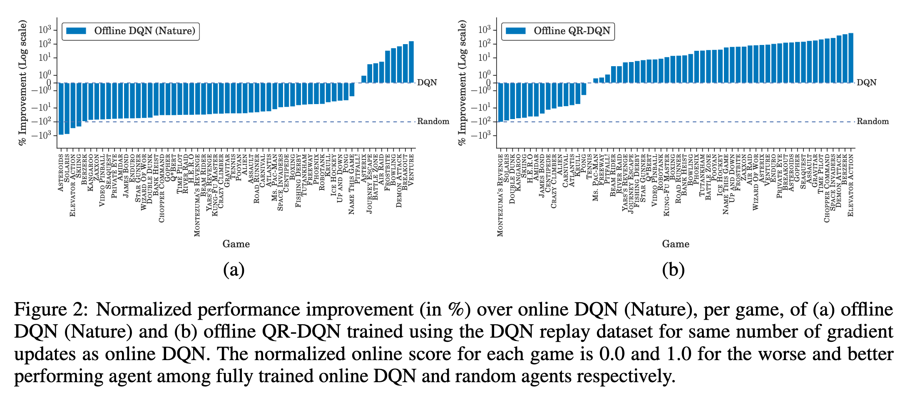
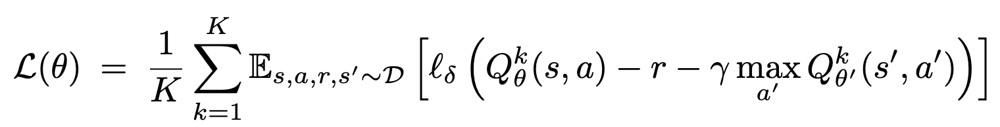
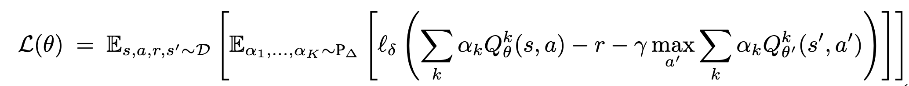
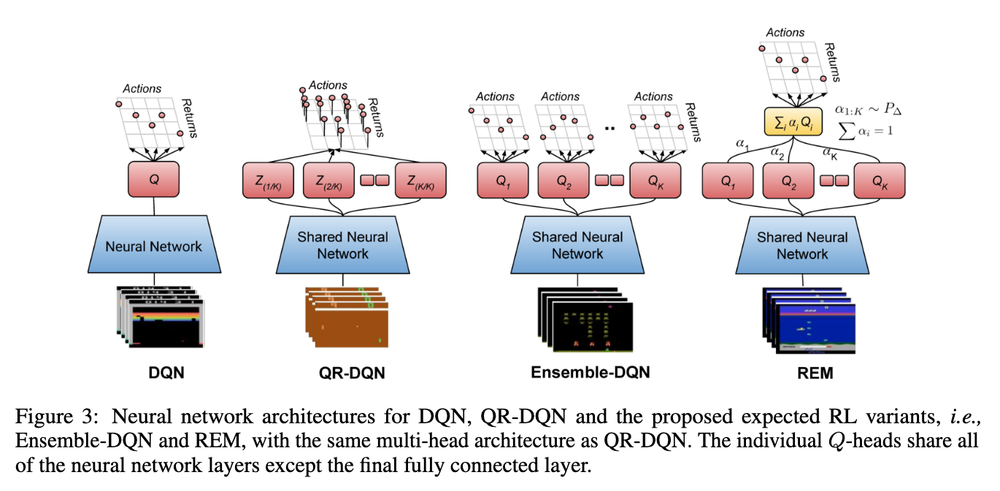
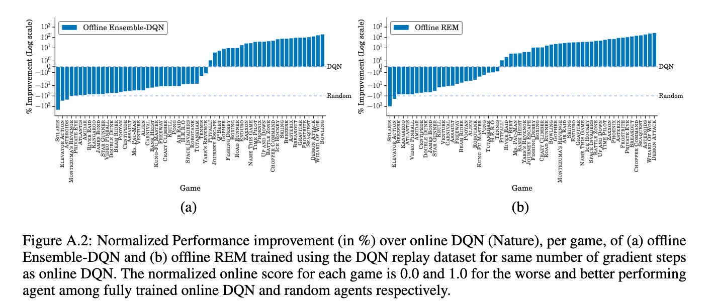
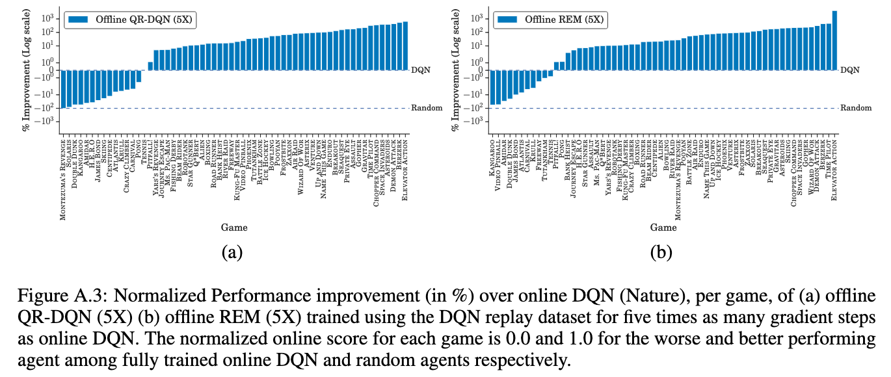

# Striving for simplicity in off-policy deep reinforcement learning

[Link to the paper](https://arxiv.org/abs/1907.04543)

**Rishabh Agarwal, Dale Schuurmans, Mohammad Norouzi**

*Neural Information Processing Systems (NeurIPS) 2019*

Year: **2019**

Implementation: https://github.com/anonymous-code-github/offline-rl

- Goal: benchmark offline and off-policy RL training on Atari 2600 using a log dataset (purely offline) generated from an online learning algorithm.
- Focus on simplicity
- In a nutshell, the authors benchmark classical DQN, vs a distributional DQN version (named QR-DQN, previously published, complex), vs 2 simple modifications proposed showing that, not only it is possible to train really offline RL agents from recorded experiences (logs), but also that the resulting agent may be more powerful than the online agent.
- Training off-line means training without exploration. The proposed algorithms only look at logged replay data of a DQN with 50 million experiences (S, A, R, S').
- The motivation of this study is that the authors empirically prove that Offline DQN underperforms online DQN except a few games, but offline QR-DQN outperforms online DQN in most of the games (46/60). After finding this out, they try to come up with a simplified approach wrt QR-DQN.

- The authors provide two proposals:
  - Ensemble DQN: K Q-functions are trained using a DNN, and providing them the same minibatches in the same order. The only difference between them is the initialization.
  
  - Random Ensemble Mixture (REM): with the aim of achieving a more efficient way of training different Q-functions, and inspired on the idea of dropout, REM consists of mixing the probability distributios of the different Q-functions trained using a random alpha factor drawn from a normal distribution and scaled to sum one. I.e. the Q-functions are weighted-averaged using random weights.
- Ensemble DQN and REM

