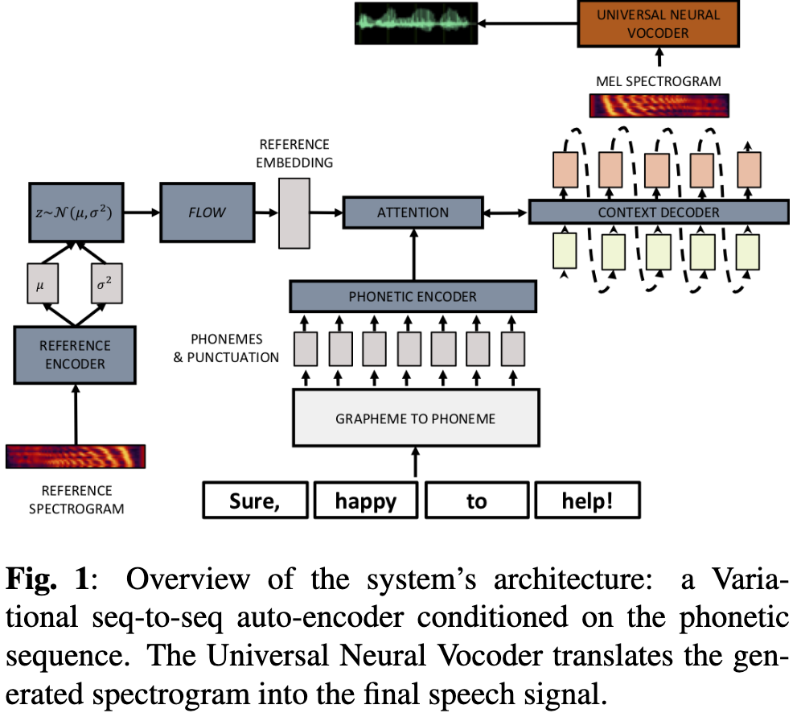
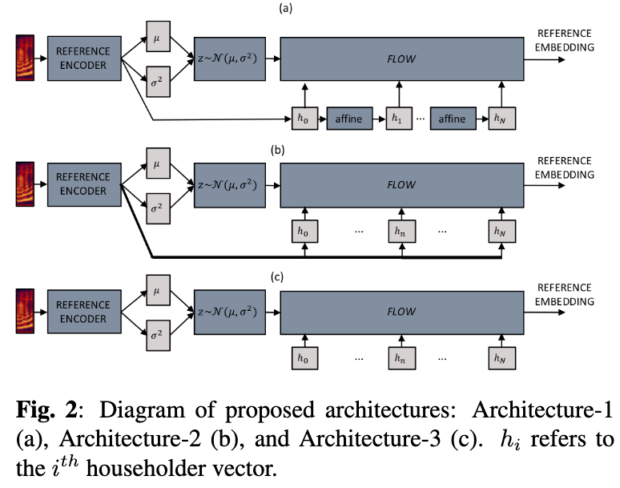
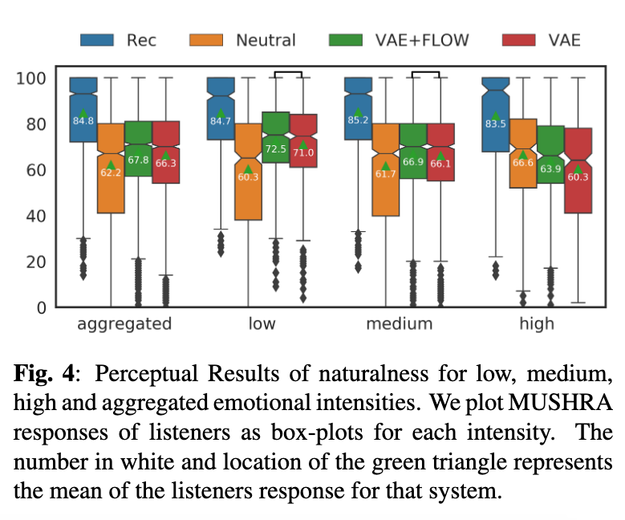
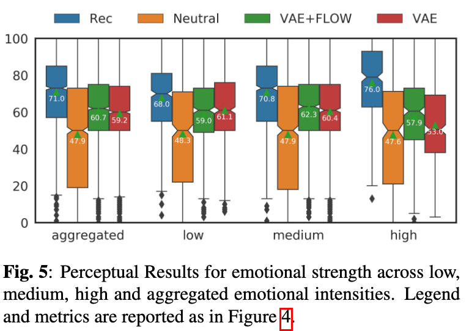
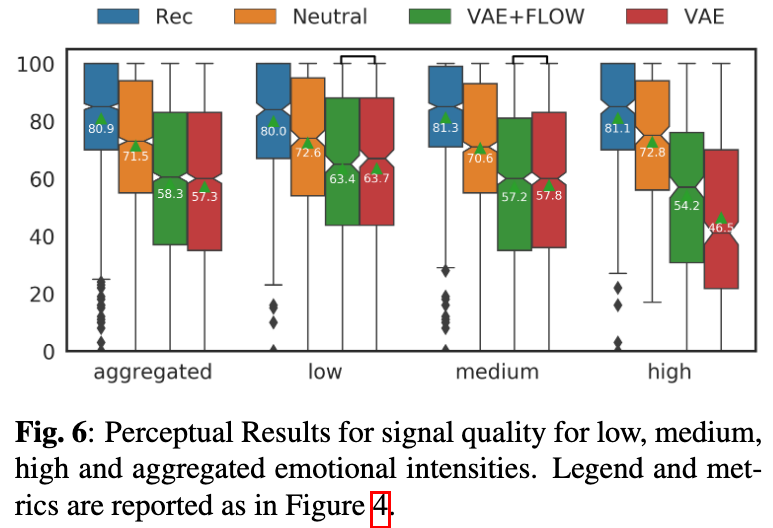

# Using VAEs and Normalizing Flows for One-shot Text-To-Speech Synthesis of Expressive Speech

[Link to the paper](https://arxiv.org/abs/1911.12760)

**Vatsal Aggarwal, Marius Cotescu, Nishant Prateek, Jaime Lorenzo-Trueba, Roberto Barra-Chicote**

*ICASSP 2020*

Year: **2020**

This paper presents a variation of the Tacotron2 architecture that features a reference variational encoder and a householder normalizing flow to create synthetic samples with the desired (reference) speaking style. Architecture detail below.

The main contribution of this work relies on the capability of matching the desired style by using a single reference spectrogram of about 1 second with the desired style.

Householder flows transform the aproximate isotropic gaussian achieved by the VAE latent distribution into a full covariance Gaussian distribution. This transformation allows correlation between variables in the latent space to arise, and potentially better latent representations.

Three householder normalization schemas have been tested, as shown in the following figure. The "Architecture 3" is the one that achieved the lowest combination of KLD and reconstruction loss across all architectures.

The results have been evaluated using MUSHRA for naturalness, emotional strength and signal quality.

