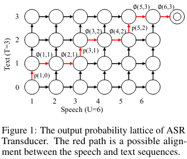
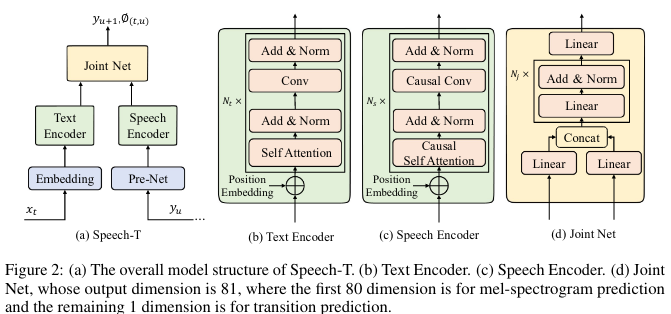
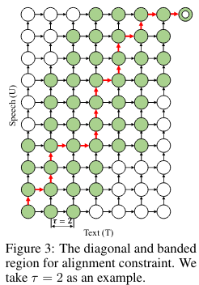
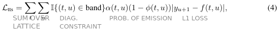
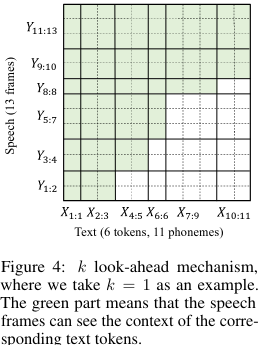
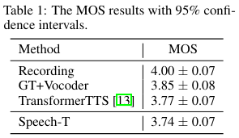
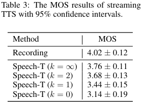

# Speech-T: Transducer for Text to Speech and Beyond

[Link to the paper](https://proceedings.neurips.cc/paper/2021/hash/344ef5151be171062f42f03e69663ecf-Abstract.html)

**Jiawei Chen, Xu Tan, Yichong Leng, Jin Xu, Guihua Wen, Tao Qin, Tie-Yan Liu**

*NeurIPS 2021*

Year: **2021**

This paper introduces the Transducer for Text to Speech, an analogy to the ASR Transducer adapted to TTS tasks.

ASR Transducer has three main components:
- A speech encoder, which takes input speech sequence and produces hidden representantions.
- A text encoder, which processes already generated text tokens in an autoregressive fashion.
- A joint network that predicts the probability of the next token using a probability lattice.

The authors found several difficulties when adapting the transducer to TTS Tasks:
1. Tokens in ASR are discrete while Frames in TTS are continuous. ASR Transducer models probabilities of emission/transition by introducing a new meta-token that represents that. In TTS there are no tokens predicted, which makes it difficult to adapt.
2. Contiguous speech frames, as opposed to tokens in ASR, are generally highly correlated. This makes the autoregressive task difficult for the model (leading to exposure bias and poor alignments). This difficulty gets reflected also here.

The potential benefit of this architecture for TTS is that it is designed to learn strictly monotonic alignments between text and speech, which may be useful for speech synthesis.

The SpeechT transducer contains the following components:
- A text encoder, which takes input tokens and produces hidden representantions.
- A speech encoder, which processes already generated frames tokens in an autoregressive fashion.
- A joint network that processes the combinations of speech and text to produce the next frame.

Both encoders are based on transformers. The joint network predicts 81 components vectors for 80-mel spectrograms. The last component is used as a "lazy" component, which is used to model the probability of transition/non-transition as a binary classification. The probability of transition is then used to fill the probability lattice. An additional diagonal constraint in form of a mask is applied to the probability lattice to improve robustness by driving monotonicity in the alignment.

The loss function is then expressed as follows

The authors propose also this algorithm to be used for streaming TTS, by restricting the look-ahead window in the text encoder self-attention, mocking the effect of words coming one by one in a streaming fashion.

The authors end the paper with a few experiments showing competitive results in terms of audio quality and robustness.

