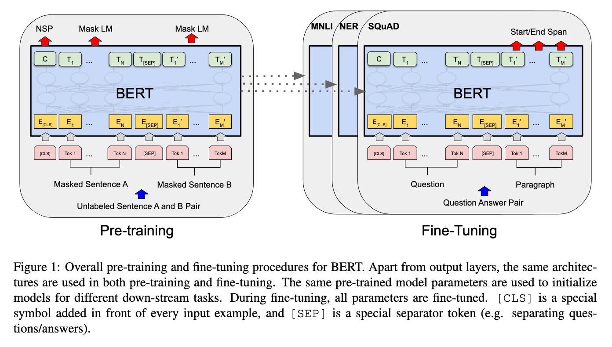
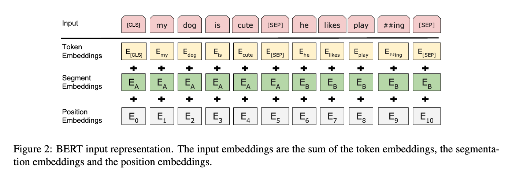
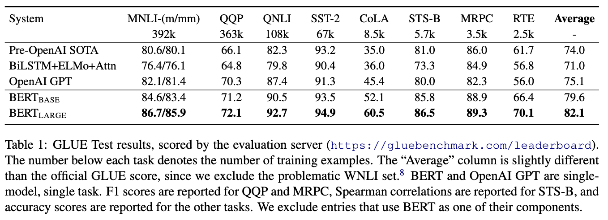
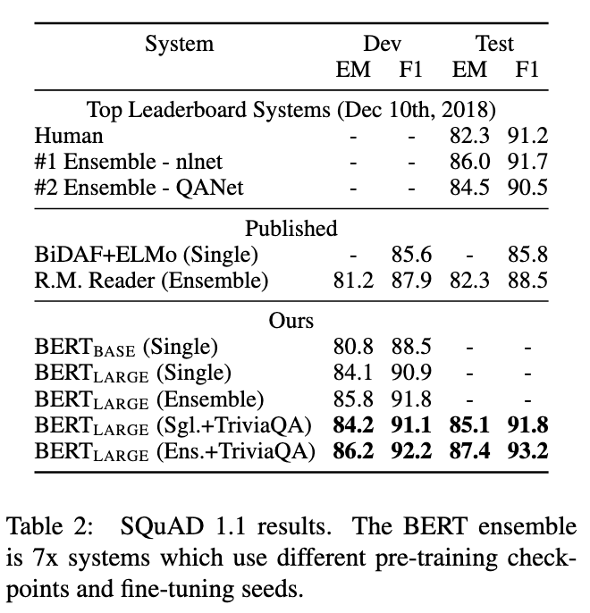
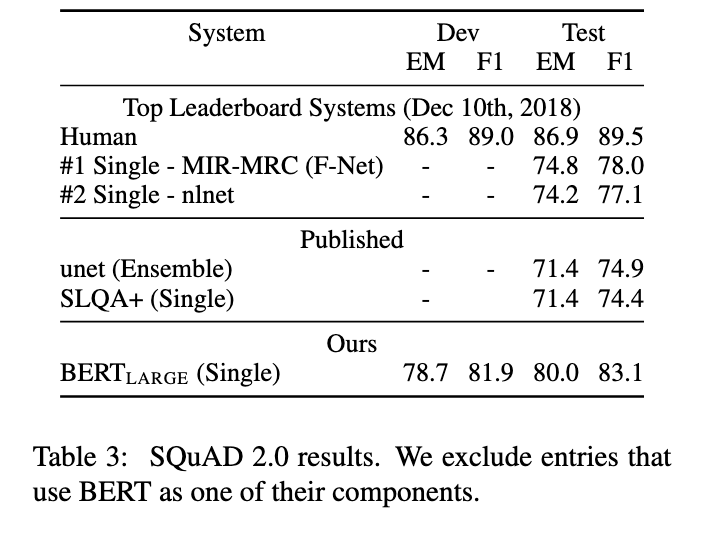
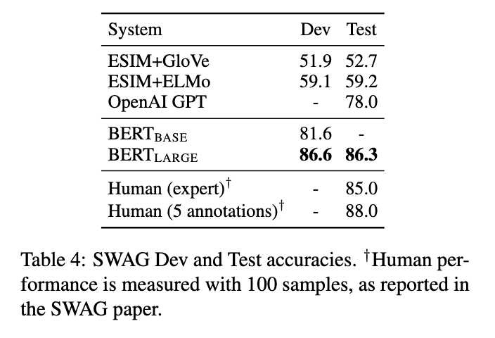
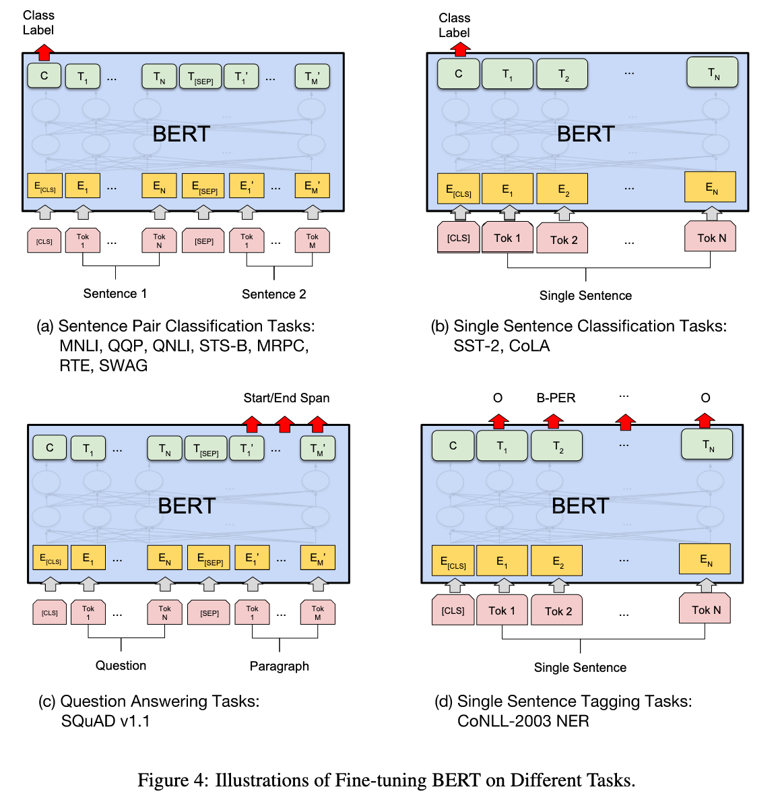

# BERT: Pre-training of Deep Bidirectional Transformers for language Understanding

[Link to the paper](https://arxiv.org/abs/1810.04805)

**Jacob Devlin, Ming-Wei Chang, Kenton Lee, Kristina Toutanova**

*NAACL 2019*

Year: **2019**

Implementation: https://github.com/google-research/bert

This work presents a framework for pretraining a deep learning transformer with text data. The main idea is that it is very straightforward to achieve state of the art results in a specific downstream application by fine-tuning the architecture starting from the pre-trained weights for about 3 epochs. The authors measured substantial improvements over the state of the art in complex 11 benchmarks.

There are two strategies to use pre-trained language representations in downstream applications:
- Feature based strategy: consisting of including the pre-trained representation into a model as additional features (e.g. ELMO).
- Fine-tuning strategy: consisting of fine-tuning all the parameters of the same pre-trained network with minimal architectural changes (e.g. GPT)

BERT uses the second approach: fine-tuning. The advantages of BERT vs other efforts like GPT rely in 2 main differences:
- The self-attention is bi-directional. In other words, it does not use a causal mask in the input of the transformer (left to right approach).
- The architecture is very versatile. By construction, BERT can be adapted to multiple NLP tasks of pretty different nature (think of question answering vs. next-token prediction vs. named entity recognition). For this reason, BERT is considered a general purpose architecture for multiple NLP tasks.

## Training process
BERT training process has two steps: the pre-training, where the pre-trained weights of the architecture are learnt, and the fine-tuning, where the pre-trained weights achieved in the previous phase are adapted to a downstream specific task.

The model architecture used is almost the same as the one defined by Vaswani et al in 2017 (Attention Is All You Need), with the difference that no input mask is used in the self-attention layers in order to achieve the bidirectional property. There are two versions of BERT, one BASE and other LARGE. The main difference between them is that the latter has more parameters and is more deep than the former.

BERT is able to process either one sentence at a time or two of them. That's one of the reasons why it is so versatile. The way of getting it to process two sentences is possible thanks to the introduction of the [SEP] artificial token. Thanks to this detail, both sentences (segments) can be concatenated in a single input sequence. In addition to this, BERT input sentences always start with a [CLS] artificial token. This allows adapting the output of the model (the vector corresponding with the output of this token) to classification tasks. Finally, the input embeddings to the self-attention layer are composed by the sum of the token embeddings, the positional embeddings and the segment embeddings (as shown in the following figure).

### Pretraining
BERT is trained through two different unsupervised parts.

- Masked Language Model (MLM) [one-sentence]: a sentence is provided with a percentage of tokens removed ([MASK] token). The model is trained to predict the full output sequence with the gaps filled. Small details: 15% of gaps are introduced out of which 80% of the times are filled with a [MASK] token, 10% with an incorrect token, and the remaining 10% is filled with the correct token (all this is done to reduce the missmatch between the pre-train and the fine-tune phase).
- Next Sentence Prediction [two-sentences]: The model is asked to predict if two sentences are contiguous in a corpus or not. This is performed as a classification task where a binary value is predicted (English Wikipedia and BooksCorpus are the two data sources used for this purpose). The sentences used here are also masked using the procedure described before.

### Finetuning
This is the easiest steps. The pre-trained network can be adapted to different tasks just by rearranging the input and outputs appropriately. The only remaining step after correctly configuring the network would be to train it for a few set of epochs.

In case of a sequence-to-sequence task, all the output token representations are fed into an output layer for token-level tasks (e.g. question answering). If the downstream task is a classification, the output of the first token [CLS] is fed into an output layer to map it to the number of layers. This is possible thanks to the versatility of the self-attention mechanism.

A normal downstream task would take just several hours to fine-tune in a single GPU machine.

## Experiments and results
BERT has been benchmarked on GLUE, SQuAD (v1.1 and v2.0) and SWAG, beating the state of the art in each of the tasks, consistently. The results compared with the benchmarks are shown in the following tables.

The paper finishes with an ablation study, summarizing that (1) the bidirectionality property and the 2-task unsupervised pre-training are crucial for the success, (2) the bigger the size of the model, the higher the accuracy and (3) the model also works in a feature-based strategy.

## Additional topics
The following picture shows 4 different tasks that can be performed with BERT, as an example.

