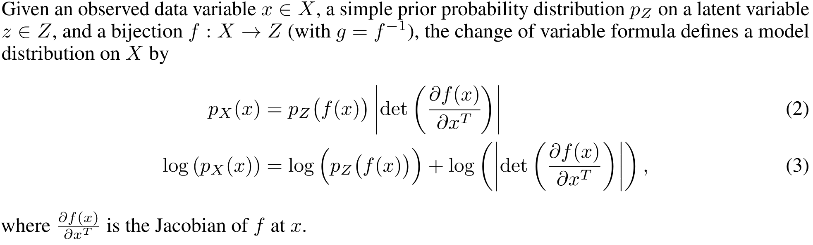
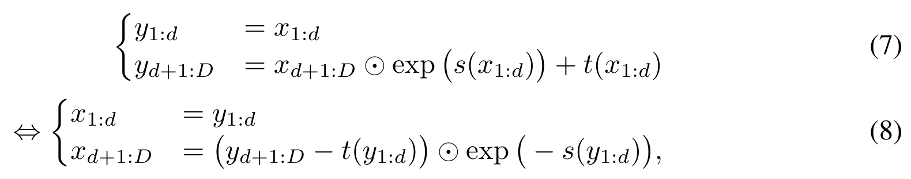
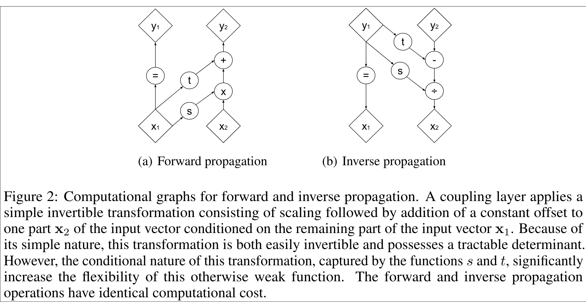
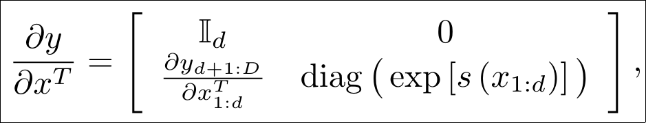
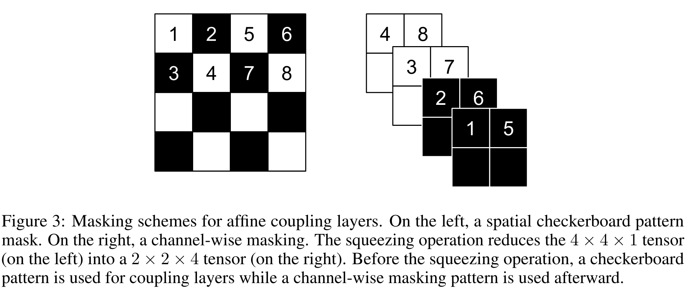
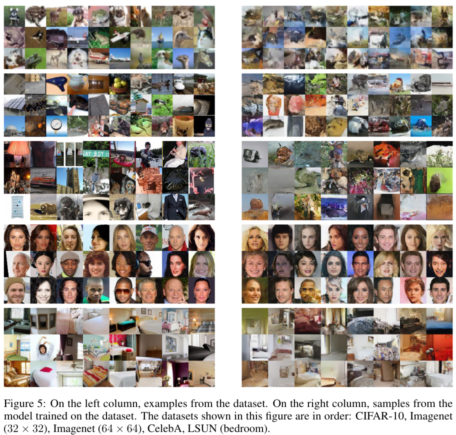
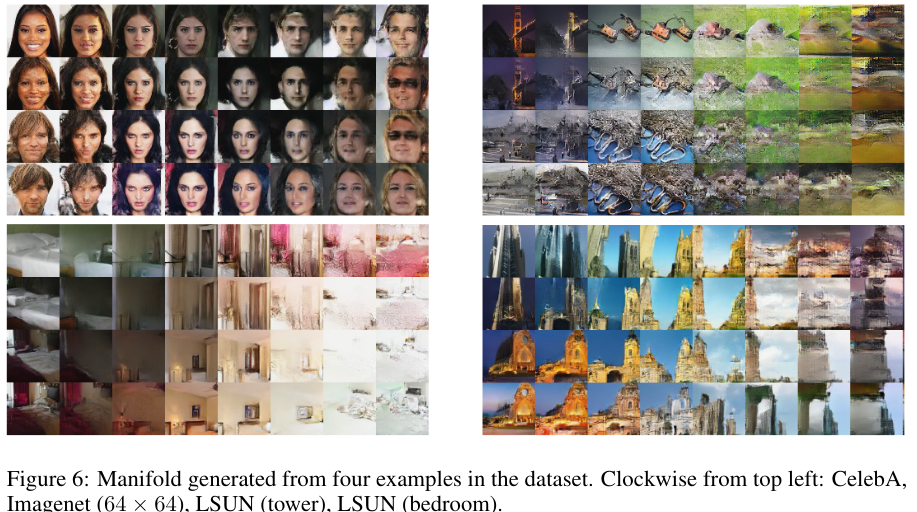

# Density estimation using Real NVP
[Link to the paper](https://arxiv.org/abs/1605.08803)

**Laurent Dinh, Jascha Sohl-Dickstein, Samy Bengio**

*Google Brain report*

Year: **2017**

This paper describes the Real Non Volume Preserving (RealNVP) model, which is a generative model for density estimation based on normalizing flows. RealNVP consists of an affine transformation that is invertible and which cost is the same for the forward and inverse transformations.

Normalizing flows are based on the change of variable formula.

These models, provided with a function which Jacobian is tractable, can be used to estimate the exact probability density of any arbitrarialy complex distribution (such as images). The challenge is (1) to carefully define those functions so that they are invertible and which Jacobian is easy to compute, and (2) to achieve a model that is flexible enough to model the distribution of the target dataset.

The authors introduce the coupling layer, which is a transformation that exploits the property that the determinant of a triangular matrix is can be efficiently computed as the product of the diagonal elements. Given a D dimensional input vector $x$, and $d<D$, the affine coupling layer and its inverse are defined as:

The $s(\cdot)$ and $t(\cdot)$ functions represent scale and translation transformations, respectively.

Where the Jacobian of the affine coupling layer is:

Notice that the Jacobian determinant does not involve computing the Jacobian of s or t, implying that those functions can be arbitrarily complex.

Notice also that a part of the output vector is the same as the input vector (remains untouched). The authors describe a mechanism to partition the input vector efficiently in order to achieve a flexible model through stacking multiple coupling layers and interleaving those partitions in an alternating pattern. They define a masked convolution as a process of two steps:

1. A spatial checkerboard pattern
2. A channel-wise masking

The following picture shows both steps in a graphical way.

The results of this paper show how the RealNVP model can achieve competitive generated images, and how it can be used for interpolating across the manifold.

