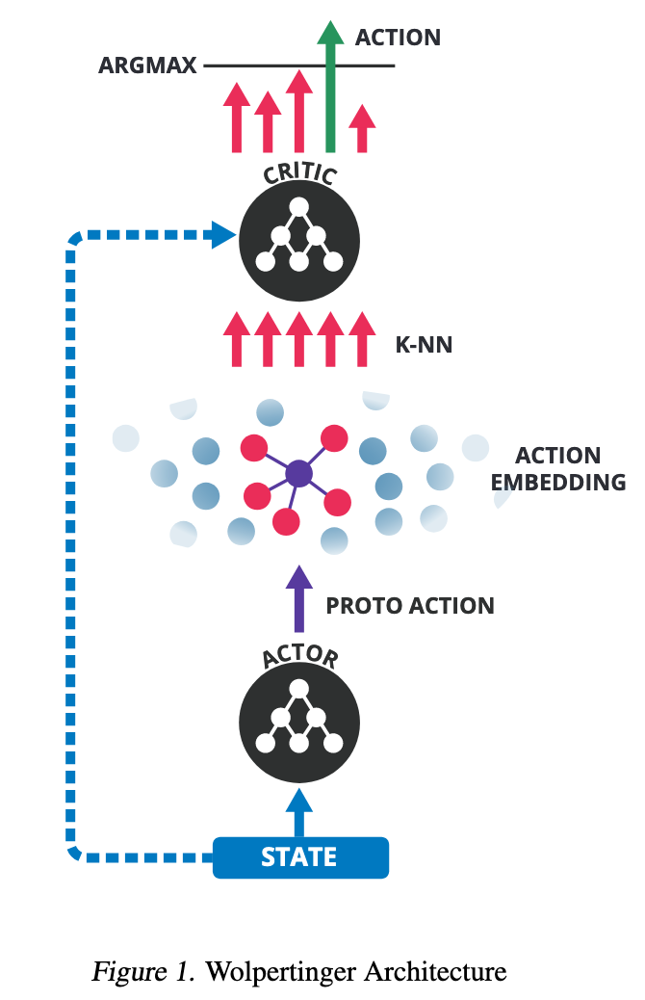

# Deep Reinforcement Learning in Large Discrete Action Spaces

[Link to the paper](https://arxiv.org/abs/1512.07679)

**Gabriel Dulac-Arnold, Richard Evans, Hado van Hasselt, Peter Sunehag, Timothy Lillicrap, Jonathan Hunt, Timothy Mann, Theophane Weber, Thomas Degris, Ben Coppin**

*Google Deepmind*

Year: **2016**

**==== NOT FULLY COVERED ===**

- Goal: design of a policy-based approach to problems with large number of actions.
- There are many examples where the number of actions is very high: recommender systems, industrial plants, language models, etc. That makes these problems intractable due to the linear dependency on the number of actions of the successful/known algorithms.
- The solution proposed is based in an actor-critic architecture, trained using DDPG.
- The authors propose a solution to the problem based on embedding the discrete large original action space into a continuous space. It is important to notice that this embedding is performed beforehand (seems not to be noticed in the paper, only a hint was found in the conclusion).
- The actor, hence, produces a continuous action in the embedded space which not necessarily has to match any possible action on that space. Then, an approximate nearest neighbor search is run in order to find the set of k closest discrete actions. The approximated search allows doing this in sub-linear (logarithmic) complexity. In addition, as compared with the algorithms that switch the actions to become inputs of the network, the actor doesn't have to be evaluated multiple times.
- Over the k closest actions selected by the approximated kNN algorithm, the critic is run and the action leading to the highest bootstraped value is selected using an argmax function (over k actions, instead of over |A|). Another more simplistic alternative would be to use the action which lays closest to the recommended action by the actor; however the authors recommend the former method, given that it is more robust against outliers.
- The authors named this method *Wolpertinger Policy*.

- The paper claims this method scales up to spaces with more than one million actions.