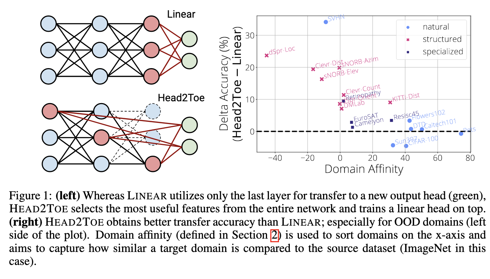
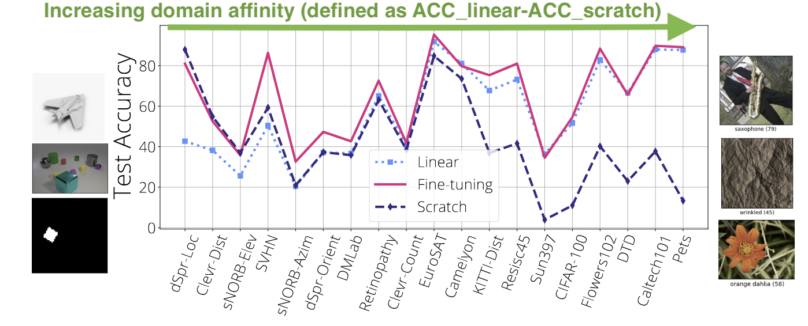
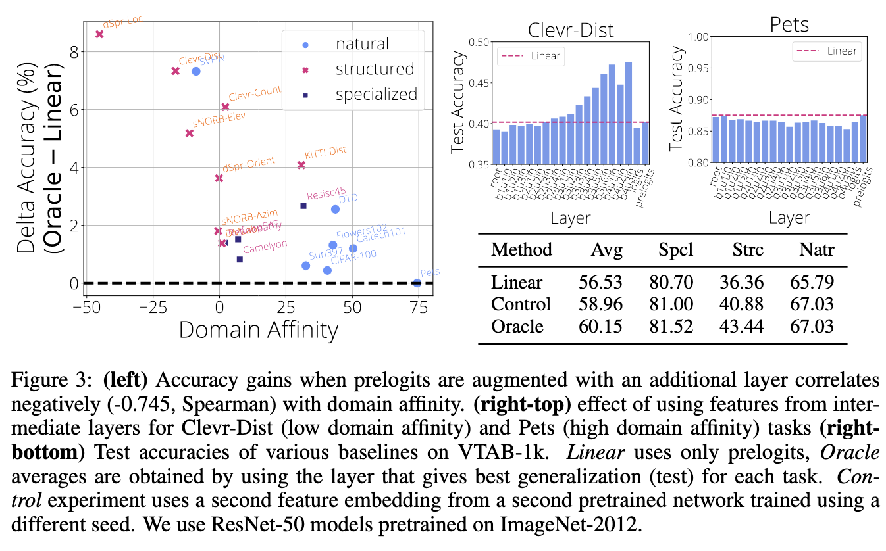
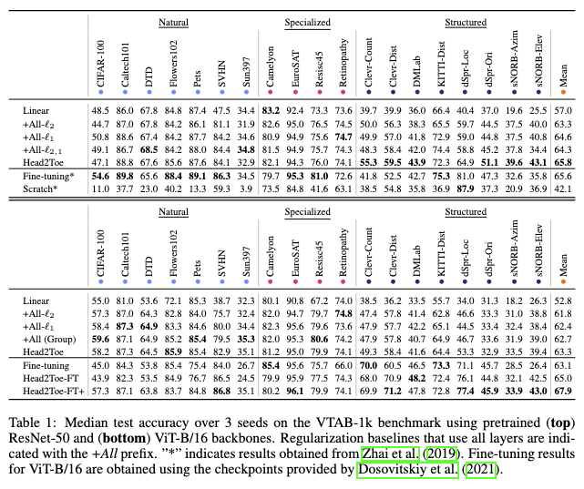

# Head2Toe: Utilizing Intermediate Representations for Better Transfer Learning

[Link to the paper](https://arxiv.org/abs/2201.03529)

**Utku Evci, Vincent Dumoulin, Hugo Larochelle, Michael C. Mozer**

*arXiv Preprint*

Year: **2022**

Code: https://github.com/google-research/head2toe

This paper discusses an idea to improve pre-trained models. The idea, in a nuthsell, consists of using a pretrained model and instead of pre-training a linear head attached at the end of the network, select features from all the layers of the pretrained model and train a linear layer feeding those features as input.

The work starts defining a set of terms.
- Source task: task the pretrained model is initially trained on. Normally, a large data set is used.
- Target task: task we want to fine-tune the pre-trained model to solve. Often, a small data set is used.
- Upstream training: train a model on a *source task*
- Downstream training: fine-tune the pretrained moodel to solve the *target-task*
- Model backbone: initial layers, except the head, that often are frozen for doing transfer learning
- 
Approaches to transfer learning.
- LINEAR: consists of replacing the head layer of the model with another layer, freeze the backbone and just train the new head.
- FINETUNING: consists of attaching a new head to the model and then adjusting **all** the weights of the model
- HEAD2TOE: it is similar to LINEAR, in the sense that only the weights of the head are trained, however that layer is feed with a mix of features from previous layers.

Interesting observations.
- FINETUNING is superior to LINEAR when the target task is out of domain of the source task. Similar observation happens with Head2Toe.
  

- Central hypothesis of the work: features needed for transfer learning are already present in the network and might be identified directly without fine-tuning the backbone. 
- Preliminar experiment: train a pretrained model using the backbone output and concatenating an intermediate layer together with the backbone output. Accuracy increases substantially. In the figure below, Oracle means the result of the layer that brings the greatest improvement. Control means concatenating the output features of the backbone of another model.

## Head2Toe
The method proposed by the paper is very simple. First, all the intermediate outputs of the hidden layers are computed, per-layer standardized, and concatenated together in a large tensor (average pooling is used to adjust dimensionality of different layers allowing concatenation). Second, a feature selection step takes place, to reduce the large tensor of features to a lower dimensional one. For that, Lasso is used. The best subset of weights (the ones having the largest norm after the model fitting) F is retained and the rest is discarded. Finally, a new head is trained without regularization over the subset of features F.

## Experimental setup

- Source task: imagenet2012
- Model architectures: Resnet-50 and ViT-B/16 (attention-based)
- Target task: Visual Task Adaption Benchmark-1k (19 classification tasks with 2-397 classes and 1k training examples)
- Baselines: LINEAR, FINETUNING and SCRATCH (training from scratch without transfer learning).

## Results
Head2Toe is often better than FINETUNING or SCRATCH at a much lower cost.

