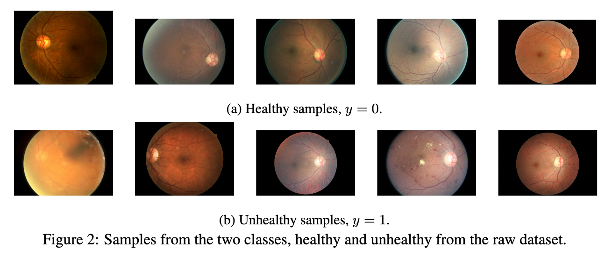
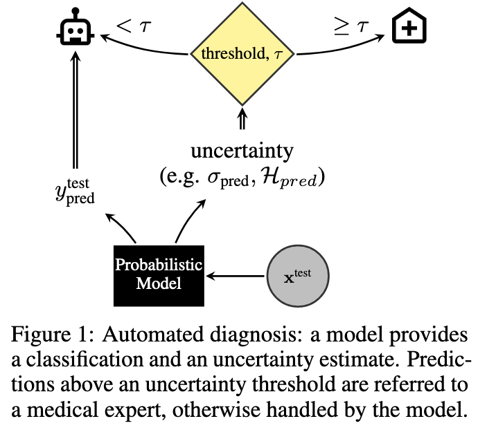
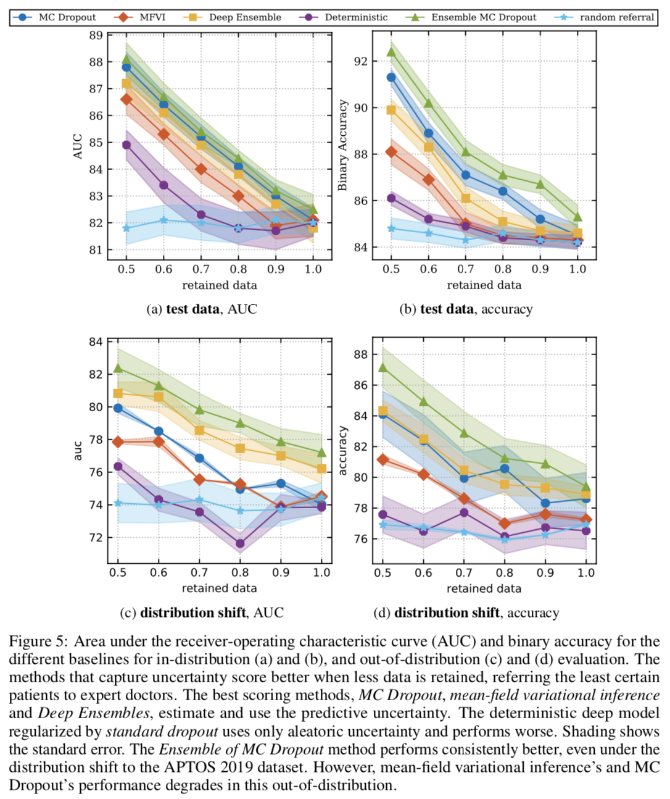
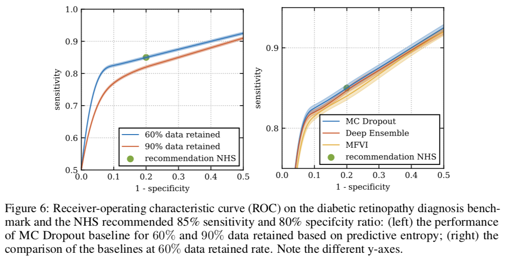
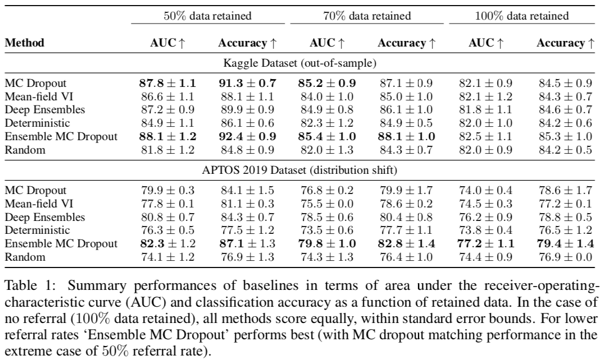
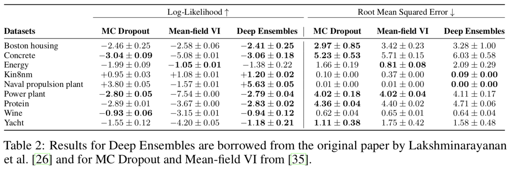

# A Systematic Comparison of Bayesian Deep Learning Robustness in Diabetic Retinopathy Tasks

[Link to the paper](https://arxiv.org/abs/1912.10481)

**Angelos Filos, Sebastian Farquhar, Aidan N. Gomez, Tim G. J. Rudner, Zachary Kenton, Lewis Smith, Milad Alizadeh, Arnoud de Kroon, Yarin Gal**

*NeurIPS 2019*

Year: **2019**

Github: https://github.com/oatml/bdl-benchmarks

The current work proposes a framework for evaluating the uncertainty estimation of Bayesian Deep Learning methods. It builds it over a diabetic retinopathy predictive model.

The paper starts introducing the problem and importance of having an uncertainty estimation along with the predictions. The deep learning models fail to inform the users when they don't know, i.e. their uncertainty

The application consists of predicting the presence of the disease given a retina image; it's a binary classification task. The performance of the following models are evaluated with Accuracy and AUC-ROC. The authors suggest using an uncertainty estimation instead of a point estimate. That allows to build a semi-automatic system where the model has the first chance to provide a prediction, and if this prediction shows a high uncertainty, the sample is referred to an expert for visual evaluation. A sample of the images and a diagram showing this methodology are shown below.

The authors do an extra effort in this work to assess robustness of the solution against out-of-distribution and distribution shift. For that, they use another dataset, collected with different equipment and different population.

For estimating the uncertainty, the entropy ($H$) of the predictions performed by the models is evaluated. This entropy can be calculated with the following equation, where $c\in C$ and $C$ is the set of possible classes, and $T$ is the number of monte carlo samples obtained by stochastic forward passes through the model.

$$H(y|x) = -\sum_c p(y=c|x) \log p(y=c|x)$$

where $p(y=c|x) \approx \frac{1}{T}\sum_t p_\theta(y=c|x)$

The following figure shows the relation between the uncertainty estimation and the output of the model for both: correctly classified images and missclassified images. Notice the clear distinction between correct classifications and incorrect classifications along the Y axis.

The methods used for predicting with uncertainty are the following ones:
- Monte Carlo Dropout: consisting of training a neural network with dropout and performing $T$ stochastic forward passes at inference time (without deactivating dropout)
- Mean Field Variational Inference: consisting of learning the posterior of the weights $q(w)$ given the prior $p(w)$ and then estimating the KL-divergence term using a Monte Carlo simulation
- Deep Ensemble: consisting of training $T$ deterministic independent models to generate the $T$ samples.
- Ensemble Monte-Carlo Dropout: consisting of combining the first and third approach; i.e. here the components of the ensemble have dropout.

In addition, two baselines have been added in order to have a fair comparison.
- Deterministic: uses a model with dropout but it is deactivated (or activated but the outputs are averaged) on inference time. The output of the model is used as a measure of uncertainty directly.
- Random: it makes random referrals; i.e. the model assigns random uncertainties to each prediction.

The results over the data are shown in the pictures below.AUC and Accuracy variation for different retention rates (i.e. retaining more or less data depending on the uncertainty of the predictions). Results are reported for the test set and for the out-of-distribution set. The results show that the MC Dropout and the Ensemble MC Dropout are the methods that better results show. The performance increases when the most uncertain samples are removed.

The authors have applied the same methods to a set of datasets from the UCI repository, arriving to similar conclusions.

