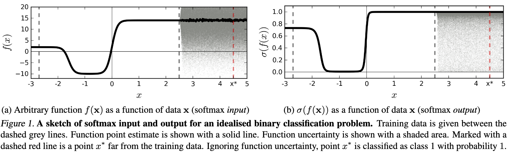
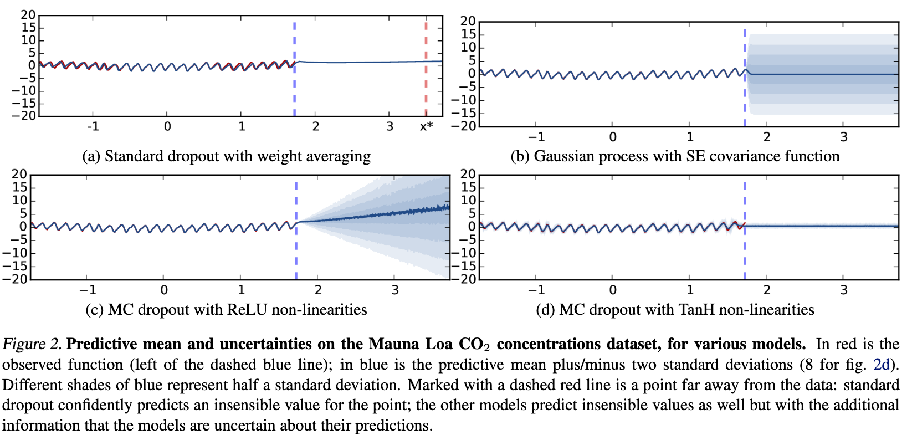
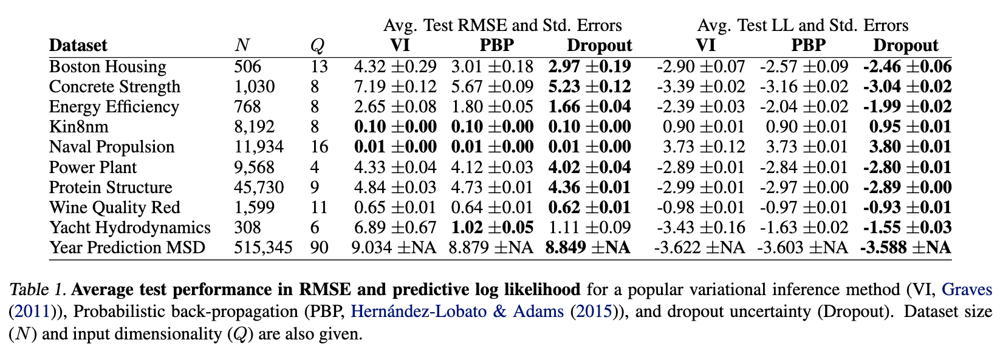
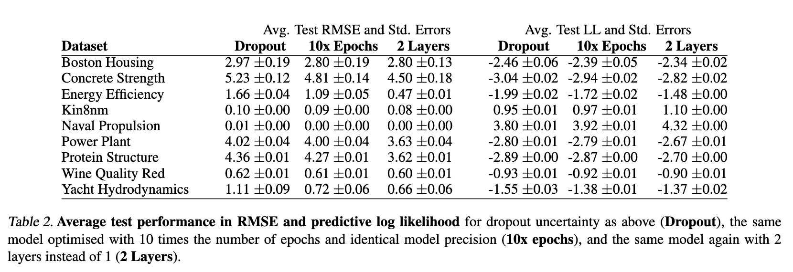
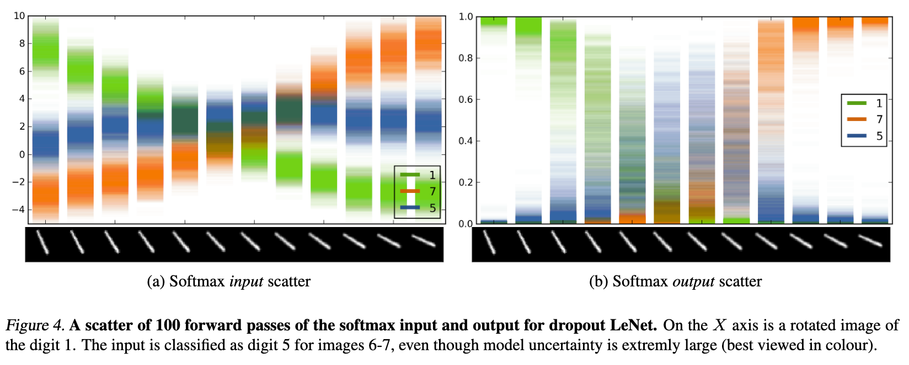
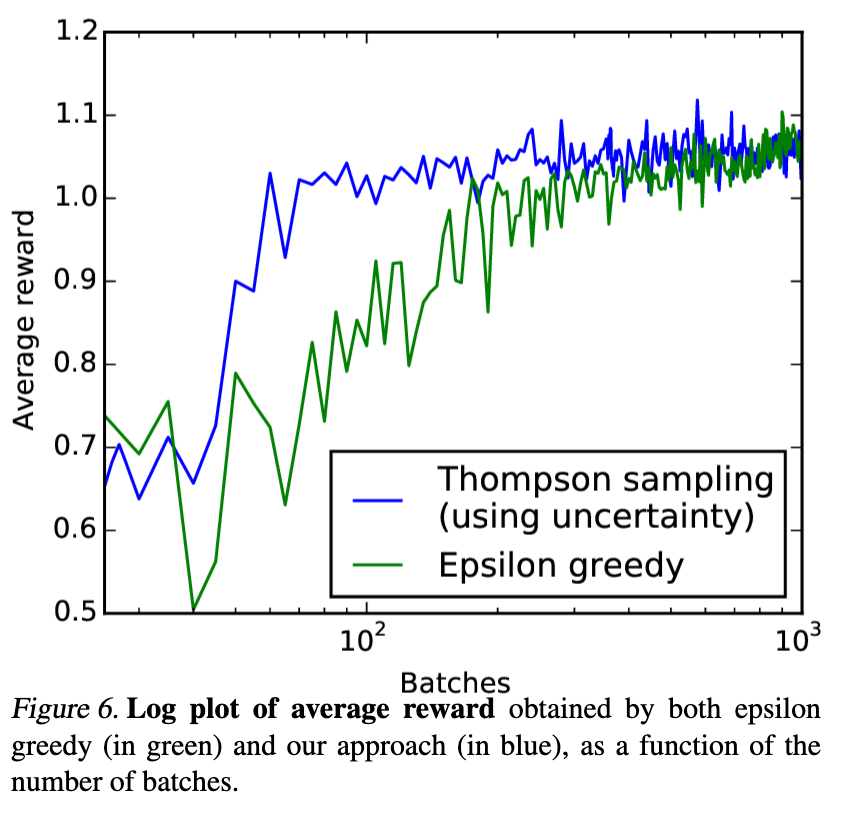

# Dropout as a Bayesian Approximation: Representing Model Uncertainty in Deep Learning

[Link to the paper](https://arxiv.org/abs/1506.02142)

**Yarin Gal and Zoubin Ghahramani**

*ICML 2016*

Year: **2016**

This works shows a pretty simple way of moving from point estimates to uncertainty estimation in Deep Learning models by using dropout at test time.

The paper starts building consciousness about the importance of building models with uncertainty estimation as opposed to point estimations. A common mistake consists of interpreting the output of a softmax layer in a classification problem as how confidence the model is in a prediction (e.g. the higher the value of an output, the higher the confidence). This is a dangerous interpretation as they show in the following figure. The left graph represents the input of a softmax function and the one in the right, the output

The authors show the connection between the use of dropout in Neural Networks and the Gaussian Processes. In other words, a neural network with dropout after every weight layer is mathematically equivalent to an approximation to the probabilistic deep Gaussian process. They then develop a simple methodology for representing model uncertainty of existing neural nets with dropout, without sacrificing either computational complexity or test accuracy.

The developed methodology, known as Monte Carlo (MC) dropout, consists of performing $T$ stochastic forward passes through the network and analyzing the results. This does not change the modeling process itself, it just needs to keep dropout "active" at test time and run several forward passes to sample from the posterior distribution.

The experiments show promising results. The authors have tested the approach (1) over a CO2 concentration dataset to test model performance on extrapolation, (2) over several small structured datasets, (3) over MNIST with conv nets, (4) over a RL problem with Q-Learning (using a Q-neural net with dropout).

For the experiment (1) the authors have used dropouts of 0.1 and 0.2 in networks with 4 and 5 layers, concluding that the results are invariant to these parameters. They have also tried using tanh and relu activations and concluded that on extrapolation, tanh saturates and relu doesn't. The following figure summarize the results.

Regarding experiment (2), the following tables show the results obtained with a neural network of 1 hidden layer (experiment with two hidden layers in the second table). The first table compares the performance of the approach presented here with more sophisticated approaches for deep bayesian nets.

On MNIST, the authors decided to train a model with dropout, and see how the pre-softmax and post-softmax outputs vary when a sampled digit 1 is rotated.

Finally, the authors remark that the proposed algorithm is also useful for Reinforcement Learning. They show how it can be used to perform Thompson sampling: an alternative of the epsilon-greedy that consists of sampling the posterior distribution of the Q-function in order to account for exploration. This method showed much faster convergence in a practical problem.

