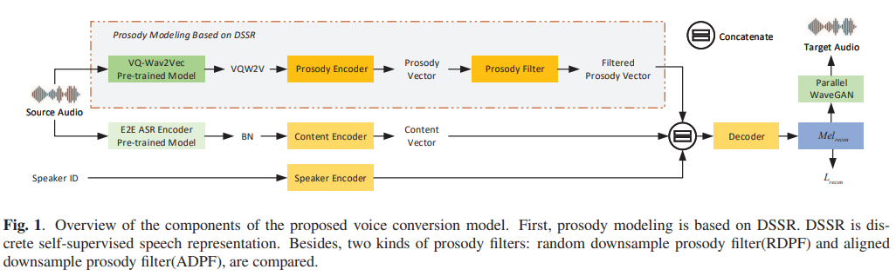
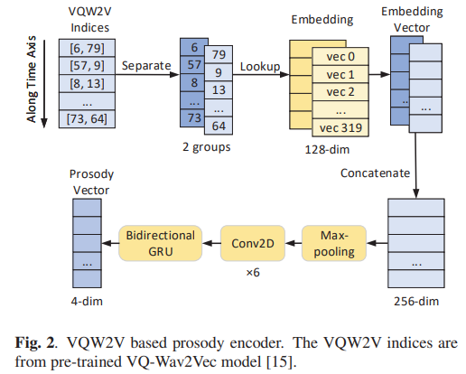
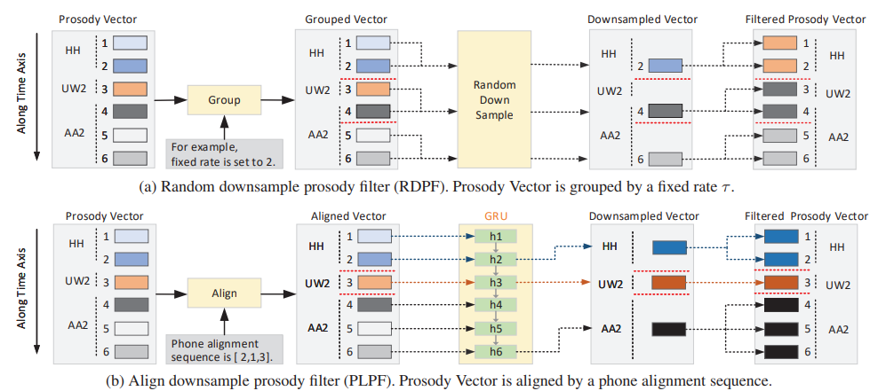

# IQDUBBING: Prosody modeling based on discrete self-supervised speech representation for expressive voice conversion

[Link to the paper](https://arxiv.org/abs/2201.00269)

**Wendong Gan, Bolong Wen, Ying Yan, Haitao Chen, Zhichao Wang, Hongqiang Du, Lei Xie, Kaixuan Guo, Hai Li**

*ICASSP 2022*

Year: **2022**

This paper shows a TTS architecture for voice conversion that claims prosody disentanglement via Discrete Self-Supervised Speech Representation.

The architecture has 3 encoders:
- Content encoder: uses ASR posteriorgrams (bottleneck layer) from a pre-trained ASR to generate a continuous representation of input speech without relying in transcriptions.
- Prosody encoder: Uses VQ-Wav2Vec to generate a prosody vector which is further filter with two proposed "prosody filters". These filters are based on downsampling the VQ-Wav2Vec vector at phoneme level. The first version (called RDPF) does it by randomly sampling in buckets obtained by uniformly splitting the WQ-Wav2Vec representation along the time axis. The second version called (ADPF) features an alignment using Montreal in order to force-align the VQWav2Vec sequence with the phonemes sequence.
- Speaker encoder: uses the one-hot representation of the speaker to learn a speaker embedding.

The following figure shows the architecture.

The following figure shows the Prosody encoder without the filter.

The following figure shows the two versions of the Prosody filter.

 The authors used as a baselines (1) the same architecture without the prosody encoder and (2) the same architecture but using mel spectrogram as prosody feature.

The results show that the proposed architecture is better than the baselines in terms of MOS and AB test for prosody consistency.