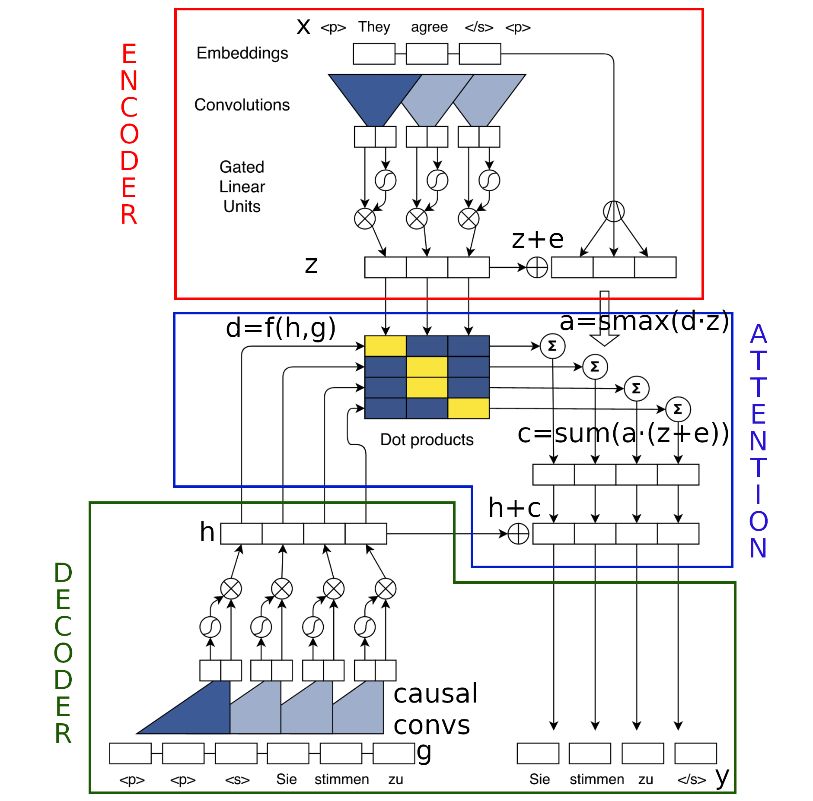
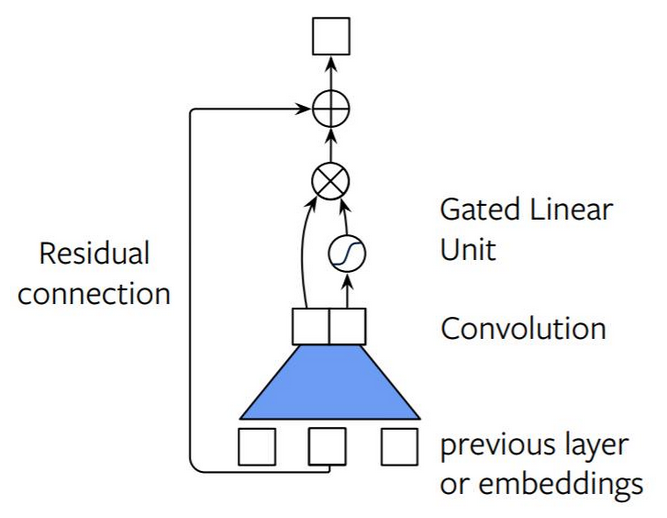
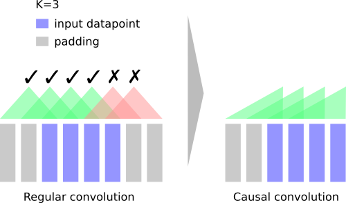
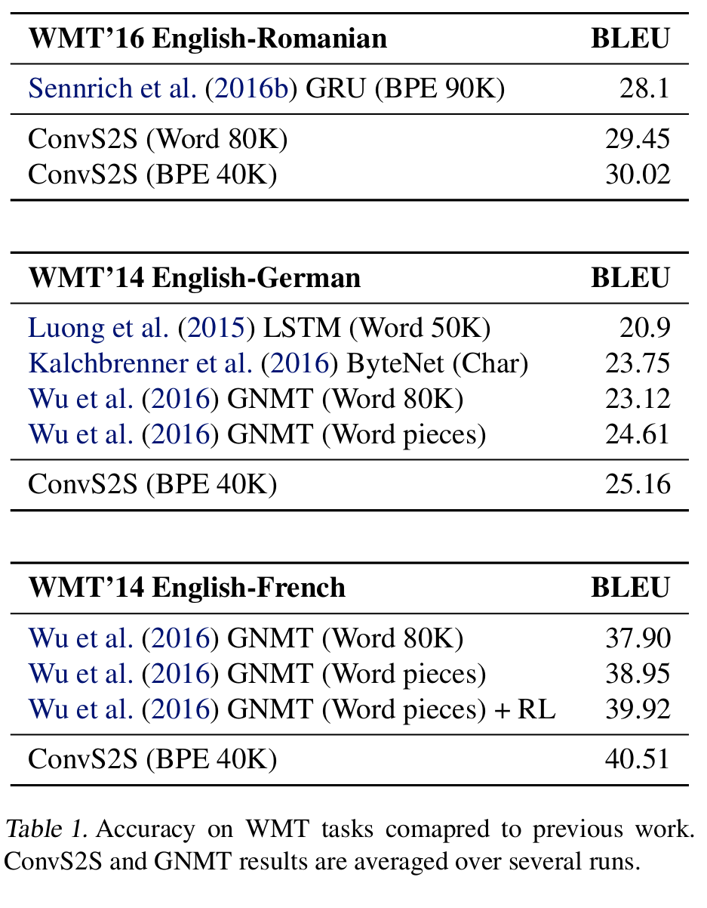
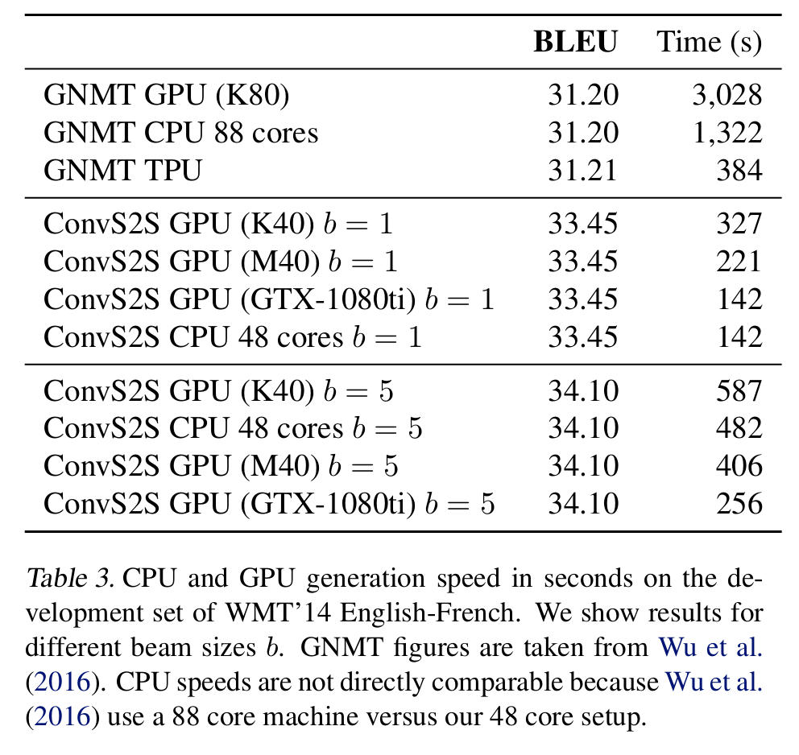

# Convolutional Sequence to Sequence Learning

[Link to the paper](https://arxiv.org/abs/1705.03122)

**Jonas Gehring, Michael Auli, David Grangier, Denis Yarats, Yann N. Dauphin**

*ICML 2017*

Year: **2017**

## Introduction
Objective: design of a neural network architecture that performs sequence to sequence using only convolutions.

The proposal of the authors of the paper is to show that it is possible to build a S2S architecture that only uses convolutions. The advantages over the canonical RNN S2S are:
- We gain more control of the maximum length of dependencies
- It enables parallelization over every element in the sequence by removing the dependency on previous time steps computations.

The CNN architecture creates a hierarchical representation over the input sequence: nearby input elements interact at lower layers and distant ones interact at higher layers.

The architecture proposed in the paper has the following characteristics:
- It's entirely convolutional
- It uses Gated Linear Units (GLU)
- It uses residual connections

The model is evaluated on NLP tasks, mainly consisting on language translation, and shows to have better performance than the RNN alternatives, while being an order of magnitude faster.

## Notation
To correctly understand the paper, the authors use an extensive notation for refering to each of the parts of the architecture. These notation is summarized below.

Encoder
- Input elements: $\mathbf{x} = {(x_1, x_2, ..., x_m)}$
- Embedding of the input space: $\mathbf{w} = {(w_1, w_2, ..., w_m)}$ where $w_j \in \mathbb{R}^f$
- Embedding matrix applied over the inputs: $D \in \mathbb{R}^{V \times f}$
- $V$ is the cardinality of the input symbols set
- $f$ is the input embedding size
- $m$ is the length of the input sequence
- Positional embedding of the input space: $\mathbf{p} = {(p_1, p_2, ..., p_m)}$ where $p_j \in \mathbb{R}^f$
- The input embedding and the positional one are combined to form the input representation: $\mathbf{e} = (w_1+p_1, ..., w_m+p_m)$
- Output of the $l$-th block: $\mathbf{z^l} = (z^l_1,...,z^l_m)$

Decoder
- Embedding of the outputs, fed into the next step in the decoder: $g = (g1, ..., g_n)$
- Output of the $l$-th block: $\mathbf{h^l} = (h^l_1,...,h^l_n)$
- $n$ is the length of the output sequence

Convolutional block
- Each kernel is parametrized as $W \in \mathbb{R}^{2d \times kd}$ and $b^{2d}$
- $k$ represents the kernel width
- $d$ represents the number dimensions in the input vector (should be the same as $f$)
- $v([A B]) = A \otimes \sigma(B)$ is the output of the  GLU unit

Attention
- The decoder output $h_i^l$ is combined with the embedding of the previous output $g_i$ into $d_i^l$.
- The attention weights are calculated using a softmax over the combination of $d_i^l$ and $z_j^u$ producing $a_{ij}^l$
- The output of the attention process is denoted as $c_i^l$

## Model
The model is composed of three blocks: (1) the encoder, (2) the decoder and (3) the attention module. The following figure summarizes, at a glance, all the pieces of the architecture.

### GLU
The encoder and the decoder building blocks are the convolutions with Gated Linear Units (GLU) activation functions and residual connections, referred as GLU blocks. 

- The encoder's input and output are the same. This is ensured by padding the input layer (SAME convolution).
- Similarly, in the decoder the output and the input are of the same type but we have to take care that the convolutions don't inject future information at training time. For that, we pad the input $k-1$ elements on the left and right side, and remove k elements from the end of the convolution output. 
  

### Encoder
The encoder of the architecture consists of a bunch of GLU blocks stacked together. It receives a sequence of inputs and returns a sequence of outputs of the same size as the inputs. It stacks several convolutions to increase the receptive field.

The input of the encoder is embedded into two latent spaces with the same size: $w$ and $p$. W is a $word$ embedding and $p$ is a positional embedding which, although not specified, seems to embed the position of each word into a space of the same size of $w$. Then they compute a joined embedding: $e = w + p$ The authors also mention that they add dropout and batchnorm after each block.

### Decoder with attention
The attention mechanism is applied in each of the layers of the decoder, that is why the authors call it multi-step attention mechanism. 

The output of the attention module for a given sequence step $i$ of the decoder, at a given layer $l$ is given by the following expression:

$$c_i^l = \sum_{j=1}^m a_{ij}^l (z_j^u + e_j)$$

As it can be noticed, $c_i^l$ is the weighted sum over $z + e$ (i.e. the input of the embedding CNN and its output) by the weights of the attention module $a_{i, j}$. In a normal approach, we would only sum over $z$, but the autors decided to do it this way to implement something that they call "key-value memory networks", where the key is $z$ and the value is $z+e$ (reference: Miller et al 2016)

The attention weights for the layer $l$, $a_{i, j}^l$ (where $\sum_{j=1}^m a_{i,j}^l = 1$), are computed with a softmax over the dot product between the decoder CNN output $d$ (combined with the previous input) and the output of the encoder $z$. The computation can be summarized as follows.

$$a_{ij}^l = \frac{\exp(d_i^l\cdot z_t^u)}{\sum_{t=1}^{m}\exp(d_i^l\cdot z_t^u)}$$

Finally, $d_i^l$ is computed by combining the current decoder state $h_i^l$ with the embedding of the previous word $g_i$ as follows:

$$d_l^i = W_d^l \cdot h_i^l + b_d^l + g_i$$

I.e. applying a fully connected layer over $h$ and summing $g$. 

Once $c_i^l$ is computed, it is added to the output of the decoder layer $h_i^l$. The output probabilities can be computed using a fully connected layer

The authors remark the fact that the decoder has the capability of keeping track of the attention history.

This attention input is computed in one-shot, not as in the RNN paradigm.

The decoder outputs $y$, a sequence of probabilities for each of the words of the input sentence +1.

## Results
The results show that the current proposal:
- improves the RNN alternatives in all the translation tasks that have been tested. 
- is not able to surpass the accuracy in text summarization. 
-  due to paarallelization capabilities, runs one order of magnitude faster than the RNN alternatives.

## Additional References
- [Official implementation in LUA](https://github.com/facebookresearch/fairseq)
- [Very well written implementation in a notebook](https://github.com/bentrevett/pytorch-seq2seq/blob/master/5%20-%20Convolutional%20Sequence%20to%20Sequence%20Learning.ipynb)
- [Blog post linking a clearer implementation in Python](http://vandergoten.ai/2018-10-13-convolutional-sequence-to-sequence-learning/)