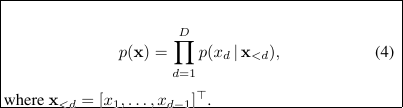
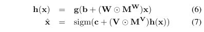
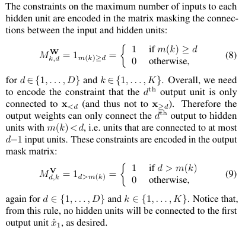
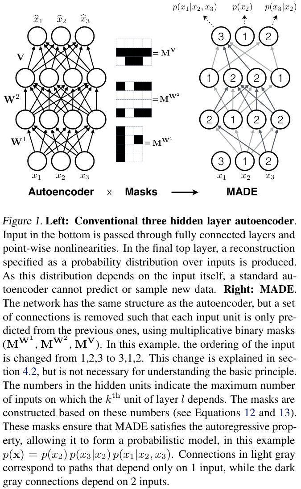
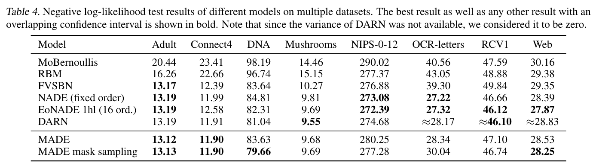

# MADE: Masked Autoencoder for Distribution Estimation

[Link to the paper](https://arxiv.org/abs/1502.03509)

**Mathieu Germain, Karol Gregor, Iain Murray, Hugo Larochelle**

*ICML 2015*

Year: **2015**

This paper introduces a modification of the classical autoencoders that enables probability density estimation.

The authors describe a simple masking mechanis over the parameters of an auto encoder that forces the autoencoder to respect the autoregressive constraints, i.e. each output is a function of the previous inputs given a prespecified ordering of input elements. This is an important constraint given that otherwise the output of the auto-encoder cannot be interpreted as a probability density. With the masking mechanism, the autoencoder reconstructs the inputs by modelling conditional distributions that can be multiplied to get a joint distribution probability (by direct application of chain rule of probabilities).

For describing the masking rules, the authors use a single hidden layer auto-encoder.

Over this architecture, the masking rules can be described as follows:

In a nutshell, the authors assign the hidden layer units with an integer index sampled from an uniform distribution where the minimum is  1 and the maximum is the number of units in the previous layer. Then, the mask of the first weight matrix is set to 1 for the units for which its number is >= the index of the previous layerm and 0 otherwise. The second matrix of weights is set to 1 for the units for which its index is strictly > than the index of the next layer, and 0 otherwise. The following figure shows an example of this.

In addition to all this, the authors provide two follow up experiments:
- Order agnosticity can be achieved by reshuffling the indices of the first layer for every minibatch.
- Connectivity anosticity can be achieved by sampling the indices for every layer in every minibatch or training example.

## Results

## Resources

- Blog post explaining the masking mechanism in detail: https://towardsdatascience.com/made-masked-autoencoder-for-distribution-estimation-fc95aaca8467