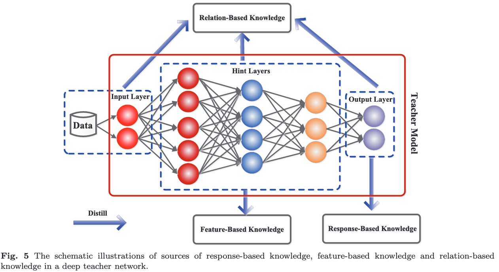

# Knowledge distillation: A survey

[Link to the paper](https://arxiv.org/abs/2006.05525)

**Jianping Gou, Baosheng Yu, Stephen J. Maybank, Dacheng Tao**

*Sydney AI Centre report*

Year: **2020**

This paper is a very complete review of the Knowledge Distillation field in the deep learning domain.

The authors organize the paper as depicted in the figure below.

Knowledge distillation is composed of three main parts:
- The knowledge
- The distillation algorithm
- The teacher-student architecture

## Background

Generally, the objective is to teach a small student by transferring the knowledge from a big teacher. The big teacher provides a supervision signal in form of soft-targets to the student.

The intuition behind why knowledge distillation works so well relies in the _dark knowledge_: the soft targets contain much more information than the hard targets.

More info about the vanilla knowledge distillation in [Hinton'15](hinton2015.md).

## Knowledge
There are three main sources of knowledge on the teacher network:
- Response based knowledge: residing in the output layer of the teacher network. The main idea consists of training the student so that it mimics the output of the teacher in form of soft targets.
- Feature based knowledge: residing in the different internal representations of the hidden layers of the teacher network. The main idea is to match internal representations of the teacher in the student network. If the architectures are very different each other, it may be useful to apply transformations in either sides to match those representations.
- Relation based knowledge: residing in the relation between different layers or data samples.

## Distillation schemas
There are three main algorithms to perform distillation:
- Offline distillation: requires two phases and one way knowledge transfer. The teacher is first trained, and then the predictions of the teacher are used to train the student.
- Online distillation: requieres one phase only and there are techniques that also leverage two-way knowledge transfer. The methods generally work by updating the teacher and student simultaneously. Mutual learning consists of having multiple neural nets learning collaboratively by assuming student/teacher roles during the training.
- Self distillation: a network early stage can be used to provide knowledge to a future stage. Also, knowledge from deeper sections of the network can be distilled into shallower sections.

## Teacher-student architecture
The relationship between the structures of the teacher and student are important. Here there are 5 main approaches:
1. The student is a simplified version of the teacher, with fewer layers and channels
2. The student is a quantized version of the teacher, the architecture is the same.
3. The student is a small version of the teacher, with efficient operations.
4. The student is chosen by Neural Architecture Search.
5. The student and teacher networks are the same.

Other remarks
- It is important to have in mind the model capacity gap between teacher and student. It can be reduced by using an assistant teacher, which closes the gap by modeling the residual error.

## Distillation algorithms
Multiple proposals are presented. The most remarkable are described below
1. Adversarial distillation: a GAN structure can be used either for (a)producing transfer data, (b) defining a KD loss function or (c) supervising online distillation. See figure below

2. Multi-Teacher distillation: combining multiple teachers may be very helpful. A naive way to accomplish that would be averaging the soft probabilities of all the teachers, but that may not be optimal. Multiple ideas are presented on the paper, for example one of them proposes choosing a different teacher from the pool at random in every training step.

3. Cross-model distillation: allows having a model when data or labels from some modality are not available at testing time.

4. Data-free distillation: new data can be synthesized (e.g. generated by a GAN) to train the student.
5. Quantization distillation: consists of defining a student with low precision weights (e.g. 2 bit) and distill the teacher knowledge into the student.

_______

The paper finishes by adding a comparison between different works and by describing different potential applications.