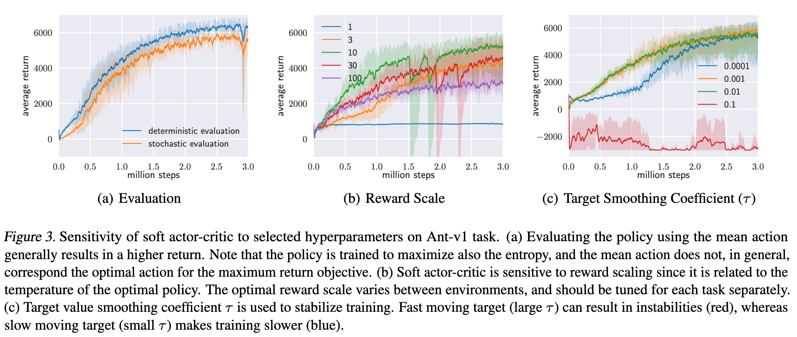

# Soft Actor-Critic: Off-policy maximum entropy deep reinforcement learning with a stochastic actor

**Tuomas Haarnoja, Aurick Zhou, Pieter Abbeel, Sergey Levine**

*International Conference of Machine Learning (ICML) 2018*

Year: **2018**

The main contribution of this work is the design of a off-policy stochastic policy-gradient algorithm, followed by an actor-critic of this characteristics.

- The off-policy algorithms hold some remarkable advantages over the on-policy ones. The most important one is its data efficiency. While the on-policy algorithms need to collect new data at each iteration step, the off-policy ones can re-use previously collected samples.
- This work is motivated by the recent success of the DDPG algorithm coupled with it's data efficiency.
- In this context, the authors suggest to elaborate a stochastic version of the DDPG algorithm that implements a maximum entropy component in order to enhance and automate exploration.
- While standard RL maximizes the expected sum of rewards $\sum_t\mathbb{E}_{(s_t, a_t)\sim p_\pi} [r(s_t, a_t)]$, the maximum entropy introduces a new term to the same equation: $\sum_t\mathbb{E}_{(s_t, a_t)\sim p_\pi} [r(s_t, a_t) + \alpha \mathbb{H}(\pi(\cdot|s_t))]$ where $\mathbb{H}$ is the entropy function and $\alpha$ is known as the temperature parameter that controls how strong the entropy is with regards to the reward term.
- The entropy maximization has a very interesting effect on how the agent behaves and explores the environment. The agent no longer seeks greedely to improve the reward, but it now has incentives to find new+good solutions. This enables it to get scores from both terms of the objective function.
- The authors derive the soft-policy algorithm by first defining the soft-Bellman operator (Bellman equation with the entropy term): $T^\pi Q(s_t, a_t)\triangleq r(s_t, a_t) + \gamma \mathbb{E}_{s_{t+1}\sim p, a_t\sim\pi} [Q(s_t, a_t) - log\pi(a_t|s_t)]$ and prove its convergence
- The authors then derive policy improvement step which consists on projecting the policy into a known distribution form (e.g. Gaussian) using the KL divergence. In this case, the KL divergence is calculated between the policy and the softmax of the Q values. $\pi_\text{new} = \argmin_{\pi'\in \Pi} D_\text{KL}\left(\pi'(\cdot|s_t) \rvert\rvert \frac{\exp(Q^{\pi_\text{old}}(s_t, \cdot))}{\sum_a\exp{Q(s_t, a)}}\right)$. The authors prove optimality guarantees.
- After all this, the authors derive the final algorithm which is applicable to continuous action spaces and non-linear approximators.

The soft actor critic algorithm proposed consists of three pieces:
- A value function: $J_V(\sigma) = \mathbb{E}_{s_t\sim D}[\frac{1}{2}(V_\sigma(s_t) - \mathbb{E}_{a_t\in\pi_\phi}[Q_\theta(s_t, a_t - \log\pi_\phi(a_t|s_t)])^2]$ where $D$ is the replay buffer. In this case the loss function is aiming to minimize the MSE between the current estimate and the value function estimated from the Q value aggregation over actions with the entropy term.
- The soft Q-function using the bellman equation described before $J_Q(\theta) = \mathbb{E}_{s_t, a_t}\sim D \left[\frac{1}{2}(Q_\theta(s_t, a_t) - \hat{Q}(s_t, a_t))^2\right]$ where $\hat{Q}(s_t, a_t) = r(s_t, a_t) + \gamma\mathbb{E}_{s_{t+1}\sim p} [V_{\bar\sigma}(s_{t+1})]$. Here, $V_{\bar\sigma}$ refers to a target network for the value function.
- Finally, for the KL divergence of the policy, the authors suggest a reparametrization and the final objective looks as follows: $J_\pi(\phi) \mathbb{E}_{s_t\sim D,\epsilon_t\sim N}\left[\log\pi_\phi(f_\phi(\epsilon_t;s_t)|s_t) - Q_\theta(s_t,f_\phi(\epsilon_t;s_t))\right]$. Here, $f$ refers to the reparametrized policy $a_t = f_\phi(\epsilon_t;s_t)$ and $\epsilon$ is just the noise vector associated with the reparametrization.

As a trick of the trade, the authors recommend using something similar to the Fujimoto's trick for avoiding the overestimation bias introduced by the q-functions: take the minimum over multiple estimators (2 in this case), to build a pessimistic estimate of the Q function.

The algorithm is described below.

## Results
The current proposal (SAC) is compared with the deterministic counterpart (DDPG) and other state of the art algorithms (TD3, SQL and PPO). The results (summarized below), show a substantial improvement in performance vs the other algorithms.

In addition to the results, an ablation analysis has been performed to analyse the robustness of the algorithm against changes in the hyperparameters.

## Additional referneces
- Blog post walk through https://towardsdatascience.com/in-depth-review-of-soft-actor-critic-91448aba63d4