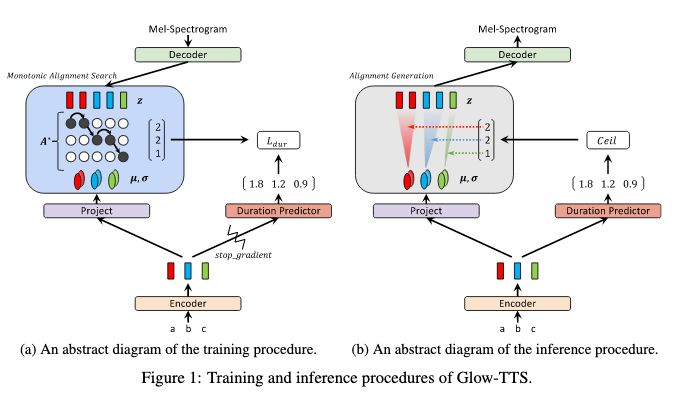
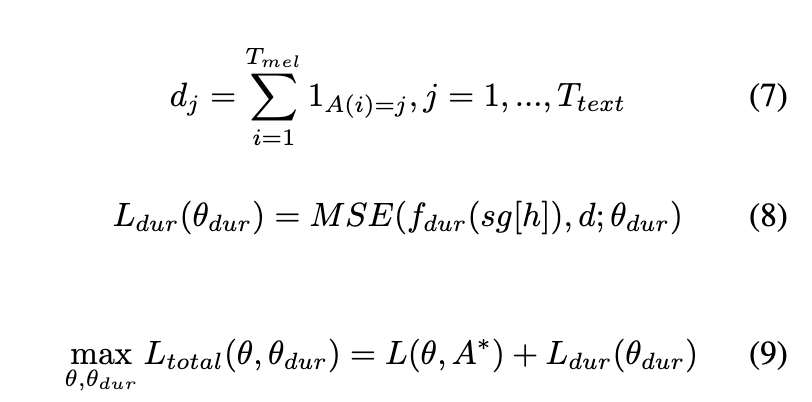
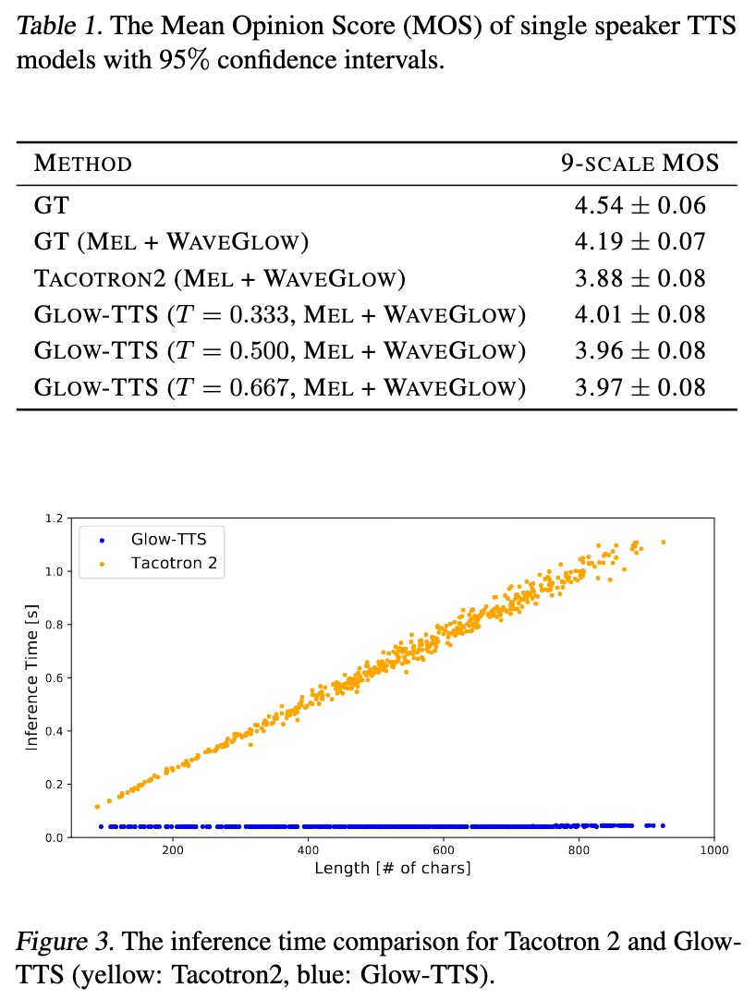

# Glow-TTS: A generative flow for text-to-speech via Monotonic Alignment Search

[Link to the paper](https://arxiv.org/abs/2005.11129)

**Jaehyeon Kim, Sungwon Kim, Jungil Kong, Sungroh Yoon**

*Neural Information Processing Systems (NeurIPS) 2020*

Year: **2020**

Samples:  https://bit.ly/2LSGPXv

Code: https://bit.ly/2LD7O0a

This work presents an alternative to Tacotron2-like model for TTS that allow much faster and parallel inference. The authors achieve this by using Glow and a mechanism to avoid training an external duration model: the Monotonic Alignment Search (MAS).

Autoregressive models like Tacotron2 have 2 main disadvantages: (1) they are slow at inference time as they cannot be parallelized, (2) they suffer from attention losses (instabilities in the attention map). FastSpeech-like models are a good alternative to Tacotron2 allowing parallel inference, but they still need an external durantion encoder which, generally, is autoregressive..

The authors propose eliminating the need for an external duration model by using a model that learns its own alignment. Glow-TTS is trained to maximize the log likelyhood of the output spectrograms given text while providing a parallel sampling mechanism (inference). The model is based on Glow, a normalizing flow that allows estimating the exact likelyhood of the data by using invertible transformations.

The model has mainly 4 pieces:
- $x$ -> $z$: a decoder takes mel spectrograms and transforms them to a latent space with known distribution (e.g. gaussian).
- $c$ -> $\mu, \sigma$: an encoder that projects each input token into the parameters of a distribution.
- The alignment $A$: computes through the MAS mechanism described below the alignment between the input tokens and the output spectrograms frames in a form of a hard attention.
- A duration prediction model that learns the alignments of the previous step and which will be queried at inference time.

The model is trained in two iterative steps (1) improve the alignment $A$ (2) improve the decoding accuracy $\theta$.

Apart from that, the MAS process is in charge of determining the most probable alignment (maximizing the log likelihood on $A$) and that is used to calculate an extra component of the loss function which accounts for the duration model fit.

The results proved to be similar to the ones from Prosotron2 but the model runs 15 times faster.

The additional benefit highlighted by the authors relies on the variability of the syntheses due to the fact that in this model we sample from the sample distribution. In the tacotron model, the variability just comes from the dropout.