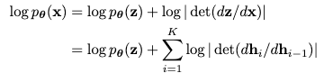
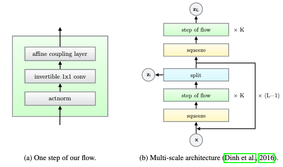
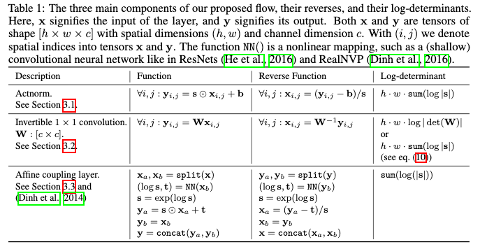
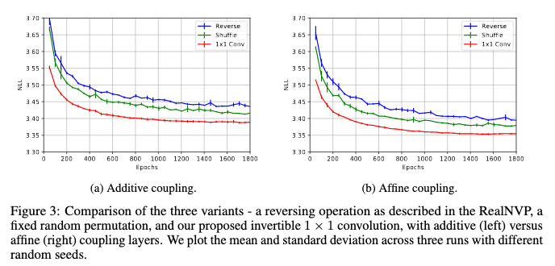
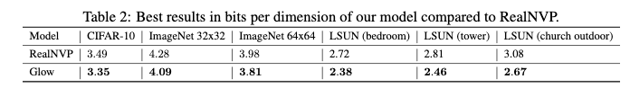
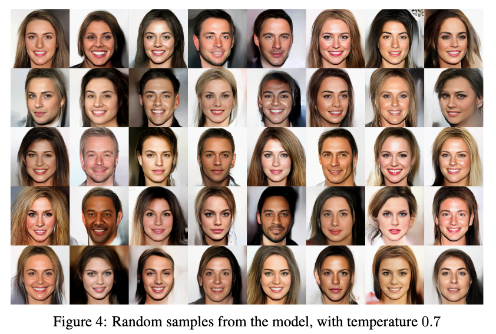
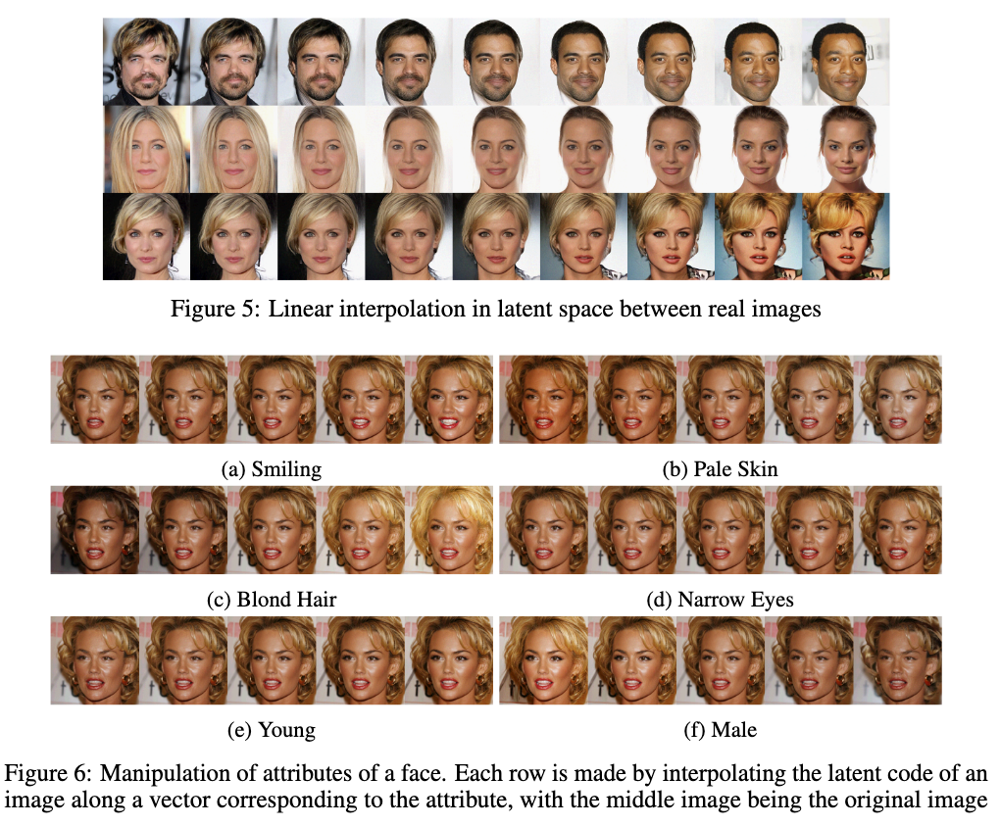

# Glow: Generative Flow with Invertible 1x1 Convolutions

[Link to the paper](https://arxiv.org/abs/1807.03039)

**Diederik P. Kingma, Prafulla Dhariwal**

*NeurIPS 2018*

Year: **2018**

Implementation: http://github.com/openai/glow

This paper introduces GLOW, a normalizing flow based generative model that achieves high quality image syntheses.

Normalizing flows are very appealing when it comes to generative models due to the following reasons:

* Unlike VAEs, we can get the exact latent-variable inference and log-likelyhood evaluation. There is no encoder and decoder, a normalizing flow consists of an invertible network, so that we can do $x \rightarrow z$ or $z \rightarrow x$ using the same function $f$, as it is bijective.
* Unlike PixelCNN and other AR models, the flows allow efficiently train and do inference. It is easy to parallelize.
* Unlike GANs or AR models, the normalizing flows provide a latent space distribution which can be used for downstream tasks.

## Background

Generative process: sample z from prior, generally $N(0, 1)$ ($z \sim p_\theta(x)$) and then transform the latent vector $z$ into a sample $x$ by using using the invertible function $g$ ($x = g_\theta(z)$).

The functions used in glow are composed of sequential transformations: $f_1 o f_2 o ... o f_k$.

The PDF of the model given a data point can be written as follows, where $h_0$ and $h_k$ are $x$ and $z$, respectively.

The log-determinant of the absolute value of the Jacobian matrix can be easily computed as long as the transformations of the flow lead to a triangular Jacobian Matrix, where the determinant is just the sum of all the diagonal vectors.

## Proposal

This paper describes the flow block, which is then pluged into the multi-scale architecture defined by Dinh et al. This block consists of 3 steps: a normalization, an invertible 1x1 convolution, and an affine coupling layer.

* Normalization: the authors propose using Actnorm, instead of Batchnorm, that was used previously, as it is data independent and allows training with size-1 batches. It consists of a BatchNorm like layer with learnable scale and bias.
* Invertible 1x1 convolutions: in the flows framework, a permutation operation is needed here. **Predefined** solutions such as reversing or shuffling have been traditionally used here. The authors propose using a **learned** 1x1 convolution, which when the input and output channels are identical, is a generalization of a permutation operation. To allow for a simple determinant, the authors recommend initializing the weights to a random rotation matrix (which has a determinant of zero until trained), together with a LU decomposition of the weight matrix.
* Affine coupling layers: A series of steps described in the table below. Some tricks are described by the authors: (1) the last convolution weights are initialized to zero so that each affine coupling layer initially performs an identity function. (2) the split is done only along channels dimension for obvious simplicity reasons. (3) permutation: 1x1 convolutions are used.

## Results

Quantitative

Qualitative

