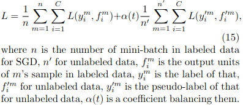
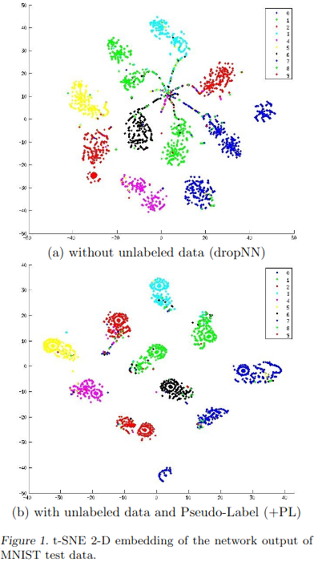
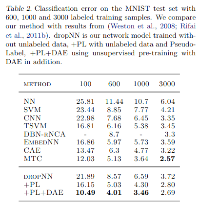

# Pseudo-Label: The Simple and Efficient Semi-Supervised LearningMethod for Deep Neural Networks

[Link to the paper](https://www.researchgate.net/profile/Dong-Hyun-Lee/publication/280581078_Pseudo-Label_The_Simple_and_Efficient_Semi-Supervised_Learning_Method_for_Deep_Neural_Networks/links/55bc4ada08ae092e9660b776/Pseudo-Label-The-Simple-and-Efficient-Semi-Supervised-Learning-Method-for-Deep-Neural-Networks.pdf)

**Dong-Hyun Lee**

*International Conference Of Machine Learning (ICML 2013)*

Year: **2013**

This paper presents a simple yet powerful semi-supervised technique to improve generalization by combining supervised and unsupervised training.

The authors propose a new training method consisting on using part of the data as labeled data, and part of the data as unlabeled data. For the unlabeled data, Pseudo-Labels are generated by picking up the class with higher probability (given by the model being trained). These labels are used as if they were true labels. Formula of the loss of this new training procedure below.

This method is motivated in the Entropy Regularization method. When minimizing the entropy of the unlabeled data, the overlap between the class probability distributions is reduced, leading to low-density separation between classes.

Because neighbors of a data sample have similar activations, it is also likely that high-density regions have the same label. This method encourages the network output to be less sensitive to variations in the directions of the manifold.

## Example of class density

## Results using MNIST and different sizes of labelled samples
