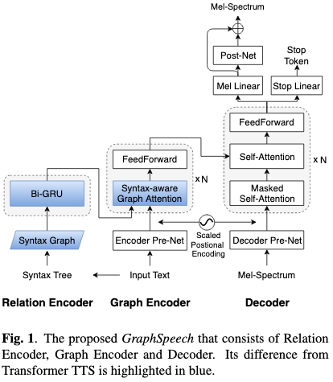

# GraphSpeech: Syntax-Aware Graph Attention Network For Neural Speech Synthesis

[Link to the paper](https://arxiv.org/abs/2010.12423)

**Rui Liu, Berrak Sisman, Haizhou Li**

*ICASSP 2021*

Year: **2021**

The current paper develops the idea of adding syntactic information along with the input text to a neural TTS system. This is done by using graph neural networks.

The architecture proposed is summarized in the following diagram

As it can be seen in the diagram, two new encoders are proposed.
1. Relation encoder: takes as input the syntax tree precalculated from the input text and processes it as a graph, where instead of directed connections, it contains undirected ones.
2. Graph encoder: merges the input text with the relations extracted by the relation encoder in a syntax-aware graph attention mechanism

The decoder of the model is an autoregressive branch with transformer architecture (i.e. masked self-attention and encoder attention). Its outputs are the mel spectrogram frames and the stop token.

The results show that GraphSpeech performs better than a transformer, although the subjective tests sample is very small.

