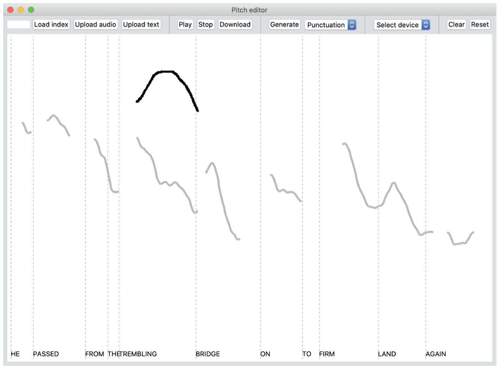
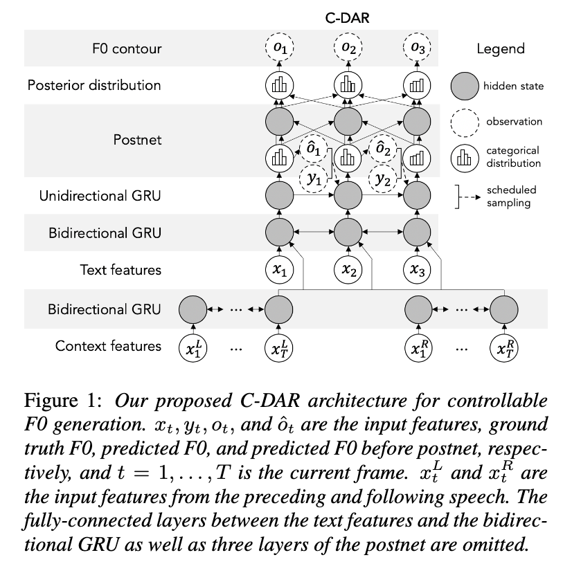
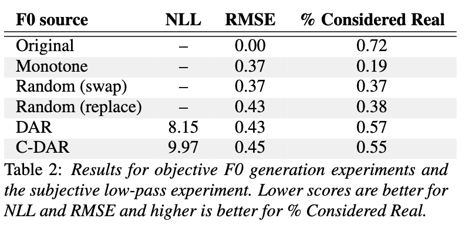
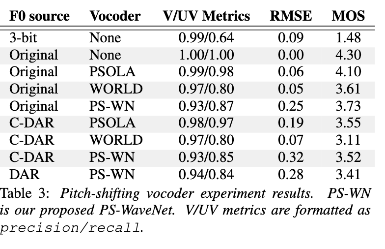

# Controllable Neural Prosody Synthesis

[Link to the paper](https://arxiv.org/abs/2008.03388)

**Max Morrison, Zeyu Jin, Justin Salamon, Nicholas J. Bryan, Gautham J. Mysore**

*Interspeech 2020*

Year: **2020**

Audio samples: [Link](https://www.maxrmorrison.com/sites/controllable-prosody/)

This paper delves into interactive controllable prosody by proposing two models (1) an f0 signal generator and (2) a pitch shifting neural vocoder.

The idea of the f0 controllability consists of the user modifying the f0 signal (by drawing), and the model to recalculate the new-modified f0 signal so that it resembles a natural one. See picture below.

The paper focuses on model (1), while they point to an implementation for model (2).

## f0 generator
The authors base their model in a Deep Auto-Regressive neural network, to which they add conditioning on the modified f0 signal.

The conditioning consists of 3 pieces that are passed as input.
1. Previous and next sentences (to condition on context). Note that this is a bit of a simplification, see section 2.3 of the paper for more details.
2. Random segments of the ground truth f0 contour (on training)
3. F0 is predicted in reverse order (?)

For evaluating the generator, as the bigger contour overrides will generate artifacts at high frequencies, the authors decided to apply a low pass filter at f0+10Hz and ask the participants of the manual evaluation to evaluate the intonation only.

## Results
DAR is the benchmark, published in a previous study. DAR does not condition on F0.

