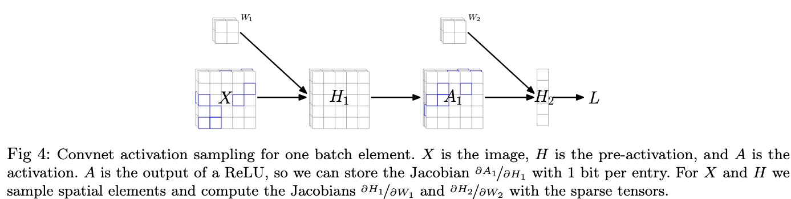

# Randomized Automatic Differentiation

[Link to the paper](https://arxiv.org/abs/2007.10412)

**Deniz Oktay, Nick McGreivy, Joshua Aduol, Alex Beatson, Ryan P. Adams**

*ICLR 2021*

Year: **2021**

Code repository: [Link](https://github.com/PrincetonLIPS/RandomizedAutomaticDifferentiation)

This paper poses the following question: _why spend resources on exact gradients when we're going to use stochastic optimization?_

As the question suggests, the use of stochastic gradient descent motivated the authors to experiment towards noisy and cheaper estimations of the gradient seeking for more resource efficient deep learning algorithms. They also highlight the hypothesis that injecting gradient estimations with higher variance could have regularizing effects. One of the keys highlighted since the introduction is the need for an __unbiased__ estimator.

The paper starts with an introductory section to Automatic Differentiation (AD), where the Bauer formula for derivating LCG-DAGs comes into place.

The idea suggested on this paper builds over the Bauer formula. The authors suggest to consider an unbiased estimator of the jacobian $\hat{J}_\theta[f]$ (where $\theta$ are the parameters and $f$ is a derivable function like a neural network) such that $\mathbb{E}\hat{J}_\theta[f] = J_\theta[f]$. For that, the idea is to define sparse linearized computation graphs to reduce the amount of intermediate variables to store.

The paper develops the idea of sample paths uniformly at random by replacement through the usage of random matrix injections. Example below.

Let's consider we want to sample the path marked in the image above. The exact gradient of $y$ with respect to $\theta$ would be defined as follows:

If we wanted just to consider the marked path, the following equation can help us calculate the gradient.

The P matrices are zero matrices with just one 1 in one of the elements of the main diagonal. They are useful as right multiplying a Jacobian matrix by one of these P matrices is exactly equivalent to choosing only one vertex of the graph.

The inline formula highlighted in the red square of the previous paragraph extends the idea of right-multiplying by P to multiple samplings with replacement.

There are also additional tricks to decrease the need for intermediate results storage. There are Jacobians that can be represented in more condensed ways: e.g. element-wise operations have diagonal Jacobians, which can be easily condensed as a vector.

_______
The authors extend this formulation to neural networks, and run experiments in multiple architectures, concluding that the described framework in essence, is equivalent to randomly deactivating activations on backpropagation time.The following figure depicts it for a CNN.

The following figure summarizes the results achieved.

Definitions of the lines represented in the figures:

* The baseline is the neural network trained with a batch size of 150, and with stochastic gradient descent with normal AD.
* The reduced batch is the same as the baseline, but with a batch size of 20, which achieved the same memory budget as the RAD experiments
* "Same sample" applies RAD using the same path sample across batch elements
* "Different batch" draws different independent RAD samples across batch elements.

The conclusion is that the neural networks with RAD converge faster than the neural networks with exact AD, at a much lower cost.
