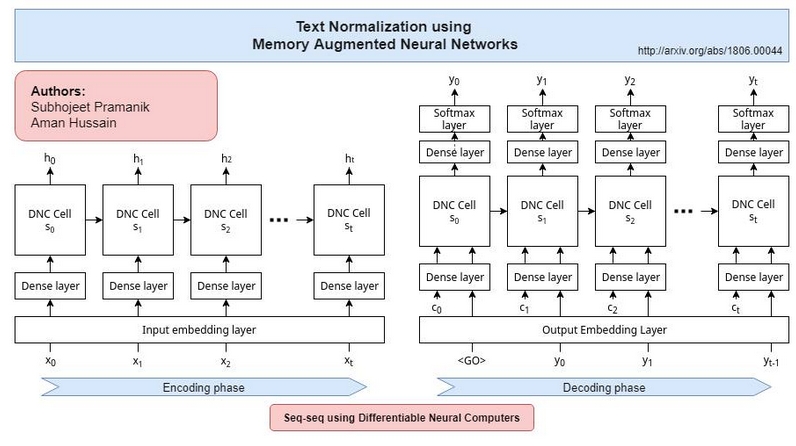
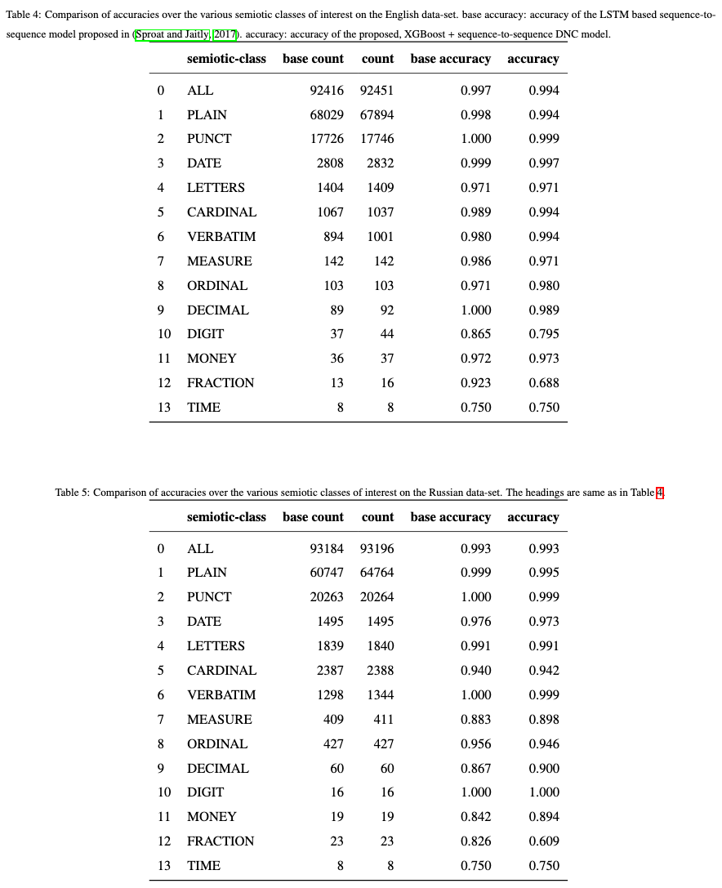

# Text Normalization Using Memory Augmented Neural Networks

[Link to the paper](https://arxiv.org/abs/1806.00044)

**Subhojeet Pramanik, Aman Hussain**

*Speech Communication*

Year: **2019**

Implementation: https://github.com/cognibit/Text-normalization-demo

The current paper shows that it is possible to do text normalization using memory augmented neural networks with the help of an XGBoost.

Text normalization is the task consisting on transforming text from written to spoken form. Example below. It is still a challenging task for deep learning algorithms, and apparently some efforts using LSTMs failed at it. One of the potential reasons of failure the authors provide in the paper is the fact that the normalization data is very sparse: in the English and Russian dataset used in this study, 92.5% of the tokens didn't need normalization. The dataset contains the unprocessed sentences, the processed ones, and a token-wise semiotic class indicating the type of token (PLAIN, PUNCT, TRANS, LETTERS, CARDINAL, MONEY, etc).

_The new model is priced at $312_ __to__ _The new model is priced at three hundred and twelve dollars_.

The approach suggested by the authors is to use an XGBoost to pre-filter the tokens that need normalization, and once that has been done, use a Differential Neural Computer to process the annotated sentence. A differential Neural Computer is a neural network with a matrix of memory, and read and write heads that can process different memory locations.

- The XGBoost is provided with a token and the two neighboring tokens as a vector of numerical labels. Then it is trained to predict a binary outcome: NeedsNormalization or DoesNotNeedNormalization. The authors claim having AUC ROC of around 0.998. Once the model is trained the sentences are anotated with a tag indicating where each sentence needs normalization. Example: _City is [norm] 15km [/norm] away_.
- The differential neural computer is provided with the tagged sentences as input, and produces the normalized token as output (only what is inside the norm tags). The architecture is depicted in the figure below.

The results are shown in the following tables.

