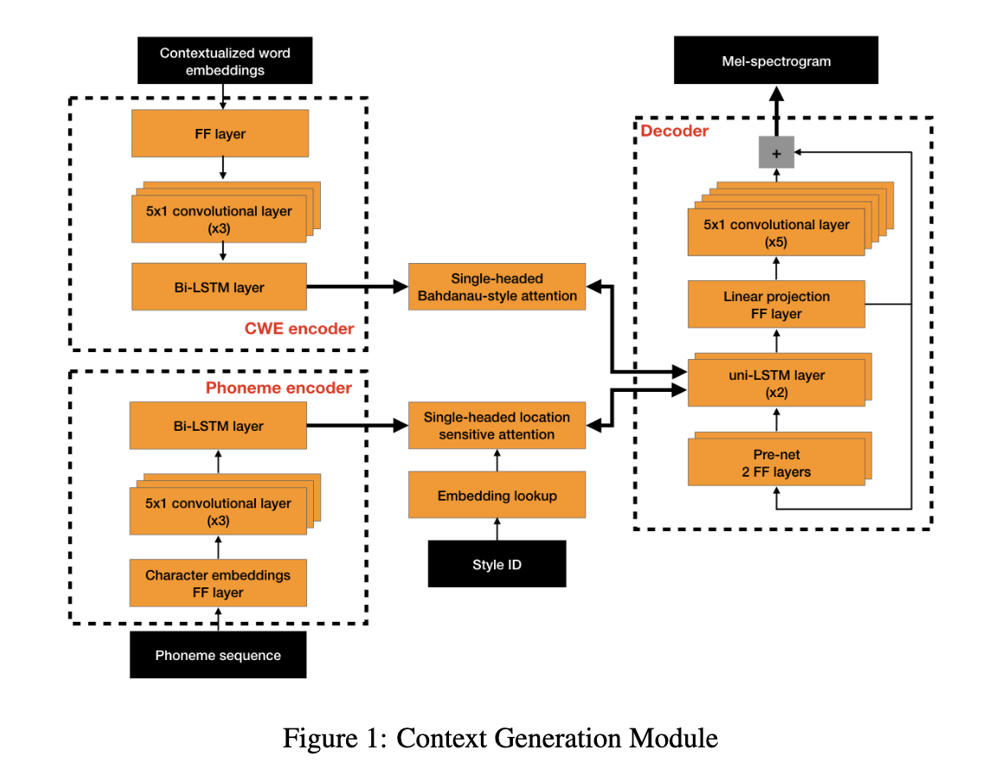
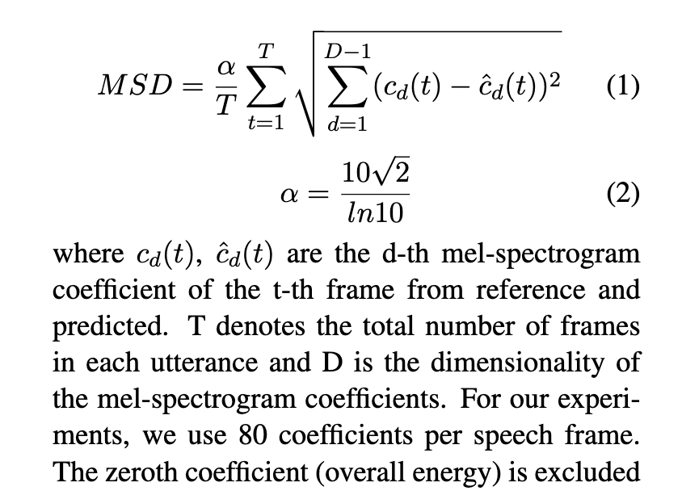
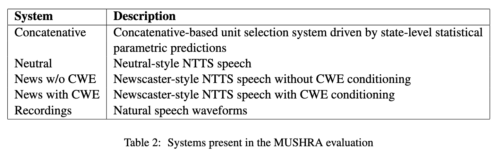
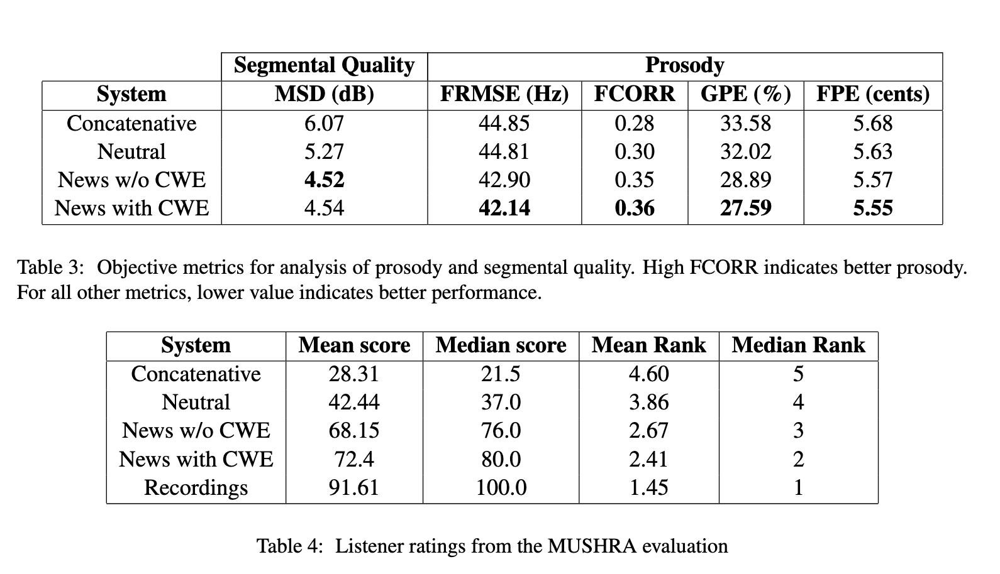
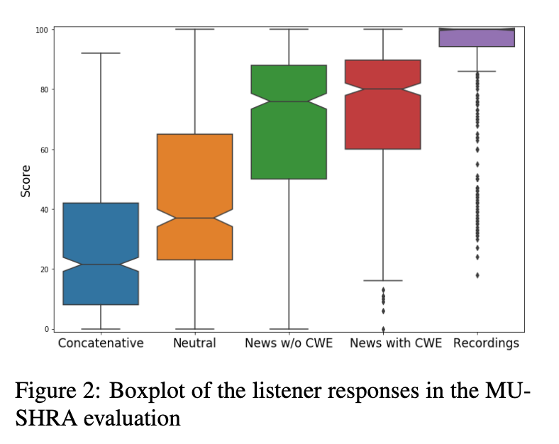
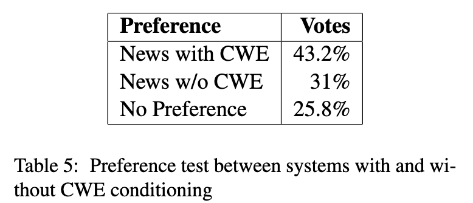

# In Other News: A Bi-style Text-to-speech Model for Synthesizing Newscaster Voice with Limited Data

[Link to the paper](https://arxiv.org/abs/1904.02790)

*North American Chapter of the Association for Computational Linguistics: Human Language Technologies, 2019*

**Nishant Prateek, Mateusz Łajszczak, Roberto Barra-Chicote, Thomas Drugman, Jaime Lorenzo-Trueba, Thomas Merritt, Srikanth Ronanki, Trevor Wood**

The current work addresses the problem of introducing prosodic variations in end to end Neural Text To Speech synthesis (NTTS). In this case, the authors conditioned the model to generate sequences with newscaster prosodics, only using adding small subset of < 5h of data.

Synthesising newscaster-style speech commands is commercially relevant given that it's a feature that can be implemented into virtual assistants for listening to daily news.

The method described in the paper consists of two modules:
- **Context generator**: a sequence-to-sequence architecture that takes phonemes and word embeddings as input for two separated RNN based encoders, and then decode that information into acoustic features (more specifically Mel-spectrogram components).  Attention mechanisms (location sensitive) are used to attend to the two encoded inputs. The architecture contains an extra input for specifying if the decoder should synthesize a newscaster style or a normal style. This input, named *styleID* by the authors, is projected into a continuous space using an embedding lookup which is concatenated to the output of the phoneme encoder. Below, a figure describing of the architecture used is provided.

- **Waveform Synthesis**: the spectrograms outputted by the context generator can be converted into a high fidelity wavelength using a vocoder. The vocoder implemented is the rnn-based vocoder proposed by Lorenzo-Trueba et al.

The decoder of the context generator produces blocks of 5 frames of 80-dimensional mel-spectrograms. Each frame is a 50ms sequence, with a 12.5ms overlap between frames. The last frame of the output is passed to the pre-net of the pre-net layer to generate the next set of frames in an autoregressive fashion. The model is teached using teacher-forcing.

The word embeddings used in this model are the pre-trained 1024-size ELMo vectors. They seem to be a good fit for modeling prosody due to the fact that they contain context and semantics.

The models have been trained using around 20h of data at sentence-level. L1-loss has been used for the mel-spectrogram outputs and L2-loss output was used for the stop-token fitting. The stop-token is just an additional decoder scalar output that, in train, it was just a number increasing from zero to one as the acoustic features were being generated.

The metrics used for evaluate the models can be split into quantitative and qualitative. Among the quantitative ones we have:
- Mel-Spectrogram distortion (MSD) which measures a normalized version of a RMSE between the original recordings and the generated ones (aligned using dynamic time wrapping algorithm)
  
- FRMSE: measuring the error in the fundamental frequency (prosodics)
- FCORR: F0 Linear Correlation coef between the generation and the reference
- Gross Pitch Error: Percentage of F0 deviations > 20%
- Fine Pitch Error: Std of F0 relative errors with deviations > 20%

For the quantitative (subjective part), a set of 10 english listeners was asked to score recordings from 0 to 100 (100 being perfect), when facing the same content generated by each of the benchmarks (described below). The MUSHRA methodology (referenced in the paper) was used.

The results are shown below.

The authors also did a survey asking the respondents to score the generations on how pleasing they find them. They aggregated the results depending on if the users chose the news with embeddings, without embeddings, or no preference.

