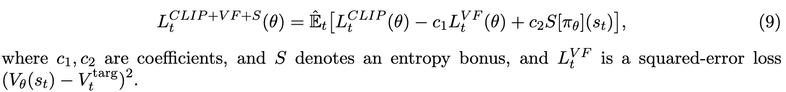

# Proximal Policy Optimization Algorithms

[Link to the paper](https://arxiv.org/abs/1707.06347)

**John Schulman, Filip Wolski, Prafulla Dhariwal, Alec Radford, Oleg Klimov**

*OpenAI Report*

Year: **2017**

The current work follows up from the TRPO development. The authors suggest an alternative to TRPO which is much simpler to implement. The algorithm is called PPO (Proximal Policy Optimization) and showed to perform very well and in a stable way.

The new objective function proposed in the current work relies on clipped probability ratios, as we will describe later.

First, the authors introduce the policy gradient methods, where the objective function is defined as follows. The gradient can be obtained by deriving the objective.

$$L^{PG}(\theta) = \hat{\mathbb{E}}_t \left[\log\pi_\theta(a_t|s_t)\hat{A_t}\right]$$

Secondly, the authors summarize the TRPO objective as follows, where $\delta$ is a hyperparameter.

$$\argmax_\theta \quad \hat{\mathbb{E}}_t \left[\frac{\pi_\theta(a_t|s_t)}{\pi_{\theta_{old}}(a_t|s_t)}\hat{A}_t\right]$$

$$\text{subject to }\quad \hat{\mathbb{E}}_t \left[KL[\pi_{\theta_{old}}(a_t|s_t), \pi_\theta(a_t|s_t) ]   \right]\leq \delta$$

Although the theory justifies the use of the KL divergence term as a penalty, the authors suggested to use it as a constraint to allow bigger updates of the parameters.

## Proposal
PPO Starts from the unconstrained objective of the TRPO algorithm (known here as conservative policy iteration, CPI hereafter), and redefine the probability ratio as $r_t({\theta})=\frac{\pi_\theta(a_t|s_t)}{\pi_{\theta_{old}}(a_t|s_t)}$. Then, the CPI loss has this form.

$$L^{CPI}(\theta) = \hat{\mathbb{E}}_t\left[ \frac{\pi_\theta(a_t|s_t)}{\pi_{\theta_{old}}(a_t|s_t)}   \hat{A}_t \right] = \hat{\mathbb{E}}_t\left[ r_t({\theta})   \hat{A}_t \right]$$

Without a constraint, the algorithm easily diverges due to too large and destructive policy updates. The authors suggest solving that problem by redefining the objective as follows:

$$L^{CLIP} (\theta) = \hat{\mathbb{E}}_t\left[ \min \left(r_t({\theta})   \hat{A}_t,\quad \text{clip}(r_t(\theta), 1-\epsilon, 1+\epsilon)\hat{A}_t\right) \right]$$

Some considerations:
- The first term is the $L^{CPI}(\theta)$ objective
- The second term is the $L^{CPI}(\theta)$ with the $r_t(\theta)$ value clipped to $[1-\epsilon, 1+\epsilon]$. This, in the words of tha authors, removes the inventive of moving $r_t(\theta)$ outside that interval.
- $\epsilon$ is a hyperparameter; the authors recommend using $\epsilon=0.2$.
- The final objective $L^{CLIP}$ is a lower bound on the unclipped objective, as it is calculated as the minimum between the unclipped onbjective and the clipped one.
- With the clipping, we only limit the change in the policy when it makes the objective worse.
- The probability ratio is clipped on the left or on the right side depending on the sign of the advantage value.

The following diagram shows how the probability ratio $r_t(\theta)$ is clipped depending on the sign of the advantage value.

Here we see that the new objective clips the probability ratio in the following cases:
- The advantage function shows a positive surprise and the probability of the new policy is more than $1+\epsilon$ times the old probability (i.e. $r_t(\theta)\geq 1+\epsilon$)
- The advantage function shows a negative surprise and the probability of the new policy is less than $1-\epsilon$ times the old probability (i.e. $r_t(\theta)\geq 1+\epsilon$)

In the rest of the cases, $L^{CLIP}(\theta) = L^{CPI}(\theta)$

The following figure gives intuition on how different objective functions vary as we interpolate along the new policy direction. The new policy has been chosen so that the KL divergence with the old policy is 0.2.

The authors also suggest other approach consisting on implementing the $L^{CPI}$ loss with an adaptive penalty in the KL divergence coefficient. However, they report that the previous formulation showed better results in practice.

## Implementation notes
- The proposed algorithm is very similar to the vanilla policy gradient
- If a value function estimation is chosen to share parameters with the actor network, then it must be added as an extra component to the network loss.
- Usually, an additional term referred as entropy bonus is added in order to automatically handle exploration.

The algorithm is very simple to implement.

## Results
In the following table, the authors compare three versions of the current algorithm averaged over 21 runs (3 runs x 7 MuJoCo tasks), and also against other algorithms.

Finally, the authors share a table with the results over all the Atari games and compare them with A2C and ACER algorithms.

