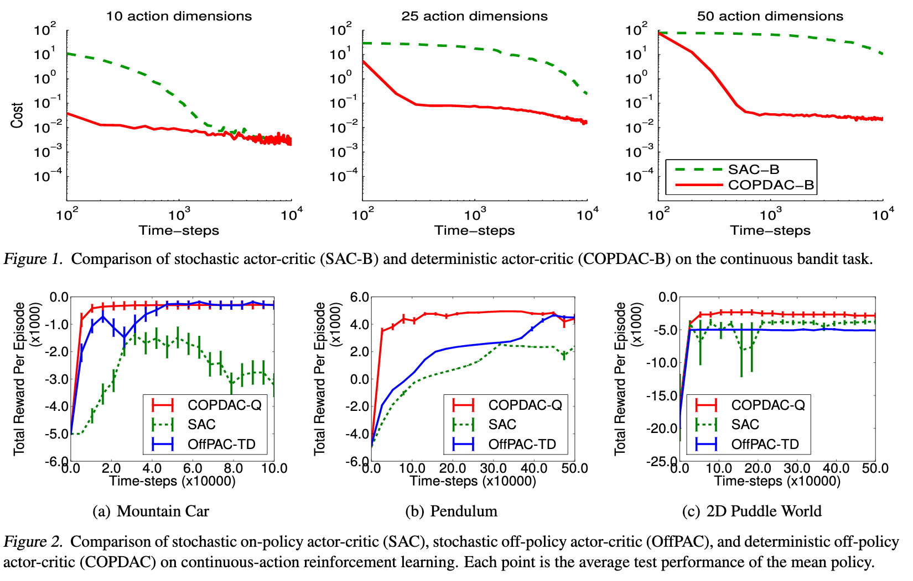

# Deterministic Policy Gradient Algorithms

[Link to the paper](http://proceedings.mlr.press/v32/silver14.pdf)

**David Silver, Guy Lever, Nicolas Heess, Thomas Degris, Daan Wierstra, Martin Riedmille**

*Proceedings of the 31st International Conference on Machine Learning, 2014*

Year: **2014**

This paper develops the idea of a deterministic policy gradient algorithm for continuous action-space problems. The authors found the policy gradient function, consisting basically of following the gradient of the action-value function. Finally, the authors derive several actor-critic algorithms that follow the deterministic policy gradient theorem.

Notation comment: the authors refer to the deterministic policies with the greek letter $\mu$ and for the stochastic policies with the greek letter $\pi$ (as usual in the latter case).

One of the main differences found between the stochastic policy gradient and the deterministic counterpart is that the first one is an expectation over the states and the actions while the second one, as it is deterministic, is to be an expectation over the states (an not over the actions). This helps with data efficiency.

The authors study how to apply the generalised policy iteration (interleaving policy evaluation and improvement) for the continuous-action-space case. They conclude that greedy policy improvement (commonly used method with stochastic policies) is infeasible, as it would require global optimization techniques at every step. As an alternative, they suggest to update the parameters of the policy so that the action-value function increases. More formally, at each step the policy parameters $\theta$ are updated in proportion to the gradient $\nabla_\theta Q^\mu (s,\mu_\theta(s))$; several gradient steps are averaged by taking an expectation with respect to the state distribution.

This operation, as described below, can be done by simply applying the chain rule, and hence obtaining the gradient of Q w.r.t the actions, and the gradient of $\mu$ with respect to the policy parameters ($\frac{\delta Q}{\delta \theta} = \frac{\delta Q}{\delta a}\frac{\delta \mu}{\delta\theta}$ where $a=\mu_\theta(s)$).

$$\theta^{k+1} = \theta^{k} + \alpha\mathbb{E}_{s\sim {{p^\mu}^k}}\left[\nabla_\theta Q^{\mu^k}(s,\mu_\theta(s))\right]$$

Applying the chain rule.

$$\theta^{k+1} = \theta^{k} + \alpha\mathbb{E}_{s\sim {{p^\mu}^k}}\left[\nabla_\theta\mu_\theta(s)\nabla_a Q^{\mu^k}(s,a)|_{a=\mu_\theta(s)}\right]$$

In plain english: update the policy proportionally to the gradient of the action value function.

The authors also show that the current formulation is equivalent to the stochastic policy gradient when the variance tends to zero.

From here, the (1) on-policy and (2) off-policy deterministic actor critic algorithms are derived, where the Q function is estimated as opposed to using MC rollouts. (1) is just a theoretical exercise, as no exploration is allowed on-policy. In this framework, the critic is updated by using TD-learning and the estimated function is used to update the actor. (2) in this case, the process looks the same because the deterministic policy gradient removes the integral over actions and hence there is no need for the importance sampling factor. There is also no need for importance sampling in the critic loss given that Q-Learning algorithm is used.

The big limitation in this algorithm is that the Q function can only be estimated using a linear model that optimises the MSE (proof in the paper, in the compatible function approximation section, 4.3).

## Results
The algorithm is tested over the following environments:
- Continuous bandit
- Continuous variants of the standard reinforcement learning tasks (mountain car, pendulum, and 2d puddle world)
- Octopus arm

The experiments show an excellent convergence speed over the stochastic counterparts, as shown in the figure below.

