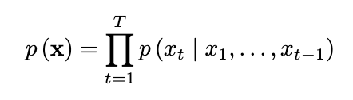
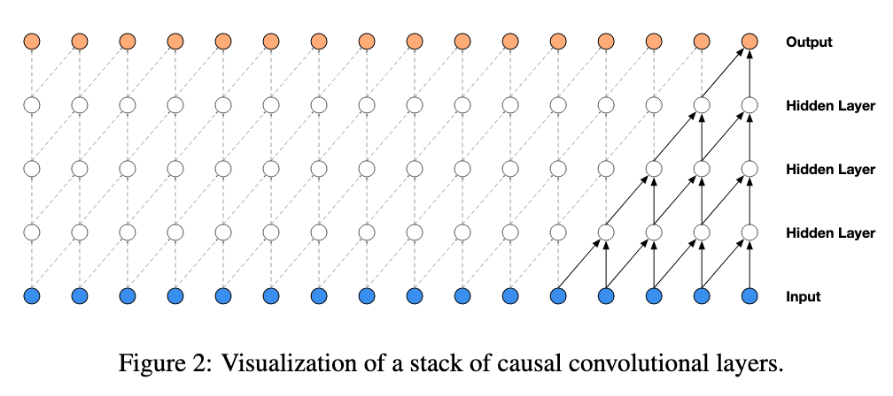
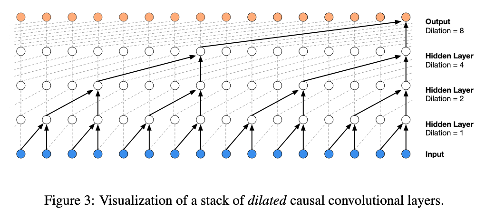
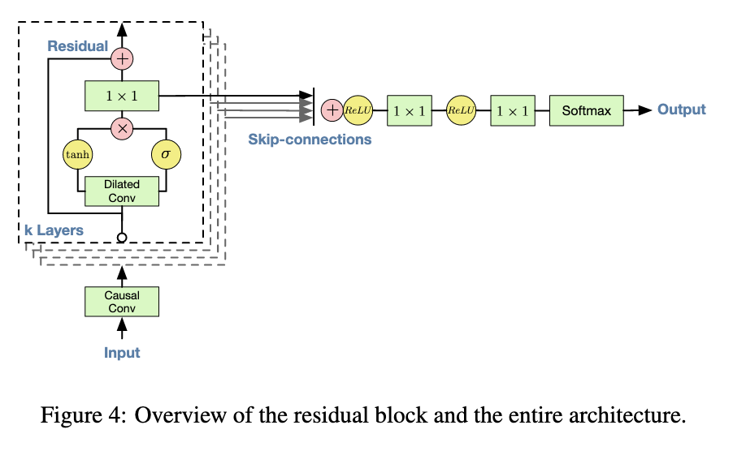
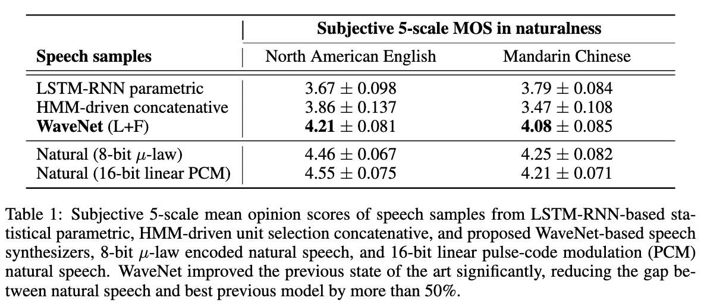

# WaveNet: A Generative Model for Raw Audio

[Link to the paper](https://arxiv.org/abs/1609.03499)

**Aaron van den Oord, Sander Dieleman, Heiga Zen, Karen Simonyan, Oriol Vinyals, Alex Graves, Nal Kalchbrenner, Andrew Senior, Koray Kavukcuoglu**

*DeepMind report*

Year: **2016**

In this paper, the authors show how to efficiently generate raw audio signals by using an auto-regressive model. The deep learning architecture used for that purpose is probabilistic and auto-regressive and is based in PixelCNN. It is applied (but not restricted to) the following applications: free-form speech generation, text to speech, music generation and speech recognition, achieving state of the art in TTS and promising results in the rest.

The auto-regressive property of the model allows for training in parallel for all the timesteps, but at inference time it has to be run sequentially.

WaveNet working principle consists of modeling the joint probability distribution factorised as a product of the conditional probabilities, as shown in the following equation.

The architecture used to generate the audio signal is a causal dilated convolutional neural network. The causal angle just means that it looks at the past to generate the feature (along the time axis). The dilated aspect refers to the fact that the convolution does not look at contiguous samples, but instead the filter skips $D$ samples in the input sequence. A dilated convolution with $D=1$ is equal to a normal convolution. Below, a graphical comparison between the causal convolution and its dilated version is shown.

As it can be noticed in the pictures, the causal convolution achieves an effective field size of $L+1$ samples when the filter is of size 2 and we stack $L$ layers. When using its dilated counterpart, the effective field size increases to $2^L$. This is achieved thanks to the structure introduced by the dilated convolution operation and the effective configuration of the $D$ parameter layer by layer. The benefit of these convolutional layers is, hence, their efficiency with regards to the size of the receptive field.

At the output of the model, a softmax layer has been adapted even if the nature of the problem is continuous. The reason why is because that kind of distribution seems more easy to model for the algorithm. As the generated audio has 16-bit resolution, the authors had to engineer a method to compress it so that not important losses occur. For that they decided to quantize the signal using a mu-law (logarithmic quantization typically used in telecommunications for human voice).

The architecture uses gated activation units and skip connections, as shown in the figure below.

Conditioning is enabled in the current architecture by adding the conditioning inputs into the model. It can be global conditioning (for all the signal) or local conditioning (at timestep level). The former is used to condition on speaker, so that we can choose the generator voice, and the latter used to condition the generations on input text (phonemes and other linguistic features∫), so that we can choose what the generated audio should say. In the latter case, we need to provide a time series with the conditioning parameters, but it doesn't need to be at the same sampling frequency as the output, because it can be upsampled using a transposed CNN.

## Results
The experiments are divided into:
- Multi-speaker speech generation (not conditioned, purely free generation): the audio is high quality but the words generated do not make sense. However, it sounds like a real person and even some realistic background sounds and human sounds (like breath) appear.
- Text to speech: This is the brilliant part of this paper. When conditioning on the linguistic features and fundamental frequencies, the audio is able to generate very high quality speech. The results are all measured subjectively using two different metrics: preference scores (the scorer is presented with 2 audio signals and has to choose which one has more quality, with the possibility to vote neutral) and Mean Opinion Score (MOS; consisting of voting individual audios from 1 to 5).
- Music generation: It has high quality too, it's interesting to see how the algorithm adapts to all the contexts. The authors remark here that it was necessary to increase the receptive field of the algorithm to get meaningful generations.
- Speech recognition: Even if the algorithm was thought for doing audio generation, it turns out that by adding some pooling layers and a convolutional block at the end it can work well also as a discriminative model.

The results for the text-to-speech application are presented below:

