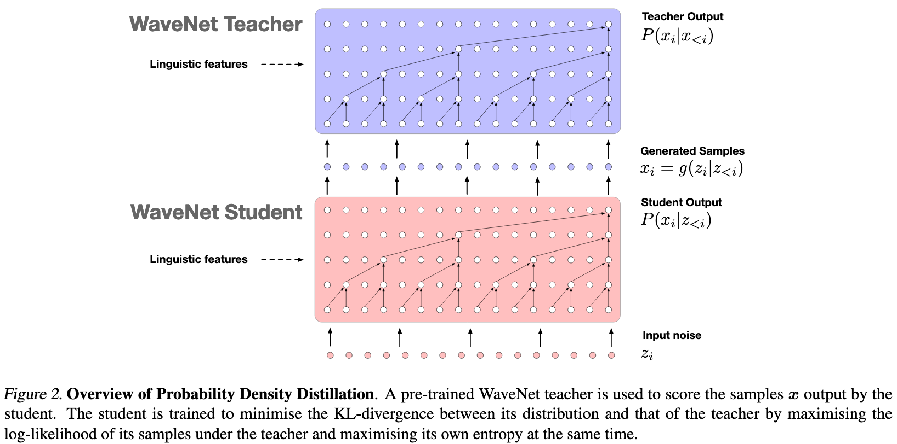
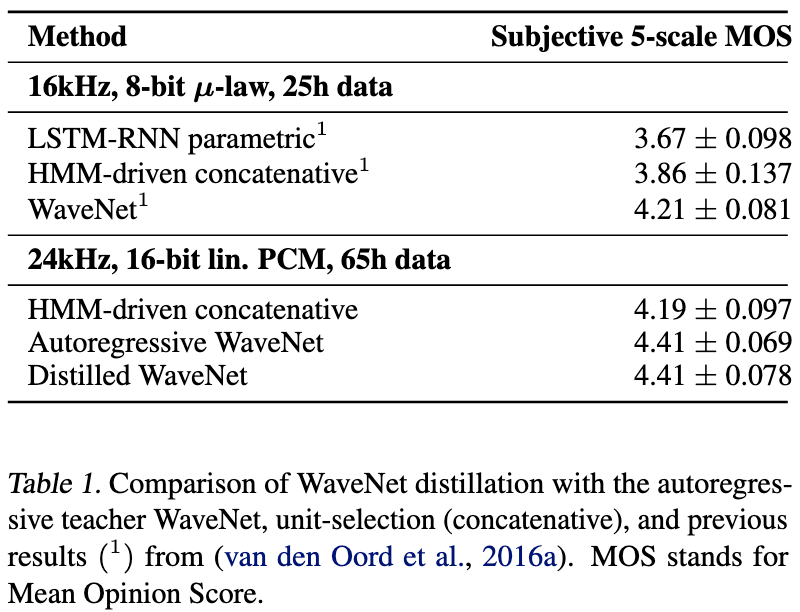
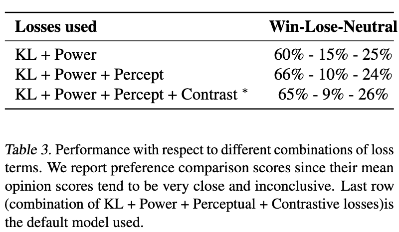

# Parallel WaveNet: Fast High-Fidelity Speech Synthesis

[Link to the paper](https://arxiv.org/abs/1711.10433)

**Aaron van den Oord, Yazhe Li, Igor Babuschkin, Karen Simonyan, Oriol Vinyals, Koray Kavukcuoglu, George van den Driessche, Edward Lockhart, Luis C. Cobo, Florian Stimberg, Norman Casagrande, Dominik Grewe, Seb Noury, Sander Dieleman, Erich Elsen, Nal Kalchbrenner, Heiga Zen, Alex Graves, Helen King, Tom Walters, Dan Belov, Demis Hassabis**

*Proceedings of the 35th International Conference on Machine Learning*

Year: **2017**

This paper introduces parallel WaveNet, a method for generating WaveNet quality samples in parallel, through a model distillation technique.

WaveNet achieved outstanding tts quality in 2016, but with prohibitive generation time. The model is autoregressive and, when generating samples, each input sample must be drawn from the output distribution before it can be passed in as input at the next time step, making parallel processing impossible. It is inherently a sequential process. The defining characteristics of WaveNet are the following ones.
- Use of causal/masked convolutions, allowing to train in parallel
- Use of dilated convolutions, allowing receptive fields to grow exponentially as more layers are added
- Use of gated activation functions, allows conditioning on extra information such as class labels or linguistic features

The authors improved the original WaveNet sample rate, from 16kHz to 24 kHz and the resolution (increasing the filter size from 2 to 3), from 8-bit to 16-bit (using a discretized mixture of logistics distribution, instead of a categorical distribution).

## Parallel WaveNet
This architecture is based on Inverse Autoregressive Flows (IAF), which are stochastic generative models related to normalising flows. These algorithms model a multivariate distribution $p_X(x)$ as an invertible and non linear transformation $f$ of a known distribution $p_Z(z)$, so that $x = f(z)$.

In summary, the network outputs a sample x, as well as a mean and standard deviation. The model has the same structure as the WaveNet architecture, with the difference of ingesting noise $z$ together with the text, and outputting $\mu$ and $s$ as well as $x$.

## Probability density distillation

It would be very slow to train the Parallel WaveNet, as estimating the log-likelyhoods is costly. Hence, the authors suggest using a new form of a neural distillation, called Probability Density Distillation. The idea consists of a student (Parallel WN) trying to match a teacher (vanilla WN). The density distillation loss is defined as follows.

$D_{KL}(P_S||P_T) = H(P_S, P_T) - H(P_S)$

Where $H(P_S, P_T)$ is the cross-entropy between the student and the teacher, and $H(P_S)$ is the entropy of the student, which gets maximized. The second term is important to avoid mode collapse.

A set of three extra additional losses is added to the main loss in order to improve the quality of the synthesis even more.

## Results
The experiments show that the WaveNet quality has been improved. Also, there is no difference in quality between AR WaveNet and parallel WaveNet, as it can be noticed in the table below.

An ablation analysis shows that the additional losses are important for the final quality of the generations.

