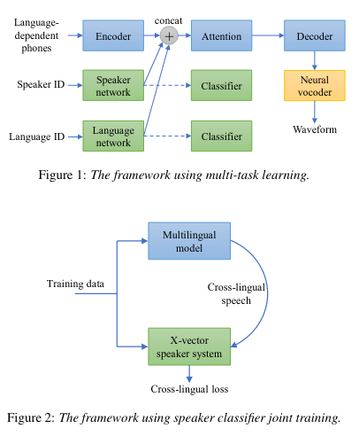

# Cross-Lingual Text-to-Speech Using Multi-Task Learning and Speaker Classifier Joint Training

[Link to the paper](https://arxiv.org/abs/2201.08124)

**Laurent Dinh, Jascha Sohl-Dickstein, Samy Bengio**

*Microsoft Azure Speech report*

Year: **2022**

Audio samples: https://jingy308.github.io/JointSpk

This paper introduces a transformer-based TTS that claims to be able to preserve speaker identity cross-language.

The model is built upon Transformer TTS, and includes end2end speaker and language embedding training. The main trick described by the paper is to do a cycle consistency check between the speaker embedding calculated from the recording, and the speaker embedding calculated from the synthesized speech. To do so and be able to propagate the gradients, the Transformer should ideally run the forward pass in free mode. This is not feasible, so the authors use a trick to mock that. The trick consists of synthesizing a sample on the fly (without retaining gradients), and use it as input in teacher forcing mode in order to apply the cycle consistency loss.

Additionally, the authors describe how the speaker and language embeddings are trained in a multi-task learning.

The results show clear improvements in speaker identity preservation across languages.

