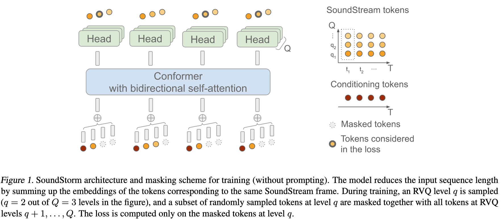
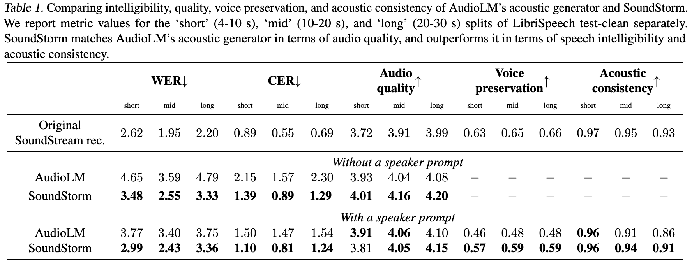

# SoundStorm: Efficient Parallel Audio Generation

[Link to the paper](https://arxiv.org/abs/2305.09636)

**Zalán Borsos, Matt Sharifi, Damien Vincent, Eugene Kharitonov, Neil Zeghidour, Marco Tagliasacchi**

*Google Research Report*

Year: **2023**

This paper tackles the problem of generating speech by learning to predict codes of a neural audio codec. This is a complex topic due to the fact that for generating high quality audio, one needs either large codebooks or long token sequences, and both are not only computationally expensive, but also difficult to model by current deep learning techniques. The problem of generating long token sequences can be addressed in 3 possible ways: (i) efficient attention mechanisms, (ii) non autoregressive decoding methods or (iii) custom solutions designed for this specific context. Soundstorm explores (ii) and (iii), proposing a model that generates multi-level tokens of the neural codec in parallel. 

In the literature, there are several studies that discuss possible approaches to generate hierarchical RVQ-like codes: AudioGen-like models predict the different levels in parallel, AudioLM does the opposite of AudioGen, flattening all the levels of codes into a long sequence and predicting the full sequence autoregressively, and VALL-E uses a hybrid approach, predicting the higher level codes autoregressively and the finer codes in parallel. 

The SoundStorm decoding schema is inspired in [MaskGit](https://arxiv.org/abs/2202.04200). At inference time, given a conditioning signal, Soundstorm starts with a sequence of all masked tokens and fills in the RVQ tokens level-by-level (in a coarse-to-fine order) by portions over multiple iterations, predicting multiple tokens in parallel during a single iteration within a level, based on confidence scores (see MaskGit).  The portion of tokens predicted by step obeys a schedule, and normally increases over iterations. The algorithm only proceeds to the $q+1$ level when the tokens of the level $q$ have been completed. The number of candidates generated per step within a layer is described by a cosine schedule. This idea works under the assumption that in finer levels, the probability distributions of the codes are conditionally independent given the codes of the previous layer. This makes it 2 orders of magnitude faster than AudioLM.  

To be able to get to that inference process, the authors have defined a compatible masking process at training time that allows using the model at inference time in that way. That masking assumes a coarse-to-fine ordering, to adapt to the RVQ structure. The conditioning tokens are never masked. The following bullets describe the masking process, where C is the codebook size, Q is the number of residual codebooks and T is the sequence length. 

- Sample the prompt delimiter timestep $t\sim\mathcal{U}\{0, T-1\}$. This parameter defines what is considered as prompt, and what is considered as target.
- Sample the current RVQ level $q\sim\mathcal{U}\{1, Q\}$
- Sample the mask $M\{0, 1\}^T$ randomly as follows: $M_i\sim \mathrm{Bernouilli}(p)$, where $p$ is the masking ratio, that is also sampled using a cosine-transformed uniform distribution.
- Apply the mask $M$ from the previous step at the current RVQ level $q$ and all the finer RVQ levels. 
- Train the model with the ground-truth tokens as target, only considering the masked tokens within the current RVQ level $q$. 

The figure below describes this procedure graphically.

## Experimental setup
The study relies on Soundstream codec, which produces codes at 50Hz and uses $Q=12$ codebooks with $C=1024$ size each. For conditioning, the authors use AudioLM tokens (25Hz) and upsample them x2. The architecture used is a Conformer with 350M parameters, 12 layers and 16 MHA heads. The model size is 1024 and the ff-dim is 4096, with a kernel size of 5 and rotatory positional embeddings. During decoding, the authors use 16 iterations for producing the coarse tokens, and then 1 to produce the subsequent ones for the following RVQ levels. A greedy strategy is followed (i.e. the tokens with higher probability are chosen). This makes a total of 16 + 11 = 27 forward passes. The authors have experimented increasing the number of iterations for both the first and the subsequent levels and found no statistical evidence of any improvement.

## Results
Despite the assumptions taken by this design, SoundStorm achieves consistently more intelligible results than AudioLM, with a synthesis two orders of magnitude faster. 

It also improves AudioLM across voice ID preservation and acoustic time consistency. SoundStorm seems to be on par with AudioLM on audio quality (subjective tests). 

