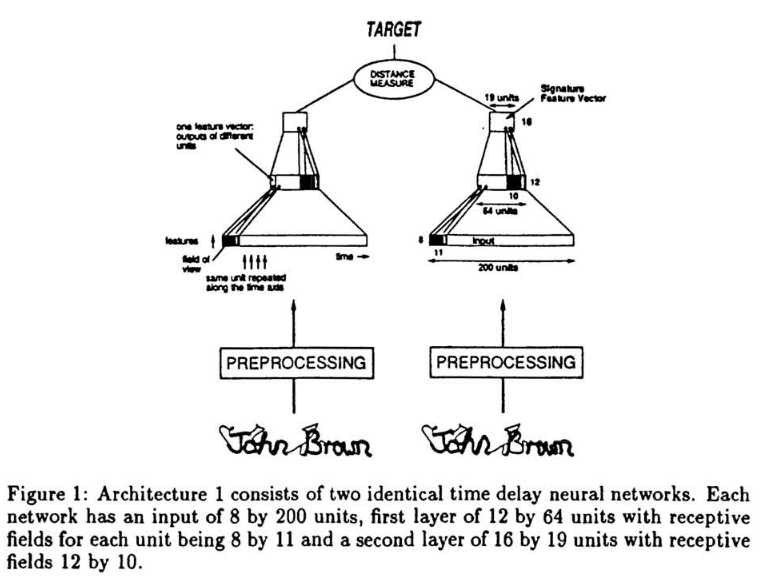
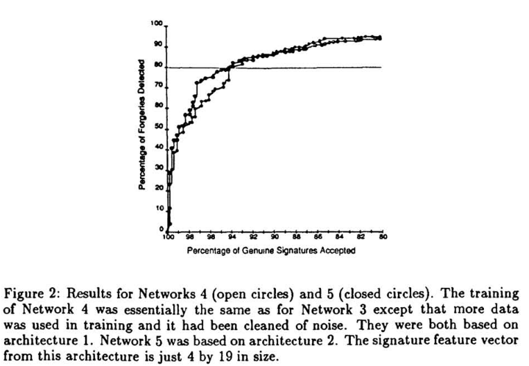

# Signature Verification using a "Siamese" Time Delay Neural Network

[Link to the paper](https://proceedings.neurips.cc/paper/1993/hash/288cc0ff022877bd3df94bc9360b9c5d-Abstract.html)

**Jane Bromley, Isabelle Guyon, Yann LeCun, Eduard Säckinger, Roopak Shah**

*NIPS, 1993*

Year: **1993**

This is the classical paper that introduces the idea of the Siamese networks for the first time. In the paper, the authors describe the problem of manual signature recognition. They explain that the idea is to keep the data as raw as possible and leave the model to extract the features needed.

The data is acquired by a digital device that stores the position of the pen, as long as the pressure in the tip at a sampling frequency of 200 samples per second. The spatial resolution is 300ppi and the signing area has a size of 5.5 x 3.5 inches. Hence three raw time series are collected, with the x and y coordinates and the pen pressure. The authors augment these features by calculating speed, accelerations and trigonometric transformations over the original features, totaling to 8 final features.

The architecture used to solve this problem is a Siamese network, which consists of two identical branches (weights are constrained to be the same in both branches) that are joined in the output of them. In the joint, a distance metric is calculated. The model is trained so that when two signatures from the same person are introduced, the network predicts 1, otherwise it predicts 0. The figure below summarizes the architecture described.

The results obtained are depicted in the following figure.

