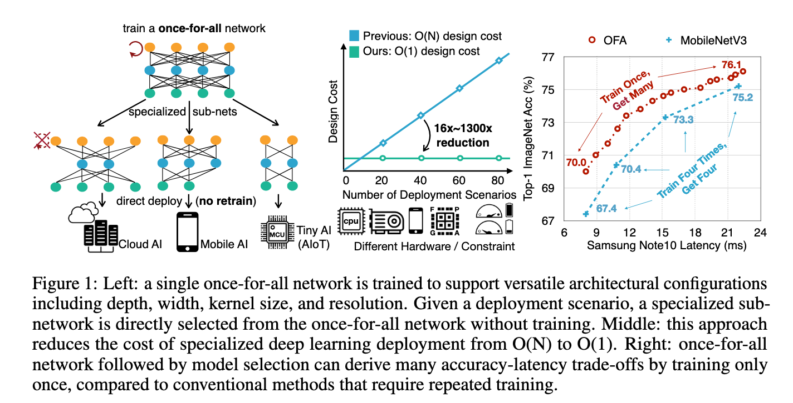
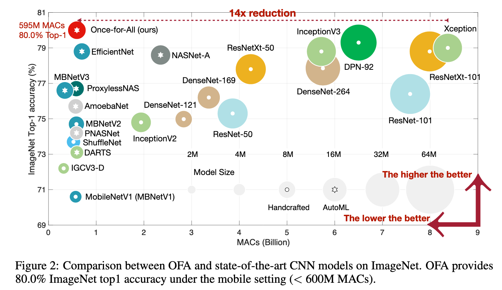
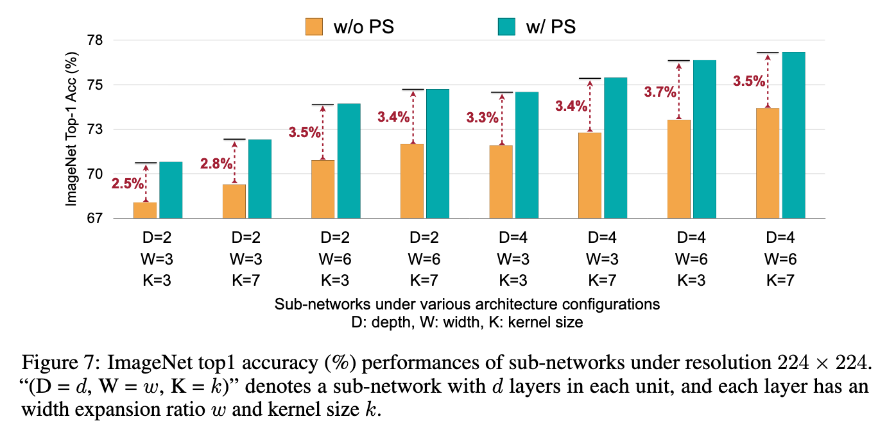
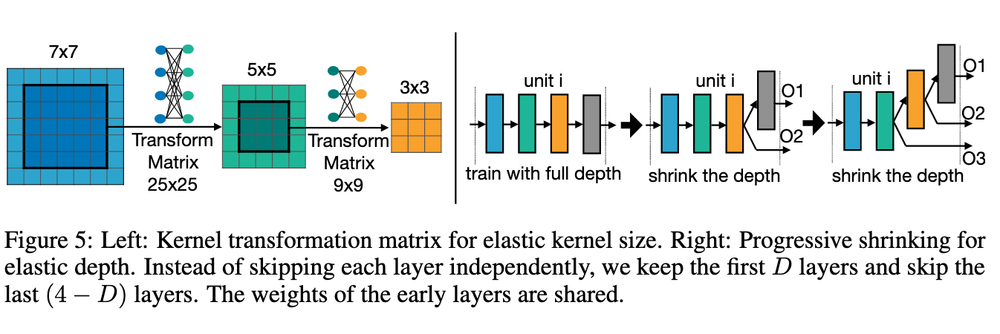
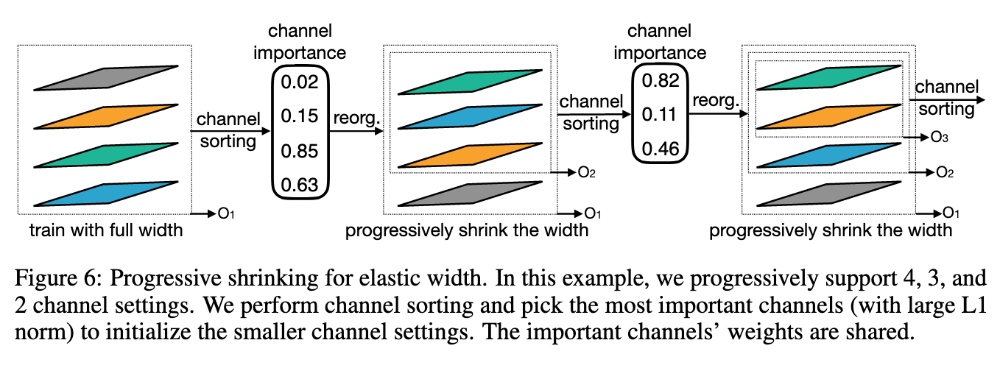
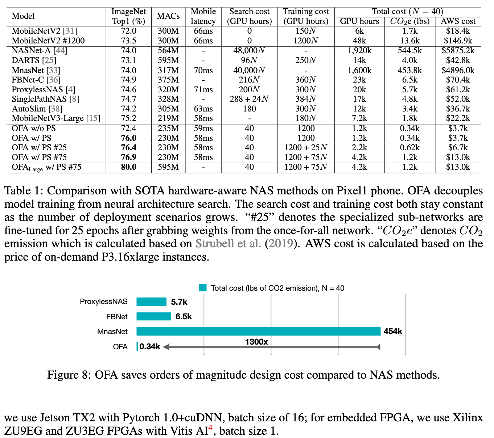
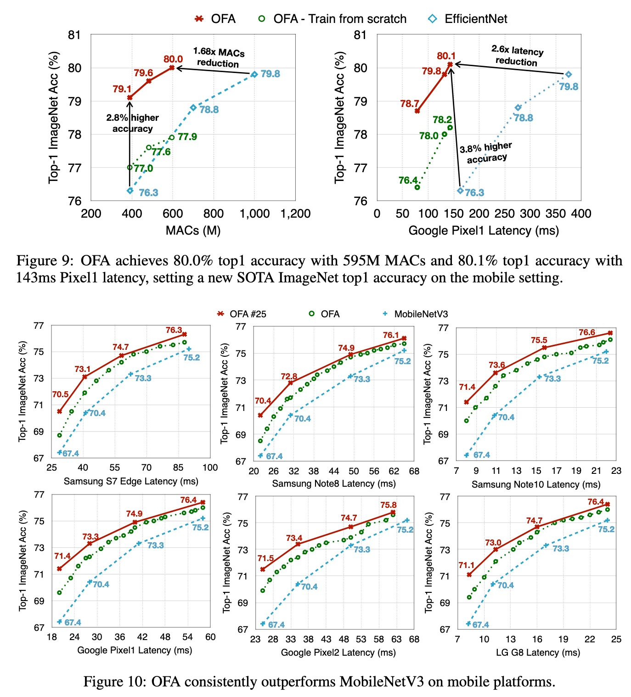

# Once-for-All: Train One Network and Specialize it for Efficient Deployment

[Link to the paper](https://arxiv.org/abs/1908.09791)

**Han Cai, Chuang Gan, Tianzhe Wang, Zhekai Zhang, Song Han**

*ICLR 2020*

Year: **2020**

Implementation: https://github.com/mit-han-lab/once-for-all

The current work proposes a methodology for building a neural net which adapts to a large range of hardware constraints (e.g. mobile devices).

It is very important to have the ability to simplify complex, high-performing neural networks when it comes to implement them in small devices. Normally, that was achieved by either pruning the trained large neural network or by running Neural Architecture Search (NAS hereafter) and therefore aiming to find small high performing architectures. The current work goes further, proposing a one-for-all network that by default has a large size, but which different pieces can be simplified (depth, width, resolution and kernel size). The one-for-all network contains sub-networks that still have high performance.

The authors start highlighting the difficulty of training such type of networks. The main challenge relies on the fact that different sub-networks interfere with each other, and all of them are contained in the larger network; therefore just sampling them and training them at the same time does not work well (naive approach). Instead of that, the authors suggest an algorithm named Progressive Shrinking (PS hereafter) that amends the problem mentioned. The proposed algorithm is applied to ImageNet using a CNN (similar to MobileNetV3).

Progressive Shrinking consists of start training the large network, and once it converges, start allowing the different dimensions (depth, width, resolution and kernel size) to shrink, in a sequential fashion (first depth, after some epoch width, etc). In order to do that, a different architecture is sampled in each training step. In the last steps of training, the sampling occurs across all the dimensions. The values tested across each dimension are: (depth: 2, 3, 4 layers per block; width expansion ratio: 3, 4, 6; kernel size: 3, 5, 7; resolution: 128..224 px). As shown in the figure below, the use of PS lead to a substantial improvement in performance.

In order to allow for elastic depth, elastic width and elastic kernel size , the following tricks are necessary.

- Elastic Kernel Size: the center elements of the 7x7 convolution kernels are used in the 5x5 convolution kernels, and the center elements of the last one are used to build the 3x3 conv. kernels. In order to allow for a bit of adaption, small transfer matrices are defined to help converting the big kernel sizes to their small counterparts. The increase in the size of the network of these parameters is negligible. These matrices are shared accross channels, but different at each conv layer.
- Elastic Depth: in order to go from the large (deepest) network to a shallower one, the first layers of the conv blocks of the large network are chosen.
- Elastic width: the channels from the large to the smaller architectures are chosen so that the ones with weights with highest L1 score remain (as they are considered more important) while the smallest L1 channels are dropped.

Once the once-for-all network is fully trained using the PS algorithm, a small meta-model (known by the authors as neural network twin) is trained to estimate the latency and accuracy of a given configuration. This model is fed with real data, collected by doing inference in the once-for-all model. The authors report a pretty small RMSE (around 0.2) in the accuracy estimation.

The results are summarised in the table and figures below.

