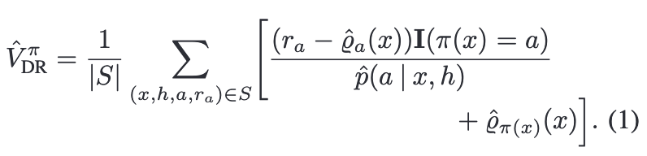
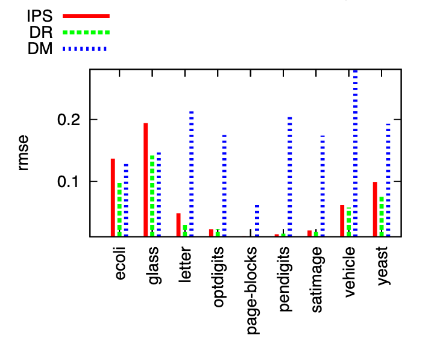

# Doubly Robust Policy Evaluation and Learning

[Link to the paper](https://arxiv.org/abs/1103.4601)

**Miroslav Dudík, John LangFord, Lihong Li**

*Proceedings of the 28th International Conference on Machine Learning*

Year: **2011**

This paper introduces Doubly Robust, a statistical approach applied to the contextual bandits problem in its offline version to correct the value estimation.

At the time the paper was published, there were two main approaches for addressing that problem:
1. The so-called Direct Method (DM): consisting of building an estimate of the reward given collected data. It requires an accurate model of rewards. Typically leads to bias.
2. The Inverse Propensity Score method (IPS): consisting on weighting action rewards by inversely weighting them by their sampling probability in the data (importance weighting). It requires an accurate model of the past policy. Typically leads to variance.

Doubly Robust (DR) is a statistical method for estimating parameters from incomplete data. It has the property of giving an unbiased estimator if either one of the two estimators (DM/IPS) is correct.

As it can be noticed in the equation, the DR has two estimators: $\hat{Q}$ and $\hat{p}$. The estimator uses $\hat{Q}$ as baseline. DR is accurate if at least one of the estimators is accurate.

The authors show empirically that it improves the accuracy over IPS and DM along several problems.
