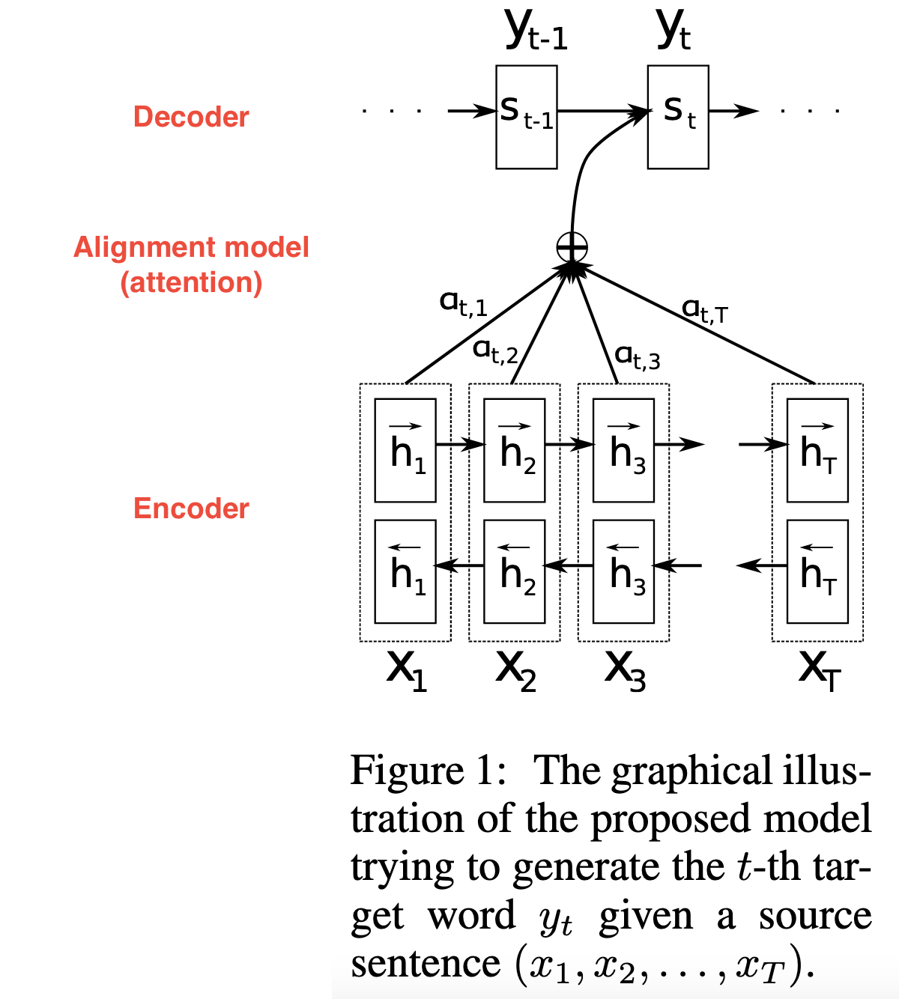
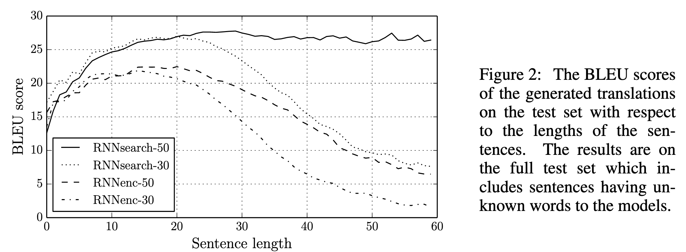
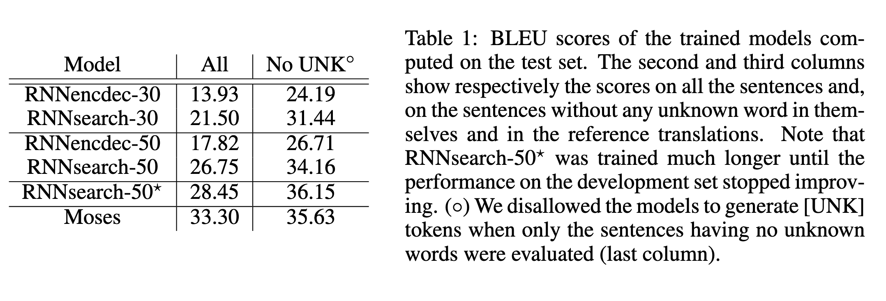
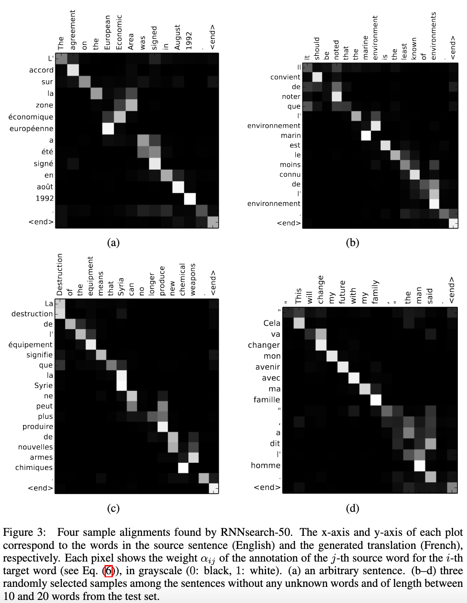

# Neural Machine Translation by Jointly Learning to Align and Translate

[Link to the paper](https://arxiv.org/abs/1409.0473)

**Dzmitry Bahdanau, KyungHyun Cho, Yoshua Bengio**

*International Conference of Learning Representations (ICLR 2015)*

Year: **2015**

The current article focuses on the field of *neural machine translation*, pointing out that one of the potential limitations of the seq-to-seq approach is that it compresses all the input sentence into a fixed-length vector. The authors propose an extension of the encoder-decoder seq-to-seq setting which later on will be known as **the attention mechanism** (they call it learning to align and translate jointly).

The difference between this approach and the classical S2S is that instead of encoding all the input sentence into a fixed-length vector, it encodes it into a sequences of vectors corresponding to difference sequence steps of the input sentence, which will be combined adaptively in each step of the decoder.

The figure above shows, at a glance, how the attention mechanism works.
- First, on the bottom, we have a bidirectional encoder that process the input sentence $x_1, x_2... x_T$.
- The output of the encoder (aka annotations) $x_1, x_2... x_T$ are weighted by a set of factors $a_{t, 1}, a_{t, 2}, ... a{t, T}$ and summed together to achieve the context vector $c_i$.
- The sum of all $a$ values is 1; hence this operation is a weighted average.
- The $a$ values are computed as a soft-max of the $e$ values. $a_{ij}=\frac{exp(e_{ij})}{\sum_{k=1}^{T}exp(e_{ik})}$.
- The $e$ values, also referred as energies, are the output of the *alignment-model*. This model tries to compute the alignment of each decoder output over the full set of inputs. The $e_{ij}$ values are function of the previous step of the decoder $s_{i-1}$ and the $j-th$ output of the encoder $h_j$; $e_{ij} = a(s_{i-1}, h_j)$. Usually, $e_{ij}$ is a MLP that combines the inputs specified.
- Once the $a_{ij}$ values are computed, they represent the importance of the annotation $h_j$ wrt. the hidden state $h_{i-1}$.
- The last step consists of getting the context vector $c_{i}$ as the weighted (by $a_{ij}$) mean of the annotations: $c_i=\sum_{j=1}^{T}{a_{ij}h_j}$
- Intuitively, we can think that the decoder decides which parts of the source sentence to pay attention to.
- The major benefit of this apporach is that we release the encoder of having to summarize all the input sentence into a fixed-size vector.
- No benefit comes without a cost. As in every decoder step now we have to compute a factor, we can easily see that the complexity of the algorithm is O(PQ), where P is the length of the input sentence and Q is the length of the output sentece.

One important note that the authors give us in the document is the reason of use of the bi-directional encoder. In their own words: "we would like the annotation of each word to summarize not only the preceding words but also the following words. Hence we propose a bi-directional RNN".

The authors apply this model (RNNSearch) along with a vanilla seq-to-seq (RNNencdec) to an English-French parallel corpora of sentences. In order to highlight its benefits, the authors separate the sentences by length. The figure below shows that the current proposal performs much better with longer sequences.

The following table shows, quantitatively, that the proposal beats the benchmark.

The authors finally provide an empirical proof of the alignment effect that the new implementation provides. They have plotted in a graph which are the attention energies for each of the encoder_input x decoder_output cases. The following figure shows how english and french hold an almost perfect monotonicity between input words and output words.

The authors showed that it is possible to align and translate sentences at the same time while optimizing for both in the same gradient step. As a future research line, they suggest to look for ways of dealing with very large vocabularies without having to include "UNK" symbols.