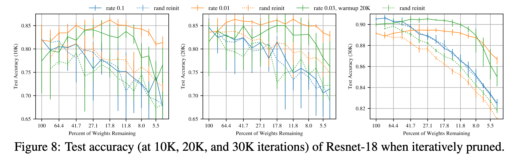

# The lottery ticket hypothesis: finding sparse, trainable neural networks

[Link to the paper](https://arxiv.org/abs/1803.03635)

**Jonathan Frankle, Michael Carbin**

*International Conference of Machine Learning (ICML 2019)*

Year: **2018**

The current work studies in depth the idea of pruning neural networks. The authors prove that it is possible to prune networks, retrain the resulting neural network from the same initialization and get same or higher accuracy in less training epochs.

Previous works show that retraining pruned architectures leads to lower-performing solutions. One of the most important findings of the current study is that the pruned architecture must be reinitialized to the initial values, instead of randomly initializing the weights again.

Lottery ticket hypothesis formulation: randomly initialized networks contain a subnetwork (pruning the original) that when trained in insolation can match or even improve the test accuracy (commensurate accuracy) of the original network in the same or less iterations (commensurate training time). The final subnetwork is known as _winning ticket_, given that as the authors empirically proved that, not only the structure of the winning ticket is important, but also the values of the weights at initialization (when the subnetwork is randomly reinitialized, the results worsen). In the words of the autors: "structure alone cannot explain a winning ticket's success".

The pruning mechanism is very simple: it consists of cutting, layer by layer, the weights with smallest magnitude. The process is described by the authors as:
1. Randomly initialize the neural network
2. Train the network until early stopping
3. Prune a percentage of the weights creating a mask $m$. $P_m$ represents the percentage of non-pruned weights.
4. Reset the surviving parameters (determined by the mask $m$) to the values in step 1

The authors suggest using an iterative pruning method, which consists of iteratively training-pruning-resetting the weights for $n$ rounds. In each iteration, $p^{\frac{1}{n}}$ % of the weights surviving from the previous round are pruned. Iterative pruning helps finding smaller winning tickets.

The following figure compares, for several problems and architectures, how as the pruning rate increases, the fact of re-initializing the weights (1) makes the network require more iterations to converge and (2) makes the accuracy of the network decrease faster. In other words, this means that preserving the initial weights in the winning tickets makes the network converge faster and hold or increase the accuracy of the original network.

The authors give a possible intuition to the lottery ticket phenomenon: dense networks are easier to train than sparse networks that result from pruning because there are more possible subnetworks from which the training might recover a winning ticket.

## Pruning fully-connected networks
- The pruning occurs as a percentage of the weights, layer by layer.
- Connections to output are pruned at half of the rate of the rest of the network.

From the figures above the authors conclude the following:
- As $P_m$ decreases from $100\%$ to $21\%$, the accuracy of the retrained winning ticket increases. At $21\%$ early stopping occurs $38\%$ earlier than with the original network.
- The gap between train and test accuracy of the winning ticket decreases at end of training when compared with the original network. This suggests that the winning tickets have better generalization.
- At the $P_m=21\%$ point, the winning ticket reaches the minimum 2.5x faster than the same network with reinitialized weights. The performance of the first one is 0.5 percentage points higher.
- One-shot pruning is also valid, although iterative pruning allows for smaller winning tickets.
- Test accuracy increases until $P_m=13.5\%$ point is reached. More prunning degrades the accuracy. At $P_m=3.6\%$ the accuracy returns to the level of the original network (but with only 3.6% of the weights!)

## Pruning convolutional neural networks
- The results show the same pattern as with the fully-connected networks, but more pronounced.
- Winning tickets arrive to the optimal iteration around 3x faster than the original network.
- Winning tickets get around 3.4% higher accuracy than the original networks
- The accuracy of the winning ticket remains higher than the one of the original network when $P_m > 2\%$
- The gap between train and test is smaller in the winning tickets.
- A similar pattern appears when using dropout.

The authors have observed than on larger/more-complex architectures like VGG19 and Resnet, to find winning-tickets they had to implement learning rate warm-up. Otherwise the winning tickets would not be found. This is shown in the figures below.

