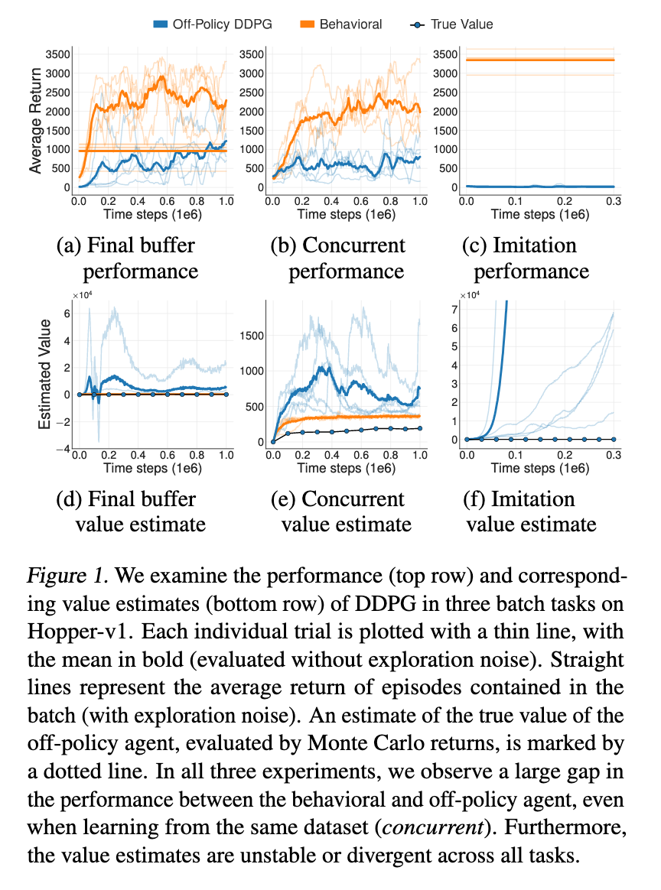
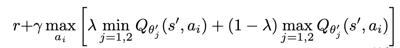
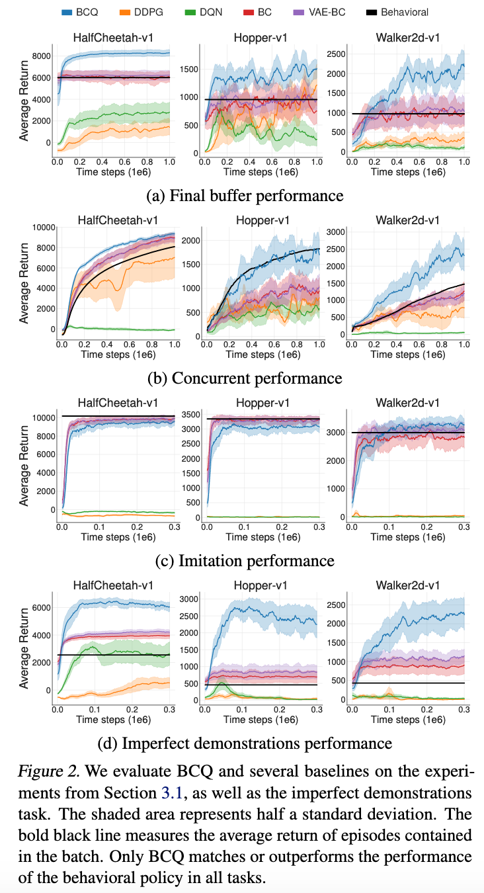
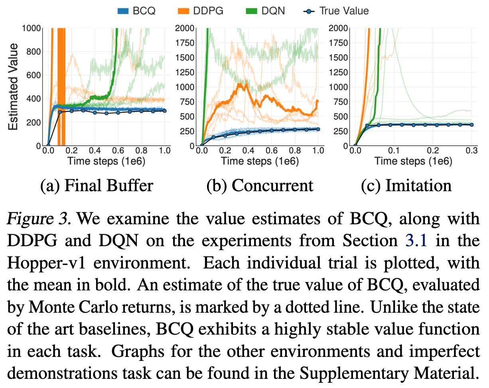

# Off-Policy Deep Reinforcement Learning without Exploration

[Link to the paper](https://arxiv.org/abs/1812.02900)

**Scott Fujimoto, David Meger, Doina Precup**

*ICML 2019*

Year: **2019**

GitHub: https://github.com/sfujim/BCQ

Objective: Learn from a fixed batch of data that has already been collected, without the possibility of further data collection

The authors of the paper claim that DQN and DDPG are incapable of learning a successful policy in the setting of batch RL. Because of what they named extrapolation error: a phenomenon in which unseen state-action pairs are erroneously estimated to have unrealistic values. They highlight that, in their experience, the algorithms trained in this setting perform dramatically worse than the behavioral agent.

To tackle the problem, they propose the batch-constrained reinforcement learning paradigm where agents are trained to maximize return while trying that the policy does not abandon the explored region of the state-action pairs space. They propose an architecture called Batch-Constrained Deep Q-Learning (BCQ) that uses a generative model to produce only previously seen actions conditioned to the state and which are further on evaluated using the Q-network. This paradigm can be seen as a bridge between off-policy learning and imitation learning.

The extrapolation error can be understood as the mismatch between the dataset and true S-A visitation of the current policy. There are different causes:
- Absent data in the batch of the behavioral policy
- Biased data in the batch of the behavioral policy
- Training missmatch due to wrongly weighted loss towards the most visited region of the S-A space

Notice that although DQN is considered an off-policy algorithm, it is uses near on-policy exploratory policies such as epsilon-greedy + replay buffer, which are quite correlated with the current policy.

To assess the performance of raw off-policy on-batch RL, the authors have performed 3 experiments:
- Final buffer: a DDPG agent has been trained and all the experiences have been recorded.
- Concurrent: ad DDPG agent has been trained and, at the same time, an off-policy (but online) reinforcement learning has been trained
- Imitation: a well trained DDPG agent has been used to generate data. So only data from expert policy has been collected.

The results of the previous experiments are summarized in the following picture

- Even if it seems that in the final buffer case the off-policy algorithm achieved some intermediate results, when looking at the value function one can notice that the extrapolation error had a dramatic effect there.

- The concurrent experiment results show how the fact of starting with a different initial initialization radically leads to a dramatically worse policy

- Finally, we can see how by only using expert agent experiences the algorithm didn't achieve any improvement. This may be mainly due to the intuitive connection this has with the "optimism in the face of uncertainty" strategy (non-explored S-A pairs may have dramatically big extrapolation errors that bias the policy to these actions). In online training these regions of the space would be visited and the errors would be corrected but in this case, as they are never corrected, the extrapolation error persists.

The proposal of the authors consist of reducing the extrapolation error by inducing a state-action visitation similar to the batch. A policy that satisfy this property is named batch-constrained. This is achieved by a state-conditioned generative model that produces likely actions under the batch distribution. Finally, a pair of Q-networks are trained to take the minimum of the estimates during the value update. This penalizes unfamiliar states.

The BCQ solution proposed by the authors consists of 4 parametrized models:
- A conditional VAE that generates samples by mapping a latent space to the batch distribution, conditioned to the state
- A perturbation model that helps reducing the big number of evaluations required on the VAE
- Two Q-learning networks in a Clipped Double Q-learning structure (equation below).
.

The results achieved by the BCQ algorithm are outstanding. They are summarized in the following figure. The set of "imperfect demonstrations" refers to an expert policy with a high exploration rate and noise added:

BCQ is the only algorithm that outperforms all the tasks in all the batches. It also achieves, as it can be seen in the previous figure, non biased estimates of the value function.