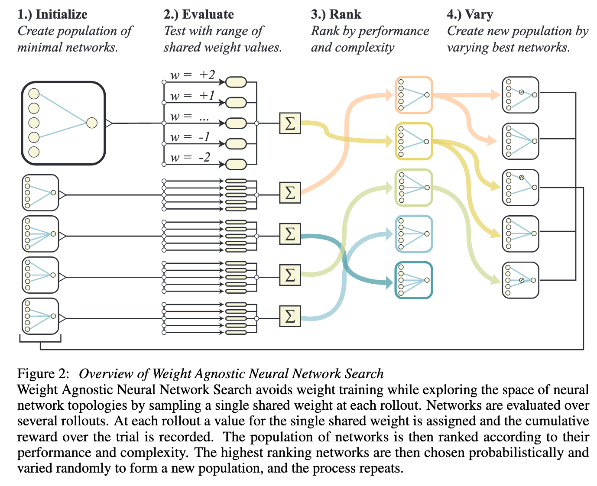
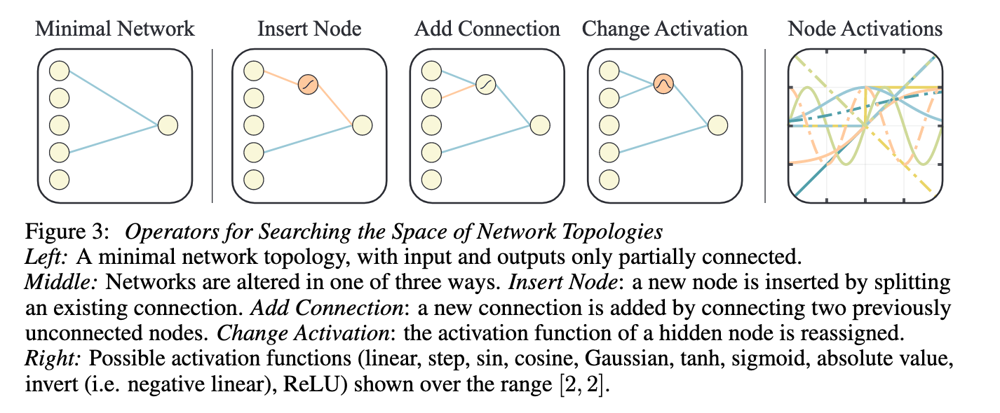
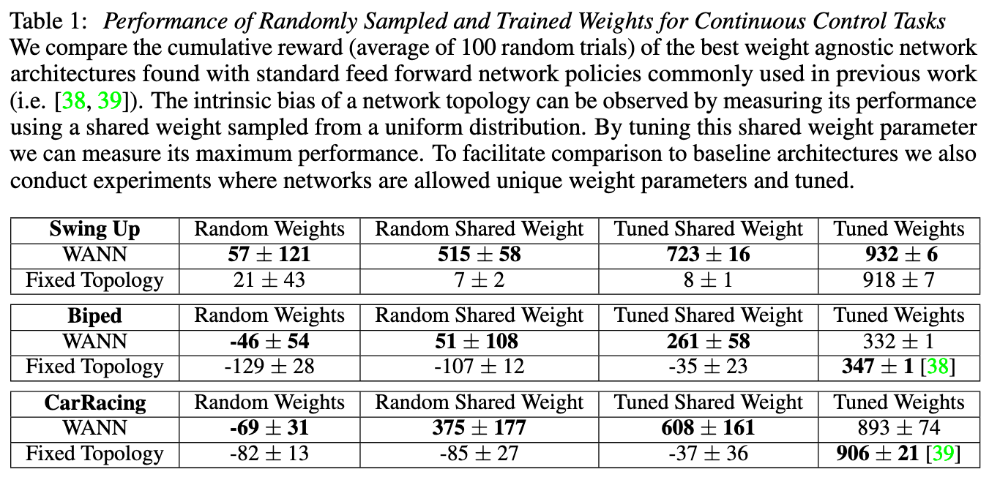
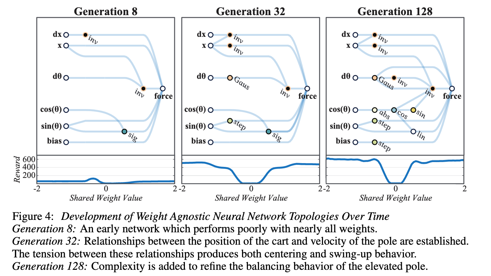
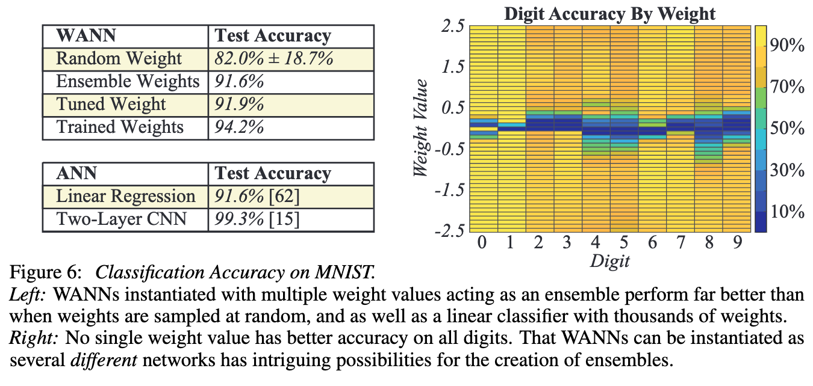

# Weight agnostic neural networks

[Link to the paper](https://arxiv.org/abs/1906.04358)

**Adam Gaier and David Ha**

*NeurIPS 2019*

Year: **2019**

The current paper studies the possibility to train neural networks which performance is agnostic to their weight values. The weights of the neural networks proposed in this paper are not trained, is the architecture the one that is tweaked in order to improve the performance of the problem.

The hypothesis introduced by this paper is biologically inspired in the precocial behaviors evolved in nature. The neural networks developed in this work are naturally capable of performing a given task, even when the weights are randomly sampled.

## Methods
The difference between NAS (Neural Architecture Search) and the current work is very different. NAS achieves its goal by finding an architecture that when trained, performs the best. Here, the weights are not the solution, but the architecture structure itself.

The weight agnostic architecture search is based on a well known evolutionary method for finding architectures: NEAT. In this case, the authors simplified that algorithm, to only allow architecture structure variations, and not weight variations. The weights of the possible connections are shared across all the network, i.e. they are kept constant for all the network. Furthermore, the values range is reduced to the following possible values ([-2, -1 -0.5, 0.5, 1, 2])

The architecture search is performed as follows.
1. An initial population of minimal neural network topologies is defined
2. Each network is evaluated with S different sets of shared values
3. Each network gets ranked based on the performance and complexity
4. A new population set is created by using a tournament selection
This process is summarized in the following figure.

The current evolutionary search uses the topological operators from the NEAT algorithm (insert node, add connection or change activation), as shown in the figure below.

## Results
The performance of the networks is compared under 4 conditions:
- Random weights: individual weights drawn from $U(-2, 2)$, each connection has a different weight
- Random shared weights: a single shared weight drawn from $U(-2, 2)$, constant for all the net
- Tuned shared weights: highest performing shared weight drawn from $U(-2, 2)$, constant for all the net.
- Tuned weights: individual weights tuned using population based REINFORCE

First of all the performance is measured in the RL context. The architectures achieved by this method are siple and even prone to study and interpretation. The performance drops when the weights are set individually at random.

The performance is also measured in a classification context. The results in this case are outstanding. The network achieves very good performance for a wide range of weights. This architecure has also been evaluated with multiple different weight initializations, leading to an interesting ensemble-effect (see ensemble weights accuracy).

## Reference
- Interactive paper: https://weightagnostic.github.io
