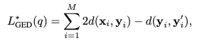
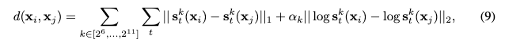
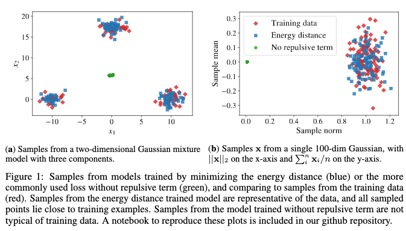
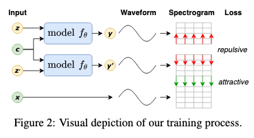
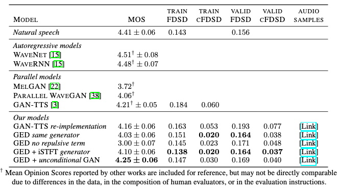

# A Spectral Energy Distance for Parallel Speech Synthesis

[Link to the paper](https://arxiv.org/abs/2008.01160)

**Alexey A. Gritsenko, Tim Salimans, Rianne van den Berg, Jasper Snoek, Nal Kalchbrenner**

*34th Conference on Neural Information Processing Systems (NeurIPS 2020), Vancouver, Canada*

Year: **2020**

Implementation: [Link](https://github.com/google-research/google-research/tree/master/ged_tts)

This paper presents an alternative approach to autoregressive models that allows train and do inference in parallel. The approach is based on a generalized energy distance loss with a repulsion term, combined with adversarial training techniques (GAN).

The proposed approach gets rid of the discriminator by replacing it the generalized energy loss, described in the equation below, where the second term is referred by the authors as the _repulsive term_. This loss is an unbiased estimator of the energy score, which is augmented with a repulsive component that I will describe below.

$d(\cdot,\cdot)$ is a metric function, which is defined by the authors over spectrograms ($S^k(x_i)$) as follows.

The repulsive term of the GED loss function is added in order to encourage the diversity of the model and avoid collapse of the generated samples to the mean. In it, $y$ and $y'$ are samples with different random noise $z$ but same contextual features $c$.

Two architectures are proposed:
1. Simplified GAN-TTS generator: consisting of a full-convolutional residual network generating directly raw audio.
2. Inverse Short Term Fourier Transform architecture: uses a set of ResNet Blocks with a iSTFT at the end to map to raw audio, effectively reducing the size of the model.

The training procedure is described in the following figure.

The data used by the authors for this study consists of 60k utterances with 567 linguistic features for conditioning.

Several experiments are performed:
- GAN-TTS (benchmark reimplementation)
- GED (proposal)
- GED without repulsive term (proposal with ablation)
- GET + iSTFT generator (proposal)
- GED + unconditional GAN (much more weighty than the proposals)

Results are described in the table below.

