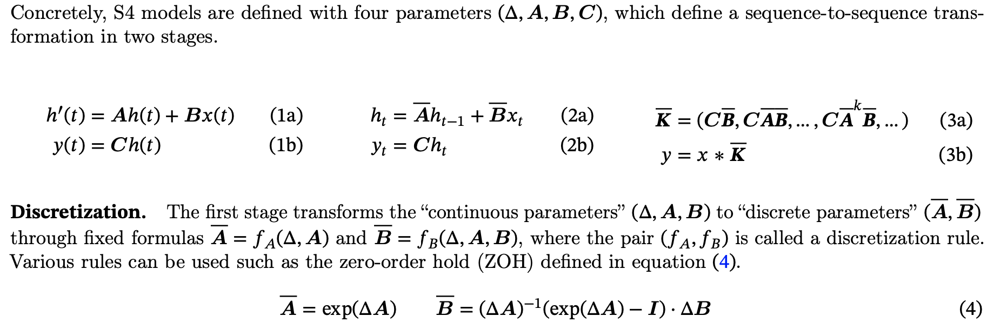
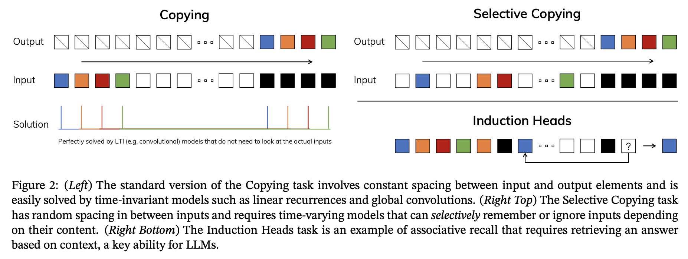
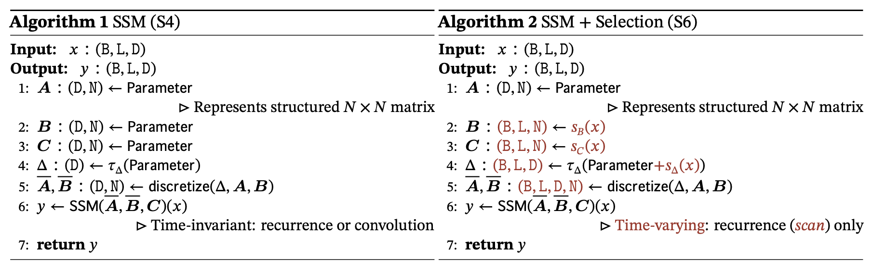
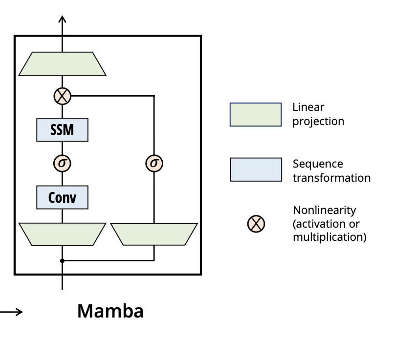
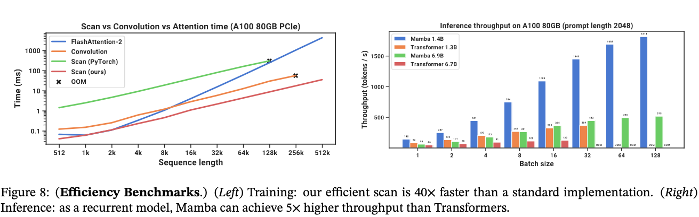

# Mamba: Linear-Time Sequence Modeling with Selective State Spaces

[Link to the paper](https://arxiv.org/abs/2312.00752)

**Albert Gu, Tri Dao**

*arXiv Preprint*

Year: **2023**

Mamba builds upon S4 state-space models (SSMs). S4 defines recurrent modules that are (1) linear in time, (2) it's dynamics are constant through time (Linear Time Invariant) and (3) can be used as a convolution (parallel) or as an RNN (sequential). The following figure summarizes S4 equations

In the previous equations, $A\in\mathbb{R}^{N\times N}$, $B\in\mathbb{R}^{N\times 1}$ and $C\in\mathbb{R}^{N\times 1}$, where $N$ is the hiddens dimensionality. The SSM is applied independently to each channel, and the input tensor (B, L, D) is mapped to (B, L, N*D). The $A$ matrix is fixed (not trainable), and it is initialized with HiPPO (like in S4).

Mamba relaxes the LTI constraint (2), building upon the fact that S4s cannot perform tasks like selective copy or heads induciton. 

To circunvent that issue, the authors suggest to make the $B$, $C$ and $\Delta$ matrices dependent on the input $x$ as shown in the algorithm below. This makes the model more powerful at the cost of dropping the convolution parallel computation mode. Still, the $S_\#$ functions represented in the S6 algorithm below are just linear projections. 

To overcome the loss in performance, the authors introduce a "hardware-aware" technique called _scan_. This is basically consisting on optimising I/O operations between high and low GPU bandwith memory, and fusing some kernels to optimize the operations. They also use gradient checkpointing to avoid memory flods.

The Mamba SSM is fit into a block which includes some pre-convolutions, a forget layer and linear projections, as shown in the following diagram.

**Parameters interpretation**
- $\Delta$ controls the balance between how much to focus or ignore the current input $x_t$. $\Delta \rightarrow 0$ represents a transient input that is ignored, and $\Delta \rightarrow \infty$ represents the system focusing on the current input for longer.
- $A$ can also be selective, as $\Delta$. It works together with $\Delta$ in $\overline{A}=\exp (\Delta A)$. Given that $A$ is fixed, selectivity is left as a task for $\Delta$.
- $B$ and $C$: provide filtering mechanisms over $x$ to derive the state $h$ with relevant information, while discarding the irrelevant one.

The algorithm is tested in several synthetic tasks and Mamba achieved competitive or better results than Transformers, with better scalability.
- Selective copying
- Induction heads
- Language modeling
- DNA modeling
- Audio Modeling and speech generation

