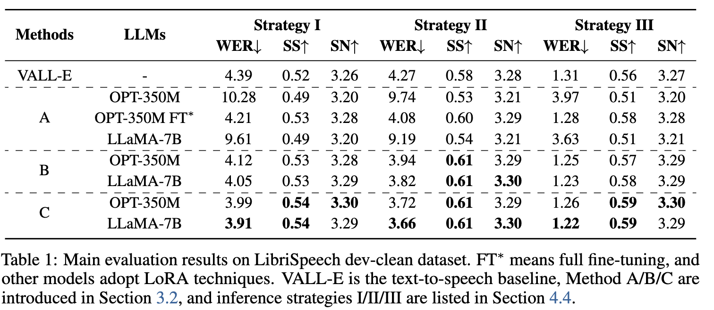
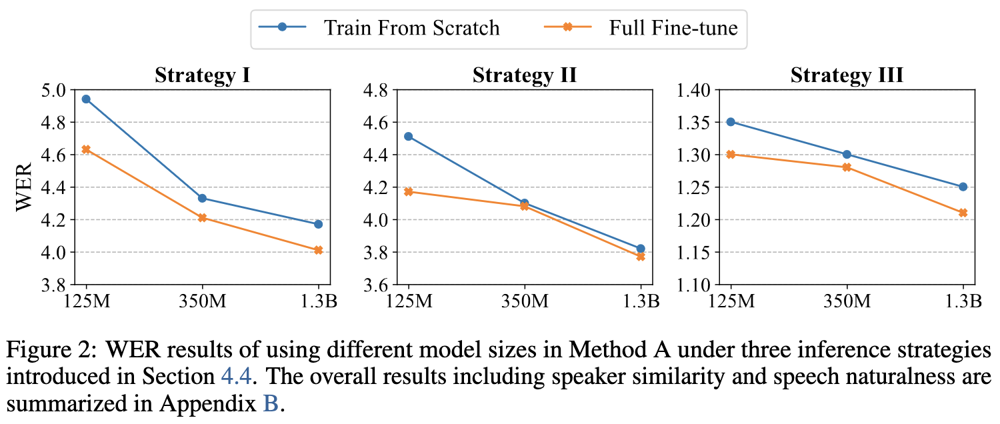
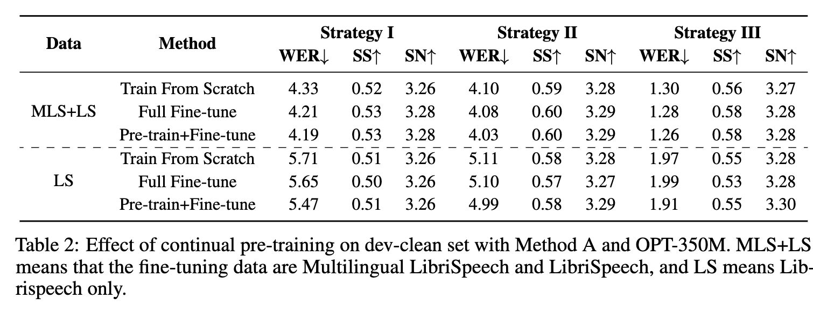

# Boosting Large Language Model for Speech Synthesis: An Empirical Study

[Link to the paper](https://arxiv.org/abs/2401.00246)

**Hongkun Hao, Long Zhou, Shujie Liu, Jinyu Li, Shujie Hu, Rui Wang, Furu Wei**

*Microsoft Research report*

Year: **2023**

This paper explores discrete large AR-transformers (Vall-E) conditioned to LLMs (LLaMA-7B among others) as a solution to the text-to-speech problem. For that, they discretize the speech signals using a codec (Encodec), and train models to predict those codecs, which are later decoded into the continuous speech signal. The authors explore 3 approaches:

1. (A) Teach the LLM to predict speech codes.
2. (B) Train VALL-E on top of (1/A). The LLM encodes both text and acoustic tokens, and VALL-E augments the speech-tokens inference.
3. (C) Train VALL-E to do the full speech task. The LLM never sees speech codes.

Additionally the authors explore effects of model-size, LoRA vs complete fine-tuning and continuous pre-training.

The main conclusions are:
- Approach 1 didn't work well so the authors conclude that the speech tokens cannot be treated as a new language.
- LLMs as encoder for VALL-E delivers good results, specially approach C.
- The results obtained when using LLMs are better than when training VALL-E directly on text

The models are trained with publicly available data (50k hours of Multilingual LibriSpeech). All the models are tested using three autoregressive strategies (I: one shot synthesis, II: 5-shot synthesis and selecting the utterance with highest speaker similarity score, and III: 5-shot synthesis and selecting the candidate with lower word error rate). The results are summarized in the table below.

Effect of model size in Word Error Rate:

Continual pre-training consists of pre-training the LLM with unlabeled speech token sequences. The following table summarizes the results of pretraining+fine-tuning vs training from scratch or fine-tuning an existing model.

