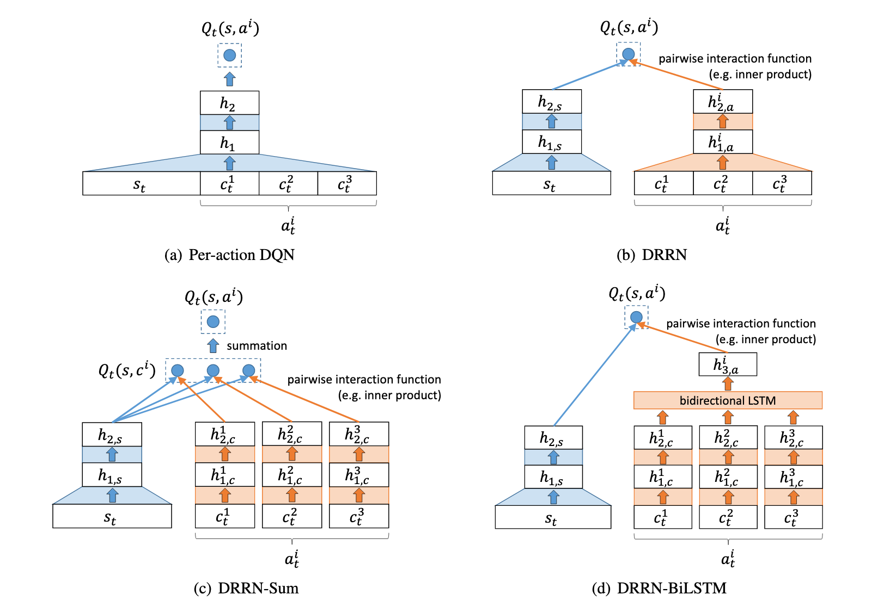
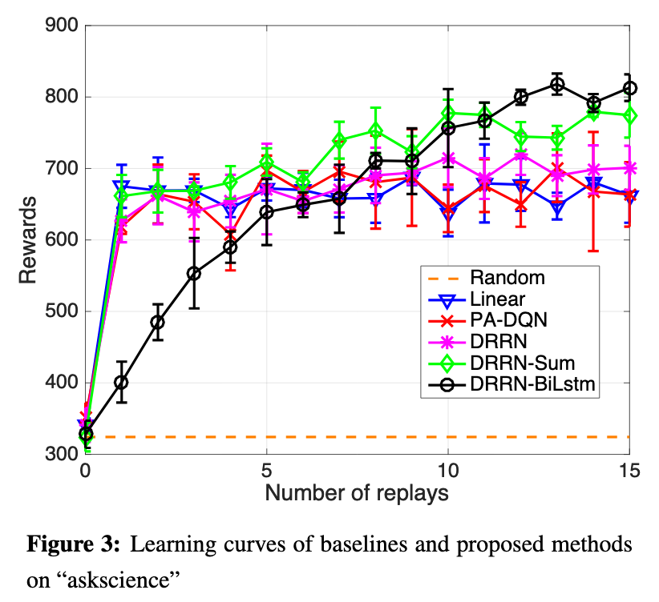

# Deep Reinforcement Learning with a Combinatorial Action Space for Predicting Popular Reddit Threads

[Link to the paper](https://arxiv.org/abs/1606.03667)

**Ji He, Mari Ostendorf, Xiaodong He, Jianshu Chen, Jianfeng Gao, Lianfeng Gao, Lihong Li, Li Deng**

*Microsoft Research and University of Washington*

Year: **2016**

- Goal: use Reinforcement Learning to recommend Reddit threads and comments to the users based upon popularity
- Difficulties :
  1. the action space is large. This means high computational complexity.
  2. the action space is combinatorial and inter-dependent. Each action is a set of interdependent sub-actions.
  3. the states and actions involves text.
- The success in this task involves successfully anticipating the long-term interest level of the posts and comments of reddit, given that the rewards are delayed.
- The goal is to take decisions not at individual level but at community level.
- The algorithm is designed to work real time, operating over the comments and posts as they appear.
- The action space is combinatorial since an action corresponds to a set of comments (aka sub-actions) chosen from a large set of candidates.
- The paper focuses on solving difficulties 2 and 3, while difficulty 1 is sidestep by (a) reducing the action space and (b) calculating the maximum Q-Value using a random sample.
- The authors decided to define reward as *karma*, i.e. a Reddit measure of popularity that is associated to both: posts and comments.
- The state is defined as a collection of the comments previously recommended.
- Only new comments associated with threads of a discussion being followed (previously recommended) are considered. That allows limiting the possible sub-actions at each step.
- The action is defined as all the comments falling below a followed subtree; the algorithm should choose which comments to bet for.
- The initial state will be always the reddit post {M0}, and the actions over it will make it grow {M0, M1, M2, ...}. When messages appear as nodes in the subtree of Mt, they will become actions {ct,1, ct,2, ... ct,N}. The algorithm's objective is to pick the set of K comments to track at time t+1. Thus, Mt+1 = at.
- As K, i.e. the size of the action space, can be arbitrarily high, the authors recommend to plug them as input of the network instead of as output, and hence the output becomes a scalar corresponding to the Q-value of the state and the action provided as input. With this setting, 4 network configurations are proposed (summarized in the following image).

    (a) the state and the actions are concatenated together and feed as input to the network

    (b) the state is feed to a network and the sub-action is feed to another, both outputs are multiplied together using an inner product.

    (c) the state is feed to a network, each comment in the sub-action space is feed through a diferent network, and then each output of the action network is compared individually with the state network output, and all the outputs are summed together to build up the final prediction. This allows retrieving the Q(S, a) for all possible sub-action.

    (d) similar to (c), but combining previously each sub-action embedding using a bidirectional LSTM.

- As taking the maximum over the NxK action space may be overwhelmingly computational expensive, the authors decide to take the maximum over a small random sample (m'=10), which represents a variant of Q-Learning which they assure works well.

- Other works demonstrated that (b) is superior to (a)
- The results in this problem showed the following performance levels
