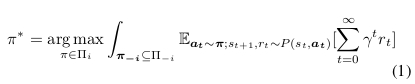
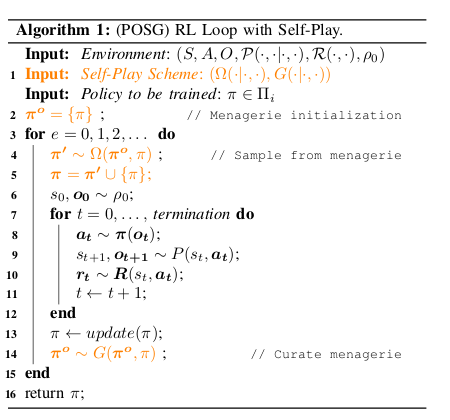
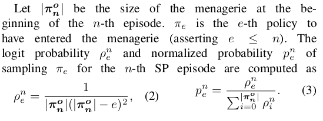
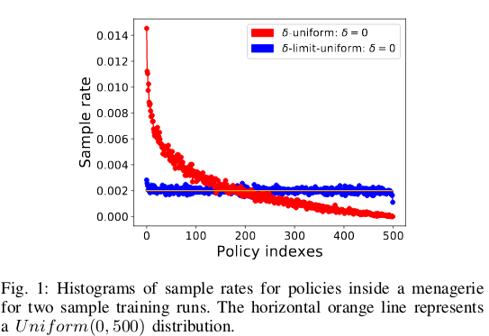
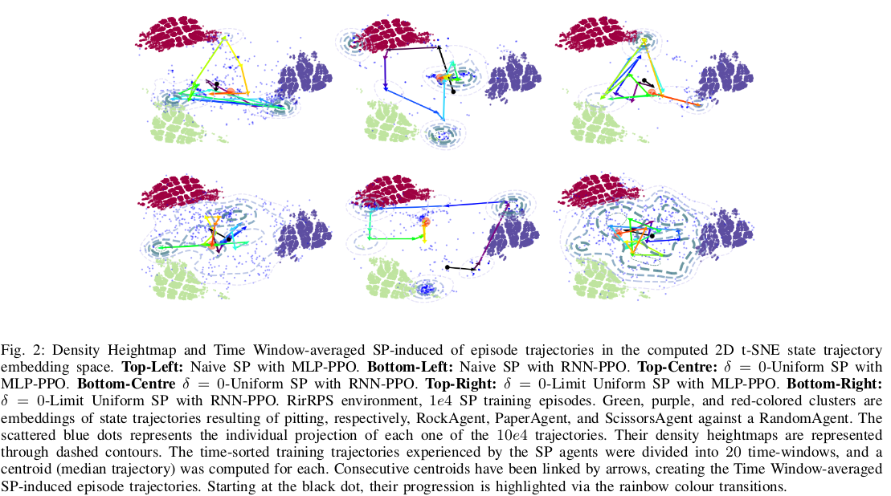

# A Generalized Framework for Self-Play Training

[Link to the paper](https://ieee-cog.org/2019/papers/paper_50.pdf)

**Daniel Hernandez; Kevin Denamganaï; Yuan Gao; Peter York; Sam Devlin; Spyridon Samothrakis; James Alfred Walker**

*IEEE*

Year: **2019**

Implementation: https://github.com/anonymous-code-github/offline-rl

This work proposes a general framework for self-play (SP) in the multi agent reinforcement learning (MARL) field.

When a SP experiment is implemented, several difficulties arise:
- Catastrophic forgetting: if the same agent is attempted to be trained by naively playing against itself, usually the train ends up in a cycle, and instead of having the agent continually learning, it *forgets* what it learned in the past. This is due to the fact that as opposed to suppervised learning, the objective in RL is non-stationary.
- Measuring the performance: it is not straightforward to measure how good the agent becomes over time. That is why the authors propose a qualitative procedure to see how the agent explores all the state-action space.

The authors define SP as a training scheme consisting of training a learning agent purely by simulating plays with itself or past versions of itself. Here, the theoretical solution given an environment $E$ for an agent $i$ consists of getting a policy that maximizes the expected reward obtained when competing across the entire set of all possible policies ($\Pi_{-i}$).

The SP setting consists of an augmentation of the general MARL framework where three pieces are introduced:
- A **menagerie** (synonim of "zoo"): represented as $\mathbf{\pi^o} \subseteq \Pi_i$, which is a set of opponent policies that will be curated and sampled to provide opponents to the agent being trained ($\pi$).
- A **policy sampling distribution** $\Omega(\mathbf{\pi'}|\mathbf{\pi^o}, \pi)$ where $\mathbf{\pi'} \subseteq \mathbf{\pi^o}$. This is just a probability distribution over the managerie conditioned on the managerie and on the current policy. This function essentially decides the opponents at each time
- A **curator** (aka gating function) of the managerie $G(\mathbf{\pi^o}'|\mathbf{\pi^o}, \pi)$ which is conditioned as well on the managerie and on the current policy. This function essentially decides if the current policy must become part of the managerie, and which policies will leave it.

The RL loop under this framework is defined as follows.

At this point, and over the defined framework, the authors present three different self-play algorithms.
1. Naive self-play: the current policy plays against itself. The managerie is the current policy, the gating function always inserts the latest policy in the managerie, discarding the rest, and the policy sampling distribution always samples the most recent policy.
2. $\delta$-uniform self-play: trats the managerie as a set of historical policies. The parameter $\delta$ is the threshold on the oldest policy that will be considered as a potential candidate, so 0 means considering all the historical policies, and 1 just the most recent one. After computing the set of candidate policies, $\Omega$ just samples uniformly from that set. $G$ in this case is fully inclusive, inserting always the training policy in the managerie.
3. Population based training self-play: uses evolutionary algorithms for $\Omega$ an $G$.

The authors develop approach (2) and compare it with (1). They point that in (2), agent that tries to defeat random versions of itself, the uniform distribution introduces a bias towards older versions. To correct that, they propose a $\delta$-Limit Uniform sampling function that gives higher probabilities to later policies. Below, the definition and a visual description.

To evaluate the training, the authors propose as a qualitative measure using TSNE to generate a 2D embedding of the state trajectories experienced by an agent during each episode.

As an experiment to test the proposal, the agents use a Rock Paper Scissor environment with imperfect recall (limited history state allowance), just 3 steps.

As algorithms, they use MLP-PPO and RNN-PPO.

Conclusions:
- Naive-SP exhibits cyclic catastrophic forgetting, as expected
- $\delta=0$-uniform and $\delta=0$-limit-uniform SPs show progressive exploration of the policy space

Additional materials:
- Ray RLLIB Implementation discussion https://github.com/ray-project/ray/issues/6669