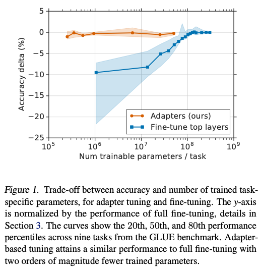
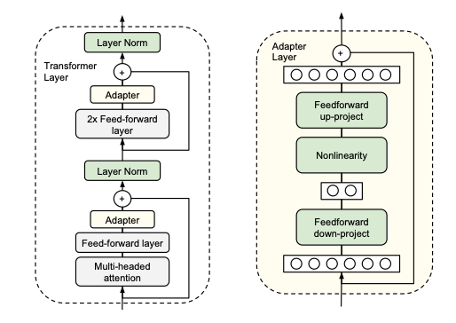
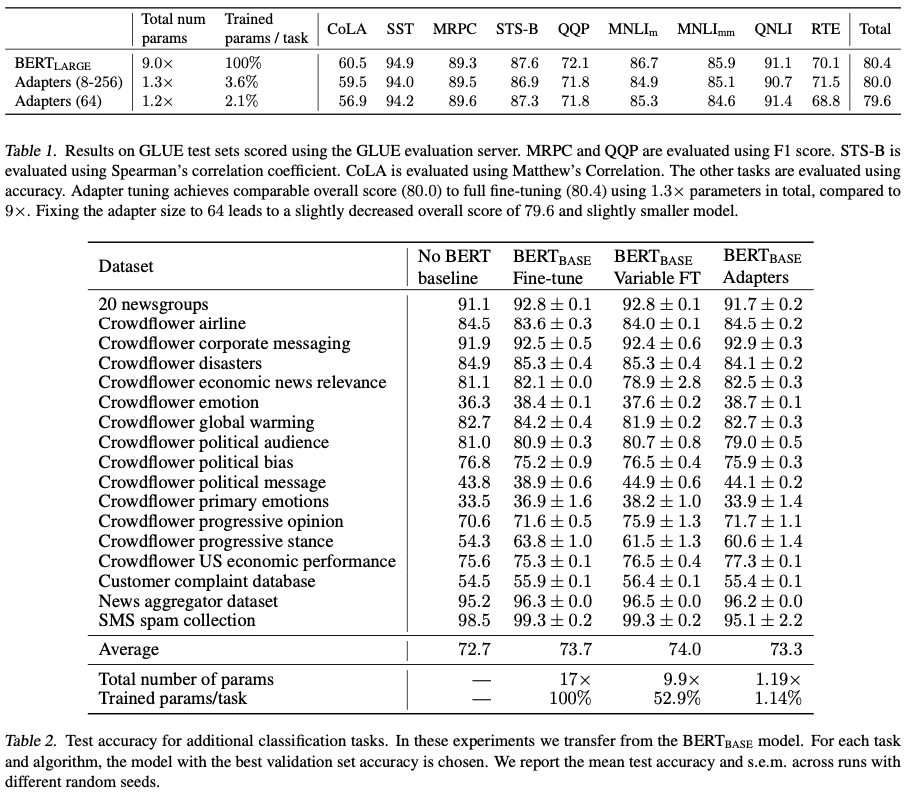

# Parameter-Efficient Transfer Learning for NLP

[Link to the paper](https://arxiv.org/abs/1902.00751)

**Neil Houlsby, Andrei Giurgiu, Stanislaw Jastrzebski, Bruna Morrone, Quentin de Laroussilhe, Andrea Gesmundo, Mona Attariyan, Sylvain Gelly**

*ICML 2019*

Year: **2019**

This proceedings introduces the idea of adapters as compact and extensible modules which can be used for transferring the learning of pre-trained models to perform new tasks, without forgetting what the original model learned. Alternatives to this are fine-tuning (top layers) and feature-based transfer. Consider a function with parameters $\bm w$: $\phi_{\bm w}(\bm x)$.

- Feature-based transfer composes $\phi_{\bm w}$ with a new function, $\chi_{\bm v}$, to yield $\chi_{\bm v}(\phi_{\bm w}(\bm x))$.
Only $\bm v$ are trained, while ${\bm w}$ are frozen.
- Fine-tuning involves adjusting the original parameters, $\bm w$, for each new task, limiting compactness.
- In adapters, a new function, $\psi_{\bm w, \bm v}(\bm x)$, is defined, where parameters $\bm w$ are copied over from pre-training. The initial parameters $\bm v_0$ are set such that the new function resembles the original: $\psi_{\bm w, \bm v_0}(\bm x) \approx \phi_{\bm w}(\bm x)$. This is achieved by using a near-identity initialization. The authors explain that the initialization is crucial for the success of the training. During training, only $\bm v$ are tuned. One usually wants that $|\bm v|\ll|\bm w|$ (# of parameters). ${\bm w}$ is never changed, preventing catastrophic forgetting.

The figure below shows that the proposed methodology (adapters) is much more parameter efficient than the alternatives.

And the figure below shows the architecture of an adapter.

There are 2 important features in the adapter:
- The bottleneck $d\rightarrow m\rightarrow d$ allows to trade-off performance with parameter efficiency. The marginal absolute increase of parameters in the network is $2md + d + m$. By setting $m \ll d$, the parameters delta of the adapter is very small.
- The residual connection allows easy near-identity initializations, by simply initializing all the parameters to very small numbers.

The manuscript presents a large amount of results. The following are the most informative ones, together with Figure 1. 

In table 2, some of the tasks have small datasets, and they do not count with a public benchmark. Hence, the authors build 3 benchmarks.
1. No BERT baseline is the result of an autoML platform that uses thousands of network configurations to solve the problem.
2. Bert Fine-Tuning is full-network fine-tuning
3. BERT variable FT is partial network fine-tuning (the authors try different layers and fine-tune report only the best results).

The authors report alternatives that were tried and either didn't succeed or didn't bring a significant improvement over the final adapter.

1. adding a batch/layer normalization to the adapter. 
2. increasing the number of layers per adapter. 
3. different activation functions, such as tanh.
4. inserting adapters only inside the attention layer. 
5. adding adapters in parallel to the main layers, and possibly with a multiplicative interaction.

