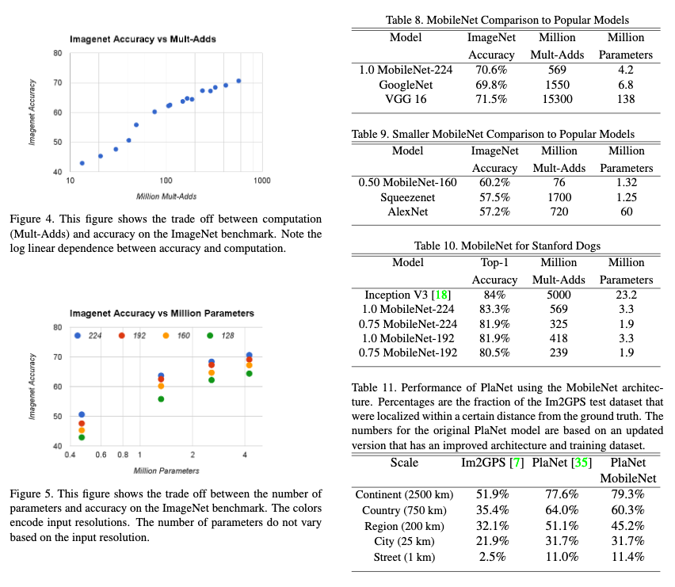

# MobileNets: Efficient Convolutional Neural Networks for Mobile Vision Applications

[Link to the paper](https://arxiv.org/abs/1704.04861)

**Andrew G. Howard, Menglong Zhu, Bo Chen, Dmitry Kalenichenko, Weijun Wang, Tobias Weyand, Marco Andreetto, Hartwig Adam**

*Google Report*

Year: **2017**

This paper shows a new convolutional architecture that has been built with efficiency in mind. The following are the main characteristics introduced along with this architecture.

- In almost all the architecture, depthwise separable convolutions have been used, drastically reducing the computation needed by $\frac{1}{N} \frac{1}{D_K^2}$ where $N$ is the number of output channels and $D_K$ is the filter size.
- The depthwise-separable convolution consists of two steps: a depthwise convolution followed by a 1x1 convolution. The authors of the paper added a batch normalization in the middle of these two layers, achieving a more non-linear net (see picture below)
- A new hyperparameter is introduced ($\alpha$) to control the depth of the network by multiplying it by the number of input and output channels
- A new hyperparameter is introduced ($\rho$) as a multiplier to the shape of the input image. This reduces the spatial dimension along all the tensors of the network.

## Architecture details

## Results

