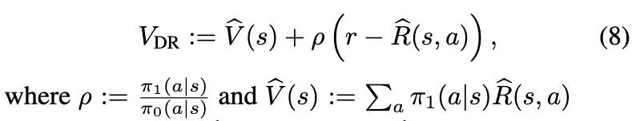
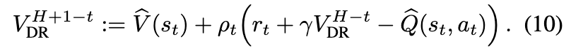

# Doubly Robust Off-Policy Value Evaluation for Reinforcement Learning

[Link to the paper](https://arxiv.org/abs/1511.03722)

**Nan Jiang and Lihong Li**

*Proceedings of the 33rd International Conference of Machine Learning*

Year: **2016**

**==== NOT FULLY COVERED ===**

- The objective of the paper is to adapt the Doubly Robust method developed by Dudík et
al in 2011 for Contextual Bandits, to the Reinforcement Learning setting. This method
aims to estimate the value of a new policy based on data collected from a different
policy.
- Currently there are 2 approaches for off-policy evaluation: (1) fit an MDP model and evaluate the policy over that model. If the estimator is good, the value of the target policy can be estimated using the Bellman Equations. However, as the authors say, it may be a good solution for small problems, but for big problems it is not because the state space is usually big, then it has to be modeled using function approximation which leads to a bias which is difficult to quantify (2) importance sampling (IS): correct the mismatch between the distributions induced by the target and behavior policy. It represents an unbiased estimate of the target policy. It consists on the ratio of probabilities of the target/behavior policies.
- The authors introduce Doubly Robust (DR) for contextual bandits and provide a simpler notation to it that makes it clearer.

- The Doubly Robust method for RL would then be:

- The authors provide another version of the DR method where variance is reduced due to state-transition stochasticity.