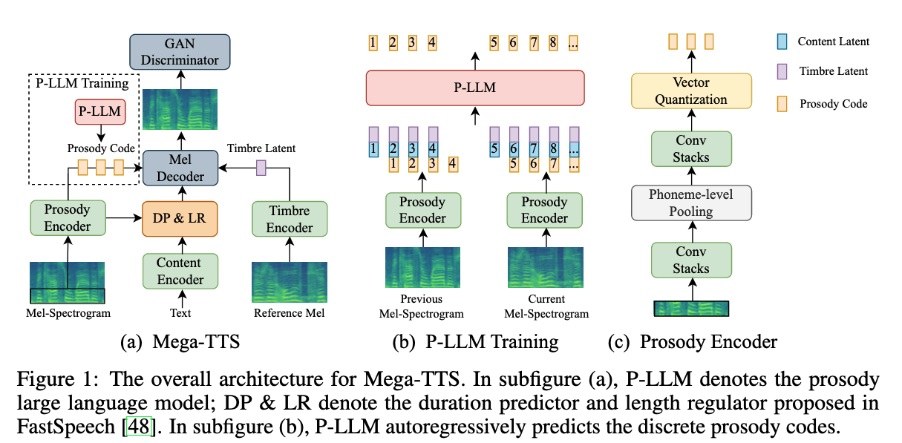
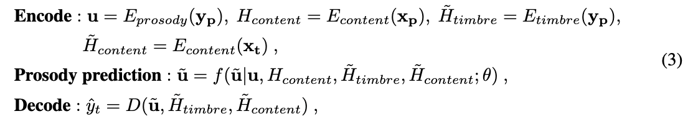

# Mega-TTS: Zero-Shot Text-to-Speech at Scale with Intrinsic Inductive Bias

[Link to the paper](https://arxiv.org/abs/2306.03509)

**Ziyue Jiang, Yi Ren, Zhenhui Ye, Jinglin Liu, Chen Zhang, Qian Yang, Shengpeng Ji, Rongjie Huang, Chunfeng Wang, Xiang Yin, Zejun Ma, Zhou Zhao**

*arXiv Preprint*

Year: **2023**

Samples: https://mega-tts.github.io/demo-page/

This paper introduces another TTS model that claims to be very good at zero-shot. The authors claim that they adopted modern modelling techniques based on LLMs but while holding strong inductive biases in the model architecture (described in the figure below).

The model consists of 6 modules:
- A transformer-based content encoder based on phonetic durations (Fastspeech).
- A convolutional prosody encoder, with a VQVAE latent space aggregated at phoneme clock.
- A pitch encoder, based on a stack of convolutions with global average pooling.
- A transformer based language model that predicts prosody tokens.
- A mel spectrogram decoder with a GAN discriminator
- A Hifi-GAN vocoder

To disentangle the prosody from the content, the authors suggest feeding the bottom 20 bands of their 80-mel spectrogram to the prosody encoder, and relying in the "carefully designed" bottleneck. The below equations summarize all the conditionings and dependencies. In them, the subindices p and t refer to prompt and target, and x and y refer to the transcription and spectrogram pairs.

The paper does ground the decisions on the following motivations, in the name of inductive bias:

- They take spectrogram as an intermediate representation because it lacks phase information, and they don't care about phase for semantics, timbre and prosody.
- Timbre is a global feature, hence it should be represented as a time independent representation
- Prosody has local and long-term dependencies, so it should be properly modeled with a LM.
- Content has monotonic alignment with speech, so it should be modeled using explicit durations and a duration predictor. 

