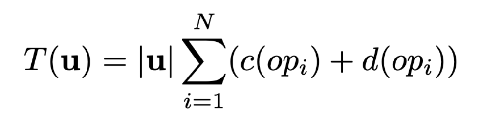
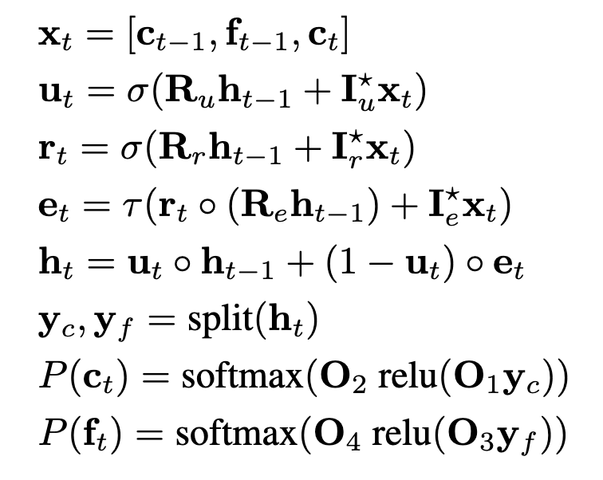
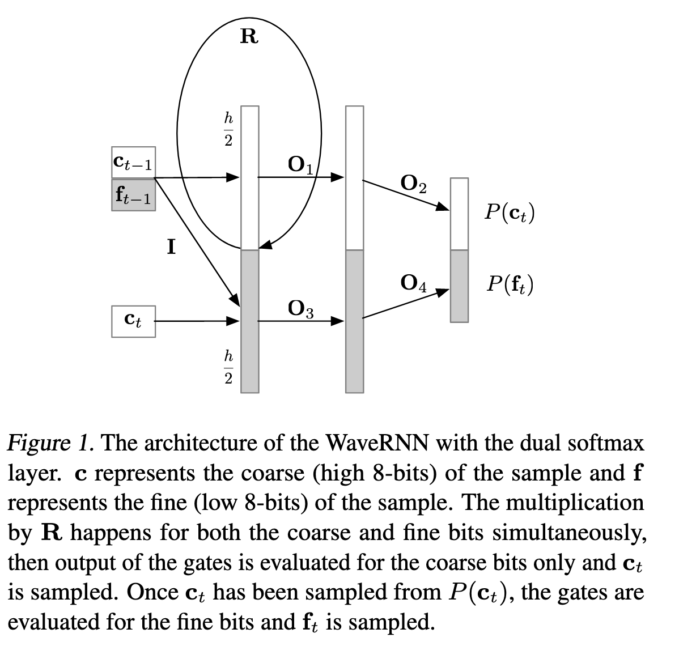
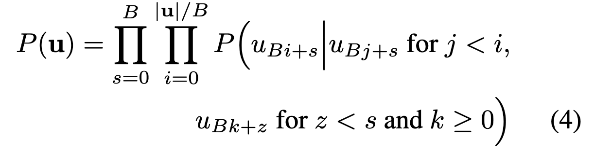
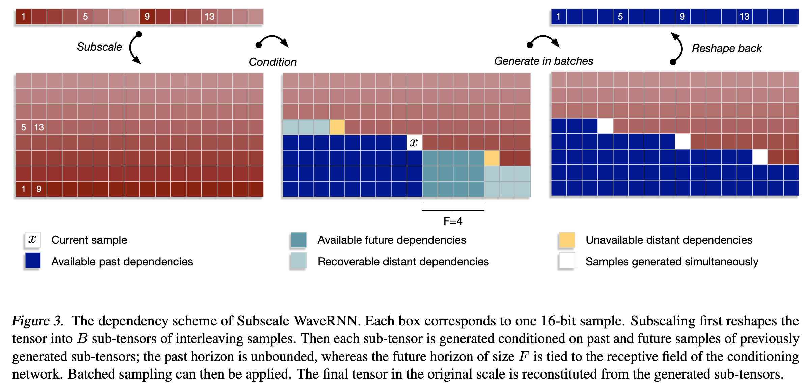
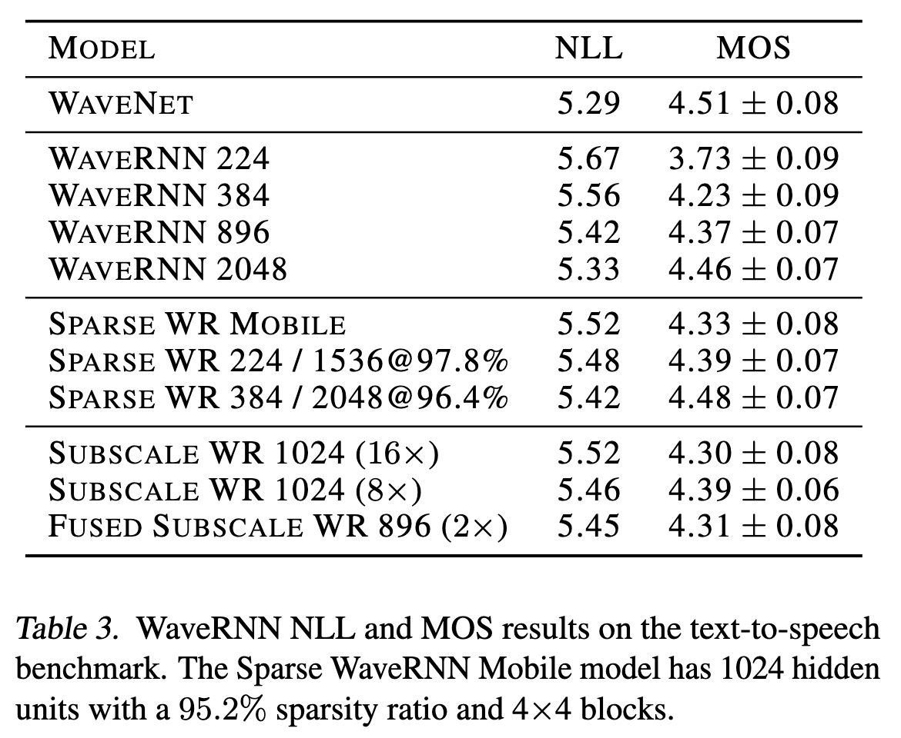
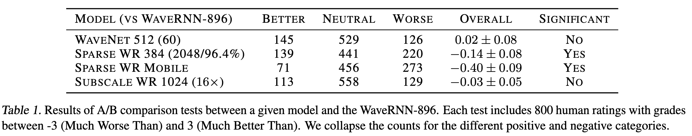

# Efficient Neural Audio Synthesis

[Link to the paper](https://arxiv.org/abs/1802.08435)

**Nal Kalchbrenner, Erich Elsen, Karen Simonyan, Seb Noury, Norman Casagrande, Edward Lockhart, Florian Stimberg, Aaron van den Oord, Sander Dieleman, Koray Kavukcuoglu**

*Proceedings of the 35th International Conference of Machine Learning*

Year: **2018**

The current work presents a set of tricks of the trade for reducing the sampling time in sequence to sequence models, specially developed for the text to speech field. The authors present a new architecture (WaveRNN) which achieves 4x real time speed synthesis.

The authors start by decomposing the time that a general seq2seq model takes to sample a sequence, with the following formula.

1. $N$: number of layers (operations) of the model
2. $d(op_i)$: overhead of each operation
3. $c(op_i)$: computation time of each operation
4. $|u|$: length of $u$, the target sequence

Each of the previous components, referred subsequently as (1), (2), (3) and (4), get analysed by the authors and an a way to improve each of them is suggested. The overarching goal of this effort consists of reduce as much as possible each of the four components with minimal loss to the quality of the synthesis.

## (1) WaveRNN
A custom single layer RNN with dual softmax layer is designed to predict 16-bit audio samples efficiently. An RNN with 896 units proved to be sufficient to get WaveNet quality synthesis. This network required $N=5$ operations (as oposed to $N=60$ in WaveNet). The operations are defined below, where $c$ and $f$ are the coarse and fine vectors, representing the generated sample highest and lowest 8-bits. $u$, $r$ and $e$ represent the RNN gates. $\sigma$ and $\tao$ are sigmoid and tanh activation functions.

## (2) Custom GPU ops
To reduce the memory bandwidth, the sampling operation is performed in the GPU, that way we avoid transfers between CPU and GPU which represent a significant bottleneck.

## (3) Sparsity
Sparsity effectively reduces the computation time required in each operation, as the number of zeros increases and hence the number of multiplications decreases. The authors use an iterative pruning by weight magnitude method, consisting of clamping to zero those weights that have a smaller magnitude, as the training process runs, until a target sparsity is achieved. They also experiment with structured sparsity, this is pruning groups of weights together. That allows a lighter representation of the pruned mask in memory (e.g. by pruning blocks of 16 weights together).

## (4) Subscaling
This is the most complex method described in the paper, allowing the sampling to be performed in parallel at a small cost. The subscaling mechanism consists of generating a batch of B samples per step, instead of just one sample per step. The generation happens as follows: the tensor u is splitted in B sub-tensors of interleaving samples, of frequency $f/B$, where $f$ is the original frequency (e.g. 24KHz); i.e. what is done here is a resampling operation so that if $B=16$, $f_b=1.5kHz$. The following equation describes the probability chain of the model.

The following figure summarizes the subscaling operation.

This method allows batching the synthesis process so that the computation can be distributed or computed on batch. The samples are conditioned to the past and future generated samples.

## Results
The following tables show how by using this techniques, the quality of the synthesis still holds and the full process becomes much lighter.

