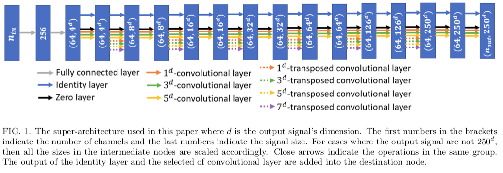

# Up to two billion times acceleration of scientific simulations with deep neural architecture search

[Link to the paper](https://arxiv.org/abs/2001.08055)

**M. F. Kasim, D. Watson-Parris, L. Deaconu, S. Oliver, P. Hatfield, D. H. Froula, G. Gregori, M. Jarvis, S. Khatiwala, J. Korenaga, J. Topp-Mugglestone, E. Viezzer, S. M. Vinko**

*Science*

Year: **2020**

- Simulation vs emulation. Sometimes a simulation needs to be run with low latency, and they can take days to run. One way of achieving a low-latency high-fidelity approximate simulation is through an emulator. This technique consists of training a ML model to approximate the outcome of a simulator.
- A lot of effort has been done in this topic using deep learning techniques and the authors claim that the best way of doing so is through network search. This is because the priors of the models are inherent to their architectures
- The paper hence proposes DENSE Deep Emulator Network SEarch), a new approach based on "superarchitectures" to find the optimal architecture for each simulation.
- DENSE is a neural network where different operations per layer are chosen based upon a parameter known as *network variable*. It takes the parameters of the simulation as input and tries to estimate the output of the simulation.
- DENSE procedure consists of randomizing the layer operations by learning a distribution over a set of different operations allowed using a Monte Carlo approach. Every step, the operations in each layer are sampled from the *network variable* distribution and the weights of the resulting network are adjusted to minimize the loss between the output of the network and the real simulation output.
- The *network variables* are learned through a similar technique as policy gradient, by maximizing the probability of those distributions leading to smaller losses.
- This schema demonstrated to be successful in multiple very complex science-based simulations.
- As a side effect, the schema presented in DENSE allows handling uncertainty in a similar way dropout does. By randomly sampling operations given the *network variables* distribution, different estimations can be generated.