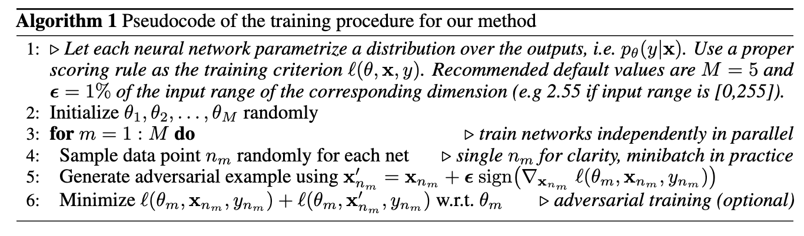
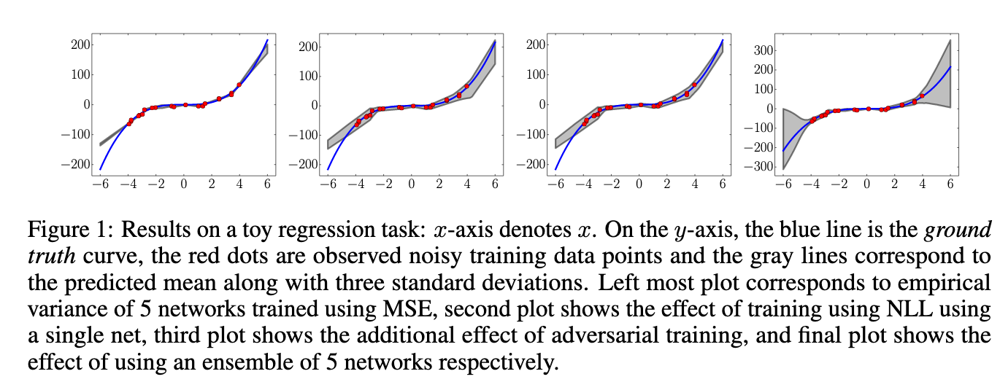
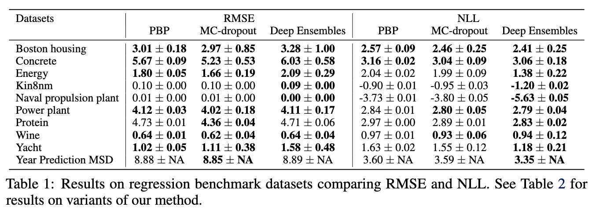
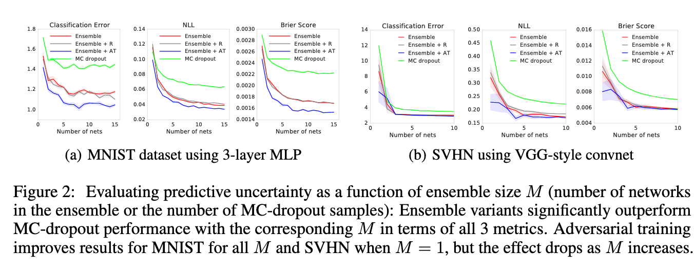
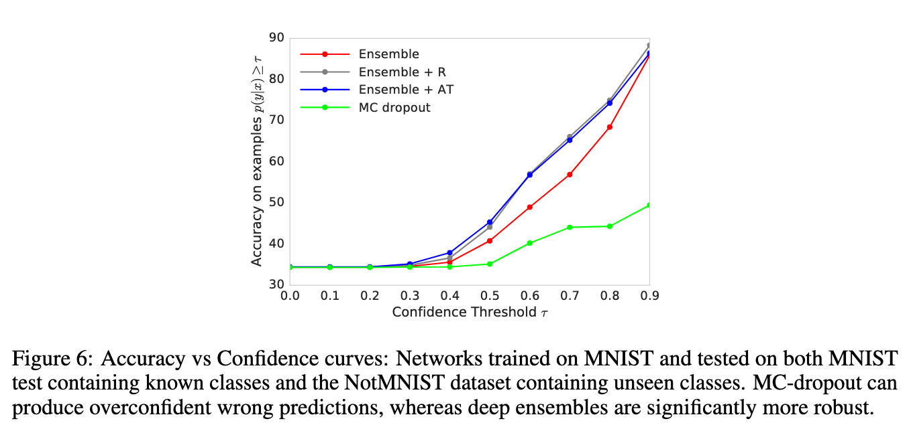

# Simple and Scalable Predictive Uncertainty Estimation using Deep Ensembles

[Link to the paper](https://arxiv.org/abs/1612.01474)

**Balaji Lakshminarayanan, Alexander Pritzel, Charles Blundell**

*Neural Information Processing Systems (NIPS 2017)*

Year: **2017**

Github: https://paperswithcode.com/paper/simple-and-scalable-predictive-uncertainty

The current work explores the idea of using deep learning bagging-based ensembles to estimate the uncertainty of a prediction. The main idea consists of training $M$ neural networks ($M \approx 5..15$) using either log-loss (Negative Log Likelihood) or Brier Score (MSE with probabilities). The authors, in addition, try to measure if the network *knows what it knows* by observing how the distributions of outputs change when the input data is supplied from another dataset.

The authors suggest the possibility of using adversarial training in addition to the ensembling mechanism to enhance the diversity of the data. Adversarial training means adding to a given input sample a small portion of the sign of the gradient of the loss wrt that sample: $x' = x + \epsilon \cdot \text{sign}(\nabla_x L(\theta,x,y))$. They also suggest using Virtual adversarial training, defined as $\Delta_x = \argmax_{\Delta_x} KL(p(y|x)||p(y|x + \Delta_x))$, in plain english: find the max change in X that produces a minimal change in p(y|x).

The authors choose to use Negative Log Likelihood for regression problems because they assume that the output of the model is Gaussian, hence they can calculate probabilities using a PDF. A benefit of this metric over MSE or RMSE is that it takes into account the uncertainty of the estimation.

The results show potential benefits of the current methodology vs the MC Dropout method, as shown in the following figures.

