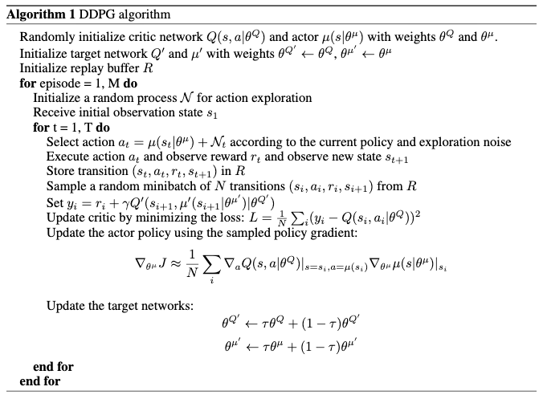
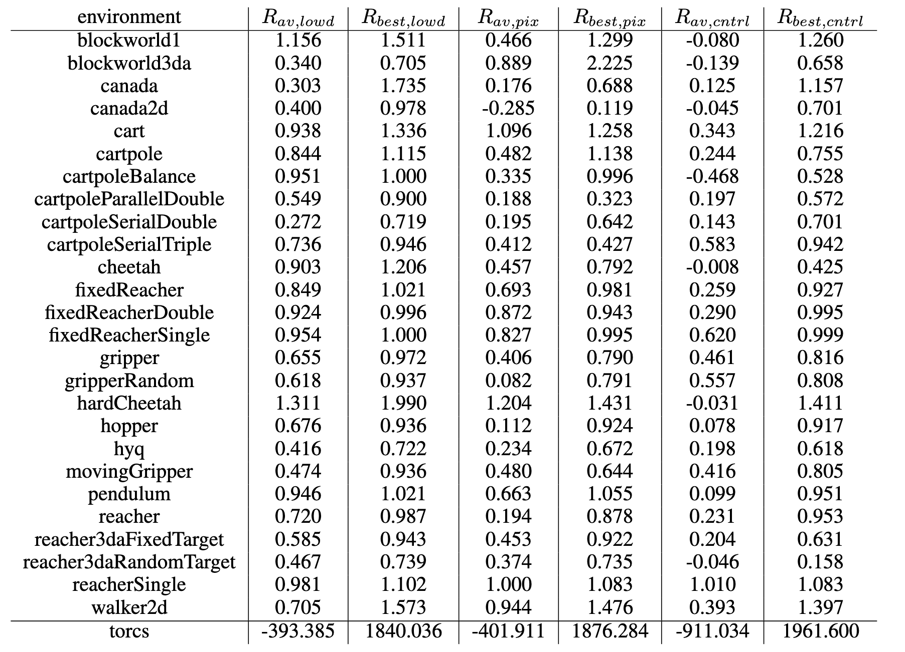

# Continuous control with Deep Reinforcement Learning

[Link to the paper](https://arxiv.org/abs/1509.02971)

**Timothy P. Lillicrap, Jonathan J. Hunt, Alexander Pritzel, Nicolas Heess, Tom Erez, Yuval Tassa, David Silver, Daan Wierstra**

*International Conference of Learning Representations, 2016*

Year: **2016**

This paper presents consequent of the DQN algorithm which is applicable to problems with continuous action-spaces.

- DQN is not easy to implement in problems with continuous action spaces given that one of the pieces of the update rule consists of calculating the maximum of the estimated q-value function over all the actions. If the space is continuous this problem becomes an optimization problem at every update step.
- One potential solution is to discretize the action space but an important limitation arises: the course of dimensionality.
- The authors suggest a new algorithm by implementing the tricks that stabilized the Q-Learning algorithm when implemented with deep learning networks, into an actor-critic framework.
- More specifically, the new algorithm consists of simply using a target network and a replay buffer into the well known Deterministic Policy Gradient (DPG) (see the formula below, where $\mu$ is the notation referring to the deterministic policy, as opposed to the common $\pi$). It builds the new algorithm known as Deep Deterministic Policy Gradient (DDPG).

  
  

- The authors suggest some additional enhancements: (1) batch normalization, (2) a new term in the policy function implementing a Ornstein-Uhlenbeck process to generate temporally correlated random perturbations to do exploration and (3) "soft" target updates using a simple exponential decay function.
- The algorithm has been tested over several MuJoCo physics-related environments with continuous actions, from low-dimensional features and from the raw pixels. The approach showed competitive results and enables the application of off-policy reinforcement learning to continuous environments.

## Intuition notes
DDPG, as opposed to DQN, uses a local search method (gradient descent) and that is why it is applicable to continuous action spaces. These are known as Pontryagine methods and the ones aiming to find the global optimum are known as Bellman methods. Here, instead of trying to find the optimum over all the actions, we find the gradient of the Q function over the input (the actions) or, in other words, we wiggle the action values to find de direction that makes the Q increase. Then, we use that wiggling on the actions  (the gradient) in order to tell the actor network how to update the parameters of the network that will lead to a better policy. In the figure below the gradient flow is highlighted. Note that this intuition applies the same way to the DPG algorithm, DDPG just applies small tricks to make DPG converge under the use of Deep Learning estimators.

## Additional references
- YouTube video explaining DDPG: https://www.youtube.com/watch?v=_pbd6TCjmaw
