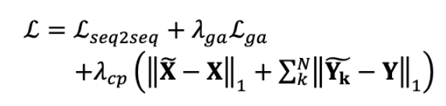

# Voice conversion with a transformer network

[Link to the paper](https://ieeexplore.ieee.org/abstract/document/9054523)

**Ruolan Liu, Xiao Chen, Xue Wen**

*IEEE*

Year: **2020**

This work presents a voice conversion system that uses a transformer with two regularization techniques: a context preservation mechanism and model adaption. The authors use one-to-one voice conversion using parallel recordings without transcripts.

Attention models with long autoregressive paths often suffer from exposure bias: failure to preserve language content. The two regularization techniques used attempt to ameliorate those failures.

## Transformer architecture

The architecture used is very similar to the original transformer. In the previous figure, the red blocks represent changes to the original transformer, and the blue blocks are additions to the architecture to stabilize and accelerate the training.

The changes represented in red blocks are:
- Use of single-headed guided encoder-decoder attention, instead of the original multi-head attention.
- Use of triangular embeddings instead of the sine/cosine ones.
- Use of prenets instead of embeddings
- Softmax removal

The changes of the blue blocks are described below, in the content preservation block description.

## Regularization techniques
- Guided attention (GA): consisting of a loss component that penalizes the encoder-decoder attention when it deviates from the diagonal. It makes the alignment diagonal and monotonic. That is achieved by multiplying a soft mask by the alignment matrix so that we maximize those attention weights
- Content preservation loss (CP): consisting of decoding the source and the target using additional decoders. The source decoder predicts the source input from encoder states. The target decider, predicts the target input from the cross-attention context. The full loss is defined in the equations below.

## Results
The model has been tested using Tacotron2 as a baseline. A Wavenet based vocoder has been used to synthesize the speech utterances.

The proposed model is about 3x faster than the baseline

The results seem to be better in terms of MOS (naturalness and similarity).

The ablation analyses conclude that (1) the regularization techniques are crucial in this application and (2) the bigger the model, the better the generation.
