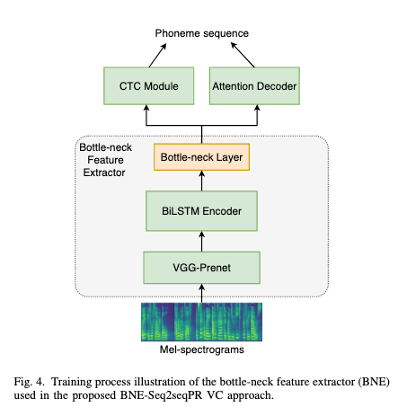
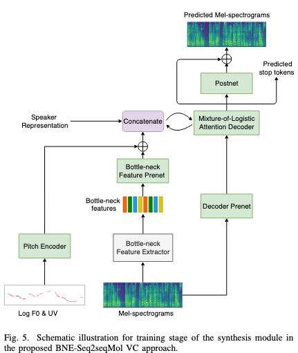
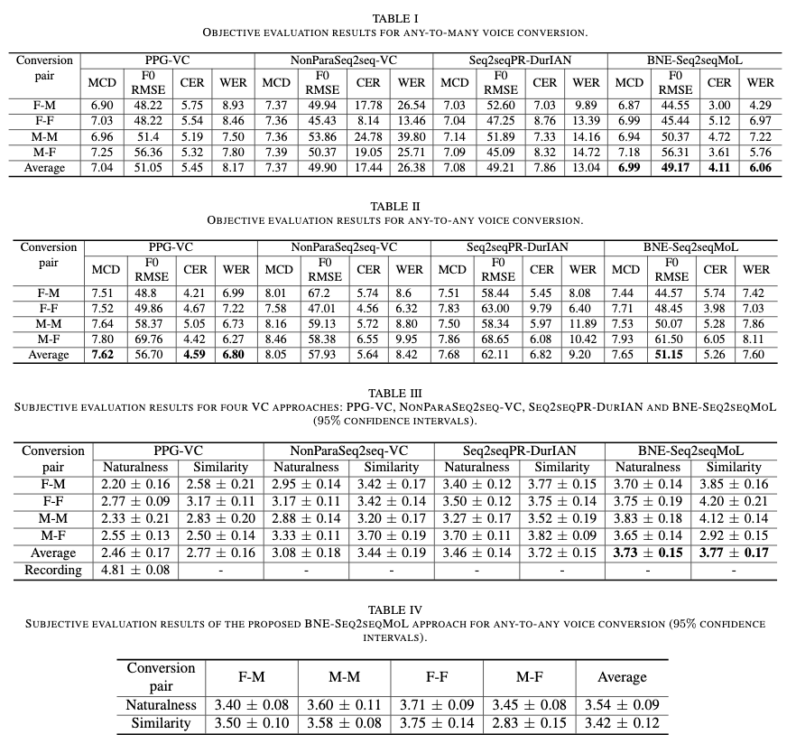

# Any-to-Many Voice Conversion with Location-Relative Sequence-to-Sequence Modeling

[Link to the paper](https://arxiv.org/pdf/2009.02725.pdf)

**Songxiang Liu, Yuewen Cao, Disong Wang, Xixin Wu, Xunying Liu, Helen Meng**

*IEEE*

Year: **2020**

Audio samples: [Link](https://liusongxiang.github.io/BNE-Seq2SeqMoL-VC/)

The current paper proposes an alternative to any-to-may and any-to-any voice conversion.

Voice conversion consists of converting the non-linguistic features from a source audio to some target, while keeping the linguistic content untouched. In this work, the authors focus only on speaker identity conversion.

Their approach is based on two previous works:
- Seq2SeqPR: a Phoneme Recognizer convolutional S2S network with CTC attention that maps the source audio to phonemes.
- DurIAN: a speaker conditional TTS model similar to Tacotron but without attention. The attention mechanism is replaced by a duration model that predicts the number of frames each phoneme spends in the output.  At training time, the real duration is used, at inference, the predicted duration is injected. DurIAN is trained in 2 stages: (1) all but the duration module is trained, (2) the duration module is trained keeping the rest untouched.

The authors propose a set of changes over these 2 previous works. Architectures briefly described in the figures below.

- The PR architecture has been replaced by a bottleneck feature extractor, which will contain more enriched information than just phonemes
- The DurIAN architecture has been modified so that it contains an attention module, and, receives speaker representation information from the previous module, and has a pitch encoder. The decoder is very similar to the one in Tacotron. Now it is called BNE-Seq2SeqMoL

## Results

Audio samples: [Link](https://liusongxiang.github.io/BNE-Seq2SeqMoL-VC/)
